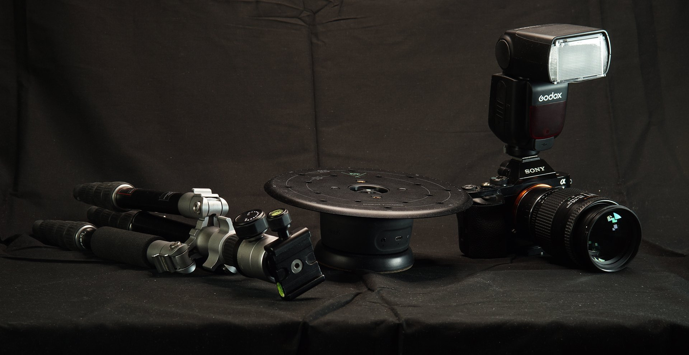

# Équipement de capture 3D

>[!WARNING]
>
> La prise en charge de capture 3D a été supprimée à partir de la version 5.1 de Sampler.

## Équipement de base et configuration

Dans ce guide de l’utilisateur, nous allons passer en revue les méthodes avancées pour prendre des photos à utiliser dans le flux de travail de photogrammétrie de Substance 3D Sampler.

Vous préférez regarder ce contenu sous forme de tutoriel vidéo ? Vous le trouverez [ici](https://youtu.be/f8iCtZ3Gmzs?si=Q353ZDCScO1YnHJT "tutoriel sur l’équipement de base capture 3D").

L&#39;accent sera mis sur la prise de vue d&#39;objets plus petits à l&#39;intérieur, dans un environnement contrôlé, avec accès à un équipement plus avancé. Il n&#39;y aura pas d&#39;accent sur des marques et des produits spécifiques, car l&#39;objectif est d&#39;essayer de garder les explications suffisamment génériques pour qu&#39;elles puissent être appliquées à différents équipements.

## Caméra

En ce qui concerne votre appareil photo, un <b>appareil photo reflex numérique</b> est essentiel pour améliorer la qualité et mieux contrôler les photos. Certains smartphones haut de gamme peuvent s&#39;en approcher, mais il est difficile de les étendre et de les connecter à d&#39;autres équipements photographiques.

Tout reflex numérique qui prend en charge le <b>mode manuel</b>, les objectifs échangeables, peut prendre en charge un <b>flash externe</b> et a une résolution de <b>12 Mp ou plus</b> est un bon choix.

## Trépied

Pour photographier des sujets plus petits, il est idéal de maintenir l’appareil photo à une position définie et de faire pivoter l’objet. Pour cela, un trépied et une plaque tournante de produit sont nécessaires. Le grand avantage d&#39;une telle configuration statique est qu&#39;elle permet de retourner un objet plus petit à l&#39;envers et de capturer également le dessous.

Un trépied est nécessaire, et bien qu&#39;il n&#39;ait pas à être compliqué, les trépieds en plastique bon marché pourraient rendre les choses compliquées s&#39;ils doivent être ajustés souvent. Un grand trépied de studio lourd est trop lourd pour une configuration de photogrammétrie. Un trépied métallique de milieu de gamme <b>facilement réglable en height</b>, avec une tête métallique<b> de bonne qualité</b>, pourrait donc être idéal.

## Platine Tournante

En ce qui concerne le plateau tournant, un simple, manuel fera pour de nombreux cas, mais un plateau tournant automatique qui peut déclencher votre appareil photo automatiquement peut rendre les choses plus simples et plus rapides. Les platines manuelles sont très bon marché et sont pratiques lorsqu&#39;elles sont sur un budget. Les modèles motorisés permettent de faire des virages précis de manière répétable, et si le plateau peut déclencher l&#39;appareil photo, il peut être beaucoup plus rapide à utiliser qu&#39;un modèle manuel.

## Lumière et arrière-plan

Un reflex numérique, un trépied et une platine tournante suffisent déjà pour capturer des objets simples dans des conditions idéales. Cela signifie photographier avec une lumière naturelle uniforme, comme depuis une fenêtre de plafond ou plusieurs fenêtres environnantes. La prise de vue de l’objet doit également être assez mate et ne pas refléter beaucoup.

La seule chose importante à laquelle il faut prêter attention, c&#39;est un arrière-plan uniforme. Le système de photogrammétrie est facilement confondu par un arrière-plan statique avec un objet en rotation, c&#39;est pourquoi il est important d&#39;éliminer ce facteur. Lorsqu&#39;il y a un arrière-plan chargé, il est possible d&#39;utiliser une simple feuille de papier ou de carton, ou un tissu de couleur uniforme, pour cacher les choses.

Une fois que tout est configuré, l&#39;idée est simple : prenez beaucoup de photos, <b>en suivant des boucles à 360 degrés complètes. 16 plans par rotation est un bon nombre, dans au moins 5 boucles différentes</b>. Un <b>de côté</b> et <b>deux de différents heights</b>, pour le bas et le haut chacun.

Découvrez maintenant les paramètres de caméra c[que vous devrez utiliser pour le processus Capture 3D](camera-settings-exposure-substance-3d-sampler.md).
