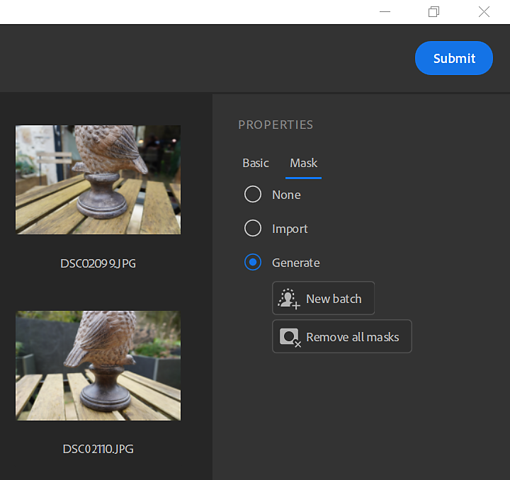
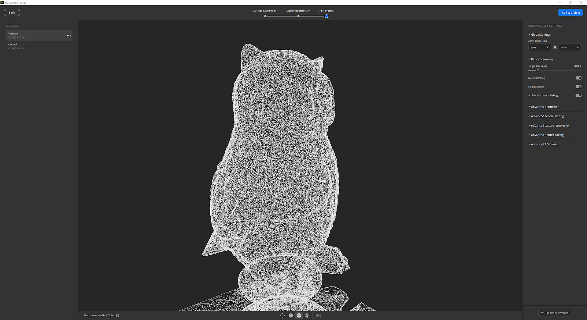

# Capture 3D

## Prise en main

## Qu&#39;est-ce que la photogrammétrie ?

Sampler utilise la photogrammétrie pour transformer des images dans un maillage avec des textures. La photogrammétrie est la science de la prise de mesures à partir d&#39;images. Il est utilisé pour extraire des informations de photographies, pour créer des modèles 3D et des textures. Le processus implique de prendre plusieurs photos d’un objet sous différents angles, puis de traiter les images pour extraire des informations sur la forme et l’emplacement des éléments dans les images.

L&#39;objectif est de faire correspondre les caractéristiques correspondantes entre les images pour établir les positions relatives de la caméra pour chaque image. À partir des fonctions correspondantes, un modèle 3D de l’objet est reconstruit. La dernière étape consiste à projeter les textures sur le modèle 3D.

## Configuration matérielle requise

La capture 3D est disponible sous Windows et MacOS Monterey ou Ventura.

Windows/Linux

Nous recommandons :

* GPU avec 8 Go de VRAM
* 16 Go de RAM. Idéalement, 32 Go et 64 Go.
* Espace disque minimum de 10 Go

[Configuration Linux](https://helpx.adobe.com/fr/substance-3d/unlisted/documentation/sadoc/3d-capture-set-up-on-linux-255426606.html)

Mac

* Les appareils Apple Silicon sont fortement recommandés (M1 ou M2)
* GPU Intel et AMD avec au moins 4 Go de prise en charge VRAM et raytracing

## Démarrage d’une nouvelle Capture 3D

## Importation du jeu de données

## Préparation du jeu de données

Faites glisser et déposez vos photos ou cliquez pour parcourir votre explorateur de système d’exploitation.

>[!NOTE]
>
> **Recommandations de jeux de données**
> 
> Nous vous recommandons d&#39;avoir un jeu de données contenant au moins <b>20 images</b> pour que la capture 3D fonctionne correctement.

Pour les utilisateurs d’iPhone, le format .HEIC n’est pas encore pris en charge. Vous pouvez utiliser Lightroom pour convertir au format .jpeg.

Sur MacOS, vous pouvez utiliser les [actions rapides](https://support.apple.com/en-gb/guide/mac-help/mchl97ff9142/mac) pour convertir vos images.

Pour les formats RAW caméras, nous vous recommandons d’utiliser Lightroom pour convertir vos photos au format .jpeg.

>[!NOTE]
>
> **Limitations du jeu de données**
> 
> **Windows** : votre jeu de données doit être inférieur à 6 G pixels (6 000 000 000 pixels) au total. Il représente 500 photos de 12M pixels

Une fois les photos importées, vous pouvez cliquer sur une photo pour l’afficher dans son intégralité.

Définition du groupe de photos :

Votre jeu de données peut être divisé en plusieurs groupes de photos. Regroupe les photos par propriétés (taille du capteur, distance focale, rotation,...)

## Masquage

L&#39;utilisation de masques présente de nombreux avantages. Il permet au processus de photogrammétrie de détecter les caractéristiques et de reconstruire uniquement les zones non masquées.

Cela permet également de déplacer l’objet pendant la capture, car les masques masqueront l’arrière-plan dans toutes les photos.

Pour utiliser des masques, sélectionnez un groupe de photos et ouvrez l&#39;onglet **Masque** sur la droite.

Vous pouvez importer des masques en respectant une convention de dénomination :

* [image\_name].file\_extension
* [image\_name]\_mask.file\_extension

Vous pouvez générer automatiquement des masques par photos à l’aide de notre technologie optimisée par l’IA.

## Alignement

L’alignement consiste à traiter toutes les images pour extraire et faire correspondre les caractéristiques afin d’établir les positions relatives de la caméra pour chaque image.

## Paramètres

Précision

Il existe deux options : faible et élevé.

* Faible : conseillé pour la plupart des jeux de données.
* Élevé : augmentez le nombre de points, il est conseillé de faire correspondre plus de photos dans les cas où le sujet a une texture insuffisante ou les photos sont petites. Ce paramètre ralentit le traitement. Nous vous recommandons d’essayer d’abord l’option basse.

Ordre des photos

Il existe deux options : Par défaut et Séquence.

Cela peut être calculé à l’aide de différents algorithmes de mise en correspondance des fonctionnalités :

* Valeur par défaut : la sélection est basée sur plusieurs critères, parmi lesquels la similarité entre les images.
* Séquence : utilisez uniquement des images voisines sur la distance donnée, conseillées pour le traitement d’une seule séquence de photos si le mode Par défaut a échoué. L’ordre d’insertion des photos doit correspondre à celui de la séquence.

## Position du nuage de points et des caméras

L’étape d’alignement produit un nuage de points fragmenté avec toutes les fonctions détectées et la position de toutes les caméras.

Si le contour de l’image est vert, l’image a été correctement alignée.

Si le contour de l’image est orange, l’image n’a pas été correctement alignée et aucune fonction n’a été extraite de cette image.

Vous pouvez cliquer sur l’image dans le panneau de gauche pour effectuer un cadre du nuage de points sur la caméra associée.

Vous pouvez cliquer sur une caméra pour effectuer un cadre du nuage de points qu’elle contient.

## Reconstruction

L’étape de reconstruction génère un modèle 3D de l’objet à partir des fonctions correspondantes en projetant les textures sur le modèle 3D.

## Paramètre

Détails de la géométrie Cette option spécifie le niveau de précision dans les photos d’entrée, ce qui se traduit par plus ou moins de détails dans le modèle 3D calculé.

## Zone d’intérêt

Avant de générer le modèle 3D, vous pouvez définir la région à reconstruire autour du nuage de points avec le cadre de sélection.

Vous pouvez translater, mettre à l’échelle et faire pivoter la boîte à l’axe 3.

En appuyant sur Maj pendant la mise à l’échelle, vous allez mettre la zone à l’échelle à partir du centre.

<table>
<tr style="border: 0;">
<td style="border: 0;" valign="top">

</td>
<td style="border: 0;" valign="top">

</td>
</tr>
</table>

## Post-traitement

Le post-traitement vous aide à adapter et à optimiser votre maillage et vos textures en fonction de vos besoins et de la manière dont vous souhaitez les utiliser.

Le résultat de la reconstruction peut générer un maillage avec des millions de polygones et jusqu&#39;à 16K textures. Souvent, cette fonctionnalité n’est pas optimisée pour le rendu, le temps réel ou l’expérience AR.

Vous devrez post-traiter le résultat pour réduire le nombre de polygones sans perdre de détails.

L&#39;étape de post-traitement enchaîne automatiquement 4 étapes:

* Décimation : réduisez le nombre de polygones en définissant le nombre de faces souhaité
* UV : définit automatiquement les seams, déplie et emballe les UV du maillage décimé
* Reprojection : reprojetez la texture des couleurs du maillage de photogrammétrie sur le maillage décimé
* Baking : Bakez les détails de la normale, de l’height et de l’AO du maillage de photogrammétrie sur le maillage décimé. Cela assurera le transfert de tous les détails de maillage perdus lors de la décimation dans des cartes de texture.

## Version

Pour itérer et tester facilement différentes options de post-traitement, vous pouvez créer plusieurs versions et sélectionner celle à ajouter à votre projet.

Pour vous aider, vous pouvez visualiser le maillage dans différents modes.

Mode solide

mode structure filaire

mode UV

## Workflow non destructif

Lorsqu’une version est ajoutée au projet, une pile de calques est créée avec plusieurs calques.

La première couche est le résultat de la reconstruction.

Le deuxième calque (si vous avez effectué un post-traitement) est le calque de post-traitement par maillage avec les valeurs définies dans la fenêtre capture 3D. Vous pouvez toujours modifier les paramètres à cette étape si vous souhaitez utiliser d’autres paramètres.

Le troisième calque est un calque de transforme de maillage pour mettre à l’échelle, translater et faire pivoter votre objet 3D.

À ce stade, vous pouvez ajouter les filtres à appliquer aux matériaux pour modifier les textures de l’objet 3D.

## Exporter

Dans la fenêtre d’exportation, vous pouvez définir le format de maillage et les paramètres de matériau (les mêmes paramètres que lors de l’exportation d’un matériau).

## Tutoriels

[Accéder aux Tutorials avancés](https://substance3d.adobe.com/tutorials/courses/Advanced-3D-Capture/youtube-f8iCtZ3Gmzs)

## FAQ

**Quelles sont les meilleures conditions de capture pour la photogrammétrie ?**

Pour que la photogrammétrie produise des résultats précis, il est important de suivre certaines bonnes pratiques lors de la capture d’images.

1. Éclairage : la photogrammétrie fonctionne mieux lorsque les images sont capturées dans de bonnes conditions d’éclairage. Évitez de prendre des images dans un environnement faiblement éclairé ou à fort contraste, car il peut être difficile d’extraire avec précision les caractéristiques des images. Les meilleures conditions d’éclairage pour la photogrammétrie sont les jours nuageux ou les zones ombragées.
1. Chevauchement : pour vous assurer qu’il y a suffisamment d’informations dans les images pour extraire avec précision les caractéristiques, il est important de capturer des images avec un chevauchement important. En règle générale, au moins 60 % des images se chevauchent, horizontalement et verticalement.
1. Caméra : utilisez une caméra et un objectif haute résolution qui offrent une bonne qualité d’image et une grande netteté. Évitez d’utiliser des caméras avec un objectif fish-eye ou un objectif grand-angle, car cela peut provoquer des distorsions géométriques qui peuvent affecter les résultats finaux.
1. Orientation : lors de la prise de vue, veillez à ce que la caméra soit de niveau et perpendiculaire au sol. Les images prises inclinées peuvent compliquer l’extraction précise des fonctions et entraîner des résultats déformés.
1. Étalonnage de la caméra : assurez-vous que la caméra est étalonnée avant de prendre des images. Ce processus permet de corriger la distorsion de l&#39;objectif et d&#39;autres erreurs qui peuvent affecter la précision des résultats finaux.

**Comment fonctionne-t-il pour le specular et les objets réfléchissants ?**

La photogrammétrie peut s&#39;avérer difficile lorsque vous travaillez avec des objets très specular ou réfléchissants, car les reflets lumineux peuvent rendre difficile l&#39;extraction des caractéristiques des images. Voici quelques stratégies qui peuvent être utilisées pour relever ces défis :

1. Éclairage : lorsque vous capturez des images d’objets très réfléchissants, essayez d’éviter la lumière directe du soleil et de capturer plutôt des images dans des conditions de ciel couvert ou d’ombre. Cela peut aider à réduire l’intensité des reflets et faciliter l’extraction des caractéristiques des images.
1. Fini mat : l’application d’un fini mat aux surfaces réfléchissantes peut aider à réduire l’intensité des reflets et faciliter l’extraction des caractéristiques des images.
1. Capturer plusieurs images : la capture de plusieurs images du même objet sous différents angles peut aider à réduire l’impact des reflets et augmenter les chances de pouvoir extraire des caractéristiques d’au moins certaines des images.
1. Retouche d’image : lors du post-traitement, certains logiciels de retouche d’image comme Lightroom peuvent être utilisés pour réduire les reflets et améliorer les caractéristiques des images, telles que l’augmentation du contraste ou la correction des couleurs.

Gardez à l&#39;esprit que les objets réfléchissants peuvent nécessiter une configuration et des traitements plus élaborés, et qu&#39;il peut ne pas être possible d&#39;obtenir des résultats parfaits dans tous les cas. C&#39;est une bonne idée d&#39;expérimenter différentes techniques.

**Quelle est la recommandation entre un téléphone mobile et une caméra de reflex numérique pour la photogrammétrie ?**

Les téléphones portables et les caméras reflex numériques peuvent être utilisés pour la photogrammétrie, mais ils ont des points forts et des points faibles différents. Voici quelques points à prendre en compte lors du choix du type de caméra à utiliser :

1. Résolution : les caméras de reflex numériques ont généralement une résolution beaucoup plus élevée que les téléphones portables, ce qui peut conduire à des résultats plus détaillés et plus précis. Cependant, avec les récents progrès dans la caméra de téléphones portables, certaines caméras haut de gamme de téléphones portables ont une résolution et une qualité d&#39;image comparables à certaines caméras DSLR bas de gamme.
1. Calibration de la caméra : la photogrammétrie repose sur un calibrage précis de la caméra, qui est généralement plus difficile à réaliser avec des caméras de téléphone mobile qu&#39;avec des caméras de reflex numérique. Certaines caméras de téléphone portable ont des paramètres d’étalonnage intégrés que vous pouvez utiliser, mais ils peuvent ne pas être aussi précis qu’un étalonnage approprié d’une caméra de reflex numérique.
1. Autonomie de la batterie et stockage : les caméras de téléphonie mobile ont une autonomie de batterie plus limitée que les caméras de reflex numériques. Par conséquent, vous devrez prévoir de charger le téléphone ou de transporter des batteries supplémentaires pendant que vous travaillez. En outre, vous devez vous assurer que le téléphone dispose d’une capacité de stockage suffisante pour traiter des fichiers image volumineux.
1. Coût : Les caméras reflex numériques sont généralement plus chères que les téléphones portables, et elles nécessitent également des accessoires supplémentaires, tels que des trépieds et des flashes externes.
1. Portabilité : Un téléphone portable est plus portable qu&#39;une caméra reflex numérique, et il est plus probable que vous ayez votre téléphone avec vous lorsque vous tombez sur un objet ou une scène intéressante que vous voulez capturer pour la photogrammétrie.

En résumé, cela dépend vraiment de vos besoins spécifiques et des caractéristiques du projet. Pour les projets de faible résolution, un téléphone mobile peut suffire. Cependant, si une haute précision et une haute résolution sont nécessaires, une caméra DSLR peut être un meilleur choix. De plus, si vous prévoyez de prendre des photos sur une base régulière ou pour un projet à long terme, investir dans une caméra de reflex numériques peut être une solution plus rentable à long terme.

**Comment étalonner ma caméra pour limiter le flou sur mon objet ?**

L&#39;étalonnage de la caméra est une étape importante du processus de photogrammétrie qui permet de corriger la distorsion de l&#39;objectif et d&#39;autres erreurs qui peuvent affecter la précision des résultats finaux. Voici quelques étapes que vous pouvez suivre pour étalonner votre caméra et limiter le flou sur votre objet :

1. Utiliser un trépied : pour stabiliser la caméra et réduire le flou, il est important d’utiliser un trépied lors de la capture d’images pour la photogrammétrie. Cela permettra de s’assurer que la caméra est dans la même position pour chaque prise de vue et contribuera à minimiser le mouvement de la caméra.
1. Utiliser un déclencheur à distance : pour réduire davantage le mouvement de la caméra, vous pouvez utiliser un déclencheur à distance ou une fonction d’retardateur sur la caméra pour prendre les images. Cela aidera à minimiser tout tremblement de la caméra causé par l’appui sur le bouton de l’obturateur.
1. Régler la vitesse d’obturation : pour réduire le flou causé par le mouvement de la caméra, vous devez utiliser une vitesse d’obturation rapide. Une règle générale est d&#39;utiliser une vitesse d&#39;obturation au moins aussi rapide que l&#39;inverse de la distance focale de la lentille. Par exemple, si vous utilisez un objectif de 50 mm, vous devez utiliser une vitesse d’obturation d’au moins 1/50e de seconde.
1. Utilisez une sensibilité ISO élevée : dans des conditions de faible luminosité, vous devrez peut-être utiliser une sensibilité ISO plus élevée pour maintenir une vitesse d’obturation rapide et réduire le flou. Cependant, gardez à l’esprit qu’une sensibilité ISO élevée peut également augmenter le bruit de l’image, ce qui peut affecter la précision des résultats finaux.
1. Utiliser un flash : dans certaines situations, l’utilisation d’un flash peut aider à réduire le flou causé par une faible luminosité. Gardez à l’esprit que le flash peut également provoquer des reflets et d’autres problèmes dans certains cas. N’oubliez donc pas de tester des prises de vue Flash et non Flash pour voir lesquelles fonctionnent le mieux pour votre application spécifique.

Rappelez-vous que l&#39;étalonnage est un processus itératif et peut nécessiter de multiples tentatives pour obtenir de bons résultats.

**Puis-je déplacer l’objet pendant la capture pour la photogrammétrie ?**

Dans la plupart des cas, il n’est pas recommandé de déplacer l’objet pendant la capture pour la photogrammétrie. Le processus de photogrammétrie repose sur une position fixe de l&#39;objet pour chaque image, car le logiciel utilise les positions relatives des caractéristiques dans les images pour reconstruire un modèle 3D de l&#39;objet.

Si l’objet est déplacé pendant la capture, il apparaît à une position différente dans chaque image, ce qui rend difficile la correspondance des fonctions correspondantes entre les images. Cela peut entraîner des inexactitudes dans le modèle 3D final et peut également rendre l’étape de correspondance des images difficile, voire impossible.

Cependant, il peut être utile de déplacer l’objet dans certains cas. Par exemple, dans le cas de petits objets, où il est difficile de prendre des images avec un chevauchement important, il est possible d&#39;utiliser un plateau tournant et de faire pivoter l&#39;objet pour s&#39;assurer que toutes les caractéristiques sont capturées sous plusieurs angles.
