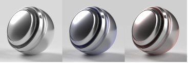
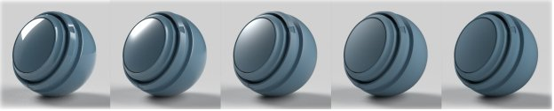

# Adobe Standard Material

>[!NOTE]
>
> Substance 3D Sampler utilise désormais par défaut le modèle de matériau [OpenPBR](openpbr.md) plutôt que l&#39;Adobe Standard Material.

## Propriétés de matériau standard

## Propriétés de la surface de base

**Base color**

Couleur de la surface.

**Rugosité**

Lissage ou cache de la surface.

**Métallique**

Degré d&#39;éclat métallique de la surface.

**Opacité**

La visibilité de la surface.

**Ambient occlusion**

Ombres des cavités et plis empêchant la lumière de frapper la surface.

**Specular level**

Force des reflets de lumière sur la surface.

**Specular edge color**

Couleur des reflets de lumière. Affecte les angles de visée des matériaux métalliques.

**Normal**

Simule les détails d’une surface tels que les bosses et les fissures.

**Échelle normale**

Force de l&#39;effet normal.

**Combiner normal et height**

Applique la texture normale au-dessus de la texture d’height.

**Height**

Crée des détails de surface à l&#39;aide d&#39;un displacement de relief ou de géométrie.

**Échelle d&#39;Height**

Echelle d&#39;height en unités de scène. S’applique à la bosse et au displacement.

**Niveau d&#39;Height**

Valeur de la texture d&#39;height représentant le displacement zéro.

**Anisotropy level**

Quantité que les reflets étirent dans une direction le long de la surface.

**Anisotropy angle**

Rotation antihoraire de l’effet anisotrope.

**Intensité des émissions**

Intensité de la lumière émise par la surface.

**Couleur d&#39;émission**

Couleur de la lumière émise.

**Opacité de l&#39;Éclat**

Simule l&#39;effet des fibres microscopiques ou du flou sur la surface.

**Couleur de l&#39;éclat**

Couleur de l’effet éclat.

**rugosité d&#39;Éclat**

Lissage de l’effet éclat.

## Propriétés intérieures

**Translucency**

Quantité de lumière pouvant passer à travers la surface.

**Couleur d&#39;absorption**

La lumière de couleur convergera à mesure qu’elle sera absorbée.

**Distance d&#39;Absorption**

Distance approximative en unités de scène que la lumière parcourra avant d’atteindre la couleur d&#39;absorption. Si cette option est définie sur zéro, le thickness n’affectera pas la couleur d&#39;absorption.

**Index de réfraction**

La quantité de lumière qui passe à travers l’objet.

**Dispersion**

Étendue du spectre de couleurs lorsque réfracté.

**Subsurface scattering**

Dispersion la lumière sous la surface, plutôt que de passer directement à travers.

**Scattering**

Couleur sous la surface à laquelle la lumière diffuse se transforme.

**Distance de diffusion**

La lumière de distance approximative doit parcourir avant d&#39;atteindre la diffusion complète.

**Échelle de distance de diffusion**

Multiplicateur de la distance de dispersion. Peut être différent pour chaque couche de couleur.

**Décalage rouge**

Définit la lumière rouge pour voyager plus loin que les autres couleurs claires. Utile pour la peau.

**Diffusion Rayleigh**

Définit la lumière orange pour qu’elle passe plus loin sous la surface et la lumière bleue pour qu’elle voyage moins.

**thickness de volume**

Thickness de la surface par rapport au cadre de sélection de l’objet. Utilisé pour les effets d&#39;intérieur lorsque le thickness réel n&#39;est pas connu.

**Échelle de thickness du volume**

Multiplicateur du thickness de volume.

## Propriétés du pelage

**Coat opacity**

Simule un calque au-dessus du matériau. Permet de créer des couches, des laques et des vernis clairs.

**Coat color**

La couleur du pelage.

**Coat roughness**

Degré de lissage ou de mat de la surface du pelage.

**Indice de réfraction de la couche**

La quantité de lumière se courbe lorsqu’elle passe à travers le pelage.

**Coat specular level**

La force des reflets lumineux sur le pelage à des angles de regard.

**Coat normal**

Simule les détails de la surface comme les bosses et les fissures sur la surface du pelage.

**Échelle de Coat normal**

Force de l’effet de coat normal.
