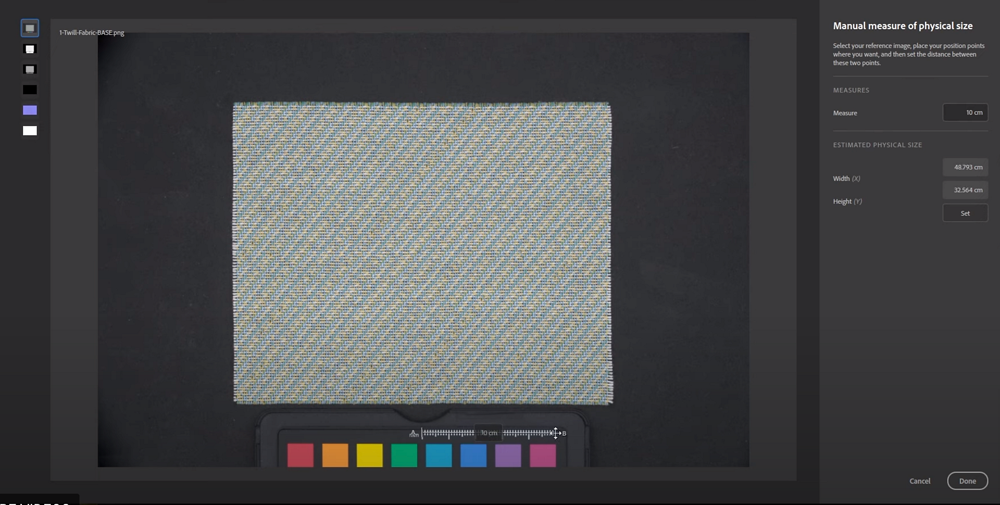

# Workflow de Taille physique de bout en bout

Faites correspondre la taille physique réelle de vos échantillons et images numérisés dans un cadre numérique pour créer des visuels physiquement précis dans toutes les applications.

## Importer des numérisations

1. Sélectionnez le modèle de création de matières.
1. Cochez la case taille physique.

   
1. Deux approches pour définir la Taille physique :

   3 bis. Cliquez sur Mesure manuelle - L’outil Mesure vous permet d’étalonner la taille physique entre 2 fonctions de l’échantillon.\
   Suivi entre deux points -> entrée

   

   3 ter. Mesure automatique : l’outil Mesure automatique vous permet d’obtenir une taille physique estimée de votre échantillon en fonction des métadonnées de l’image (ppp). Il est plus rapide, mais ne fonctionne qu’avec les numérisations, car il utilise la valeur ppp stockée pour calculer une taille de départ précise.

   <b>Vous pouvez maintenant traiter les numérisations</b>
1. Ajoutez un recadrage et ajustez-le à l’échantillon. La taille physique affichée dans l&#39;angle inférieur droit de la fenêtre d&#39;affichage 2D est mise à jour.

   Affichez les proportions physiques dans la fenêtre 2D pour voir avec précision les cartes sur lesquelles vous travaillez.\
   Vous pouvez régler la vue 2D pour qu’elle s’adapte à la taille physique afin que la valeur PPP de votre rapport d’écran corresponde à l’échelle de votre matériau. En d&#39;autres termes, vous pouvez placer votre échantillon réel à côté de votre écran pour vérifier les dimensions.

   
1. Ajoutez une option Égaliser pour supprimer les dégradés.
1. Ajout d’une mosaïque pour corriger le mosaïque
1. Si nécessaire, la transformation de déformation est utile pour réaligner uniquement des parties de la texture.

   <b>Prêt à exporter</b>
1. Exporter en tant que

   Sélectionnez le format Sbsar, Sampler y placera des Tailles physiques, sous forme de métadonnées. Cela permettra à d&#39;autres applications de lire et d&#39;utiliser également ces informations.\
   Vous pouvez également exporter des images ; cela respectera le rapport de taille physique.

   Si vous devez utiliser la taille physique à tout moment, utilisez le *panneau Taille physique*.

   Lors de l&#39;exportation en tant qu&#39;images, il est désormais possible de forcer la taille des images à respecter le rapport de taille physique.

## Tutoriel vidéo

Vous pouvez également trouver des tutoriels vidéo pour vous aider à découvrir cette fonctionnalité :
