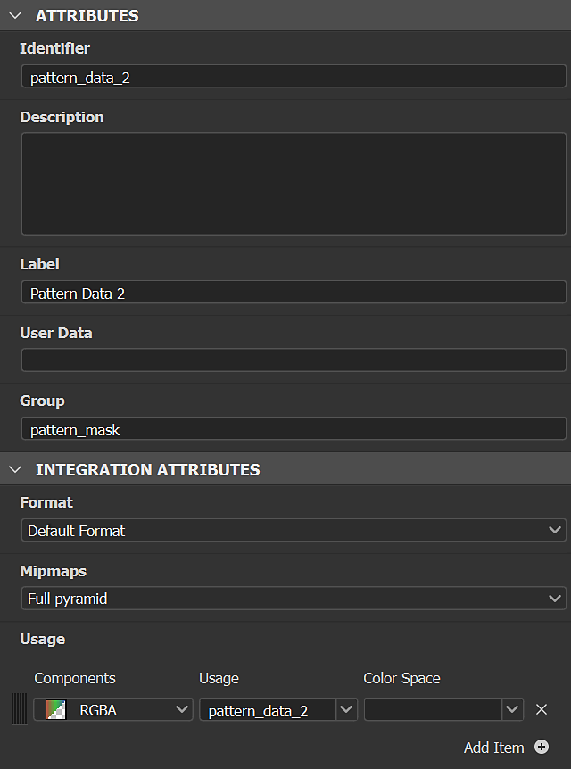

# Générateurs de textures

Les générateurs de textures offrent un meilleur contrôle sur la création de matériaux à l&#39;aide des options <b>bruits, motifs </b> et<b> grunges</b> paramétriques. Les images générées peuvent être utilisées dans des masques ou des couches colorées.

<table>
<tr style="border: 0;">
<td style="border: 0;" valign="top">

</td>
<td style="border: 0;" valign="top">

Les générateurs de textures sont un type de ressources dans Substance 3D Sampler. Ils peuvent être filtrés dans le panneau Actifs avec l’icône Générateurs de Textures.

</td>
</tr>
</table>

## Comment utiliser les générateurs de Textures

### Cartes de couches

Glissez-déposez un générateur de textures dans la vue 3D, la Vue 2D ou la pile de calques et sélectionnez une couche pour l’utiliser.

Un filtre Remplissage sera créé dans la pile avec le générateur de Textures dans la bonne entrée. Vous pouvez accéder aux propriétés du générateur de Textures dans le panneau Propriétés.

#### Filtres

Certains filtres tels que <b>Parquet</b> utilisent par défaut des générateurs de textures pour les masques de motif. D&#39;autres utilisent une image ou un générateur de Textures comme le filtre <b>Motif</b>.\
Dans les filtres, vous pouvez utiliser des générateurs de textures dans n&#39;importe quelle propriété d&#39;image, par exemple les <b>masques personnalisés</b>.

Les filtres peuvent suggérer des générateurs à utiliser ; ils s’affichent dans le nouveau sélecteur d’actifs, lorsque vous cliquez sur une propriété d’image.

#### Tutoriel

Tous les tutoriels Substance 3D Sampler sont disponibles sur notre [page d’apprentissage](https://creativecloud.adobe.com/cc/learn/app/substance-3d-sampler).

[Conception de textiles avec les générateurs de Textures Sampler](https://creativecloud.adobe.com/cc/learn/substance-3d-sampler/web/fabric-texture-generator?locale=en)

[Matériau de fibres de carbone en quelques minutes avec Substance 3D Sampler](https://creativecloud.adobe.com/cc/learn/substance-3d-sampler/web/create-carbon-fiber-material?locale=en)

[Matériau de tissu écossais en quelques minutes avec Substance 3D Sampler](https://creativecloud.adobe.com/cc/learn/substance-3d-sampler/web/create-plaid-fabric-material?locale=en)

## Création de générateurs de Textures personnalisés

Vous pouvez importer des générateurs de Textures créés avec Adobe Substance 3D Designer via le bouton *Importer* dans les actions de Pile de calques. Ils doivent être configurés d’une manière spécifique dans Designer pour fonctionner correctement lors de leur importation dans Sampler.

### Type

Choisissez « générateur de Textures » comme type</b> de graphe<b>.

#### Sorties

Le nœud de sortie des filtres du filtre doit avoir l&#39;<b>identifiant</b> ou l&#39;<b>utilisation </b> défini :

* La sortie principale du générateur de Textures ne doit pas être utilisée. Il peut alors être reconnu comme la sortie principale de 3D Sampler.

<table>
<tr style="border: 0;">
<td style="border: 0;" valign="top">

</td>
<td style="border: 0;" valign="top">

</td>
</tr>
</table>

* La <b>sortie secondaire</b> du générateur de Textures nécessite <b>utilisation</b> pour être utilisée.\
  Leur nom de groupe sera le <b>Identifiant</b> de la sortie principale.

>[!NOTE]
>
> Si vous créez vos propres filtres et générateurs de Textures pour travailler ensemble, nous vous recommandons d&#39;utiliser des <b>utilisations personnalisées</b> en fonction des <b>Identifiants de sortie</b>.

<table>
<tr style="border: 0;">
<td style="border: 0;" valign="top">

</td>
<td style="border: 0;" valign="top">

</td>
</tr>
</table>

>[!IMPORTANT]
>
> Si vous souhaitez que votre générateur de Textures personnalisé figure dans une liste de ressources suggérées, vous devez ajouter les données utilisateur suivantes dans votre graphe de Substance :
> 
> alchemist::sugtedfilters=[FilterName,FilterName2];

>[!NOTE]
>
> Les données utilisateur peuvent être utilisées avec [filtres personnalisés](../filters/custom-filters.md).

#### Format

Exportez votre filtre en tant que fichier d’archive de Substance de données (.sbsar)

>[!NOTE]
>
> Vous pouvez exposer des paramètres de filtre pour contrôler le filtre directement dans Sampler. Voir comment [ici](https://experienceleague.adobe.com/fr/docs/substance-3d-designer/using/substance-graphs/manage-parameters/exposing-a-parameter)
