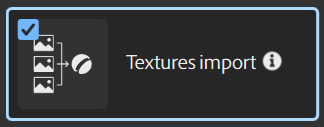

# Importation de texture

Le modèle **Importation de Textures** charge plusieurs images et les connecte automatiquement aux canaux de sortie corrects en fonction de leurs noms de fichier.

La correspondance des canaux est basée sur les conventions de dénomination spécifiques détaillées ci-dessous. En cas de doublons ou de textures sans correspondance, les images seront marquées comme telles dans l&#39;interface.

## OpenPBR

Sampler met en correspondance les fichiers avec les OpenPBR suivants avec le canal équivalent dans le matériau.

>[!NOTE]
>
> Les identifiants de canal Height sont les mêmes que ceux utilisés pour ASM.

| Identifiant OpenPBR | Utilisation SBSAR |
| --- | --- |
| poids_de_base | baseWeight |
| base_color | baseColor |
| base_metalness | métallurgie/métallique |
| base_diffuse_rugosité | baseDiffuseRoughness |
| specular_weight | specularWeight |
| specular_color | specularColor |
| specular_rugosité | specularRugosité/rugosité |
| specular_rugosité_anisotropie | specularRoughnessAnisotropy/anisotropyLevel |
| specular_ior | IOR/IOR spéculaire |
| transmission_weight | transmissionWeight |
| transmission_color | transmissionColor/absorptionColor |
| transmission_profondeur | transmissionDepth/absorptionDistance |
| transmission_dispersion | transmissionScatter |
| transmission_dispersion_anisotropie | transmissionScatterAnisotropy |
| transmission_dispersion_scale | transmissionDispersionScale |
| transmission_dispersion_abbe_number | transmissionDispersionAbbeNumber |
| subsurface_weight | subsurfacePoids/translucency |
| subsurface_color | subsurfaceColor/scatteringColor |
| subsurface_radius | subsurfaceRadius/scatteringDistance |
| subsurface_radius_scale | subsurfaceRadiusScale/scatteringDistanceScale |
| subsurface_dispersion_anisotropie | subsurfaceScatterAnisotropy |
| coat_weight | coatWeight/coatOpacity |
| coat_color | coatColor |
| coat_rugosité | rugosité du pelage |
| coat_rugosité_anisotropie | coatRoughnessAnisotropy |
| coat_ior | coatIOR |
| coat_darkening | coatDarkening |
| fuzz_weight | fuzzWeight/sheenOpacity |
| fuzz_color | fuzzColor/sheenColor |
| fuzz_rugosité | fuzzRoughness/sheenRoughness |
| emission_weight | emissionWeight |
| emission_luminance | luminance d&#39;émission |
| emission_color | emissionColor/emisive |
| poids_film_fin | thinFilmWeight |
| thickness_film_fin | thinFilmThickness |
| couche mince | thinFilmIOR |
| opacité | opacité |
| fine_paroi | ThinWaled |
| normal | normal |
| tangente | tangente |
| coat_normal | coatNormal |
| coat_tangente | coatTangent |

## Adobe Standard Material

Vous trouverez ci-dessous une liste des conventions de dénomination de fichier prises en charge pour chaque canal :

| **Canal** | **Adobe Standard Material** |
| --- | --- |
| **Ambient occlusion** | <ul><li>occlusion ambiante</li><li>ao</li><li>occlusion</li><li>ambient_occlusion</li></ul> |
| **Base color** | <ul><li>couleur de base</li><li>couleur</li><li>albédo</li><li>base_color</li><li>base</li><li>col</li><li>couleur</li><li>base_color</li><li>couleur de base</li></ul> |
| **Diffuse** | <ul><li>diffuse</li><li>diff</li></ul> |
| **Emissive** | <ul><li>émissif</li></ul> |
| **Brillance** | <ul><li>brillance</li><li>gloss</li></ul> |
| **Height** | <ul><li>hauteur</li><li>heightmap</li><li>displacement</li><li>disp</li></ul> |
| **Métallique** | <ul><li>métallique</li><li>mtl</li><li>métallurgie</li></ul> |
| **Normal** | <ul><li>normal</li><li>nrm</li></ul> |
| **Opacité** | <ul><li>opacité</li><li>alpha</li></ul> |
| **Rugosité** | <ul><li>rugosité</li><li>rugueux</li></ul> |
| **Specular** | <ul><li>spéculaire</li><li>spécification technique</li></ul> |
| **Specular level** | <ul><li>niveau spéculatif</li><li>specular_level</li></ul> |

