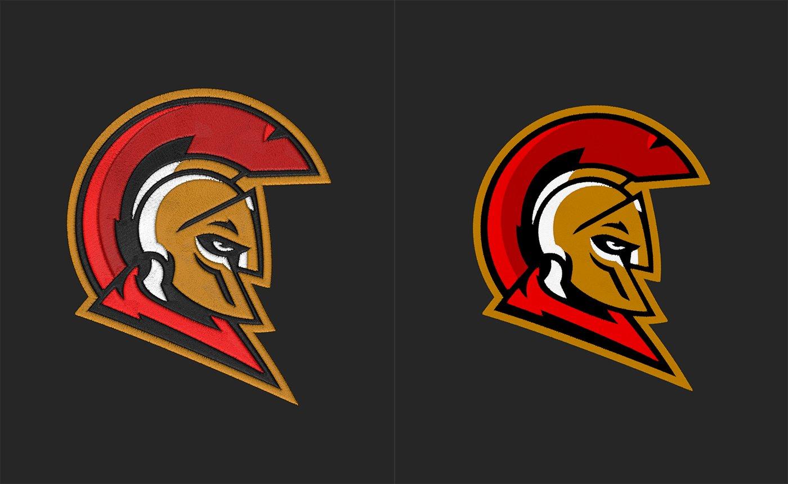

# Broderie

<table>
<tr style="border: 0;">
<td width="41.60%" style="border: 0;" valign="top">

Générateurs De **Entrée :**

</td>
<td width="58.30%" style="border: 0;" valign="top">

## Description

Le filtre Broderie vous permet de convertir rapidement des images en correctifs brodés. Vous pouvez personnaliser l’apparence des correctifs et utiliser les outils de gestion des couleurs pour faire office de masque pour plusieurs matières.

Les images ci-dessous montrent le **filtre Broderie** en action.

Dans l’image ci-dessus, l’image source a été importée. Notez que l’image est opaque et présente un arrière-plan blanc.

Dans l&#39;image ci-dessus, le **filtre Broderie** a été ajouté à la pile de calques et a converti l&#39;image source en un patch brodé. Notez que bien que l&#39;image source soit opaque, la sortie du **filtre Broderie** est transparente.

</td>
</tr>
</table>

## Module externe de broderie Tajima

Vous souhaitez tester le plug-in de broderie Tajima ? \
En savoir plus [ici](../../pipeline-and-integrations/tajima-exporter-plugin.md).

## Paramètres

<b>Paramètres de base</b>

* <b>Générateur aléatoire</b> :\
  Valeur de départ aléatoire sur laquelle sont basés tous les autres paramètres aléatoires de ce filtre.
* <b>Image</b> : image/masque\
  Sélectionnez une image sur votre système ou peignez un masque personnalisé.
* <b>Nombre de couleurs</b> : 1-8\
  Le filtre de broderie essaiera de diviser les images importées en couleurs distinctes. Modifiez cette valeur pour modifier le nombre de couleurs utilisées.
* <b>Densité</b> : 80-300\
  Sélectionnez la densité des fibres.
* <b>Conception</b> : Remplissage, Contour, Remplissage + Contour, Point De Suprême\
  Sélectionnez le mode de broderie : *Remplissage* remplit toute la zone de couleur, *Contour* crée un contour de la zone de couleur, *Remplissage + Contour* crée à la fois sur chaque zone de couleur et *Topstitch* crée un contour de toile de dessus de la zone de couleur.
* <b>Remplissage/Contour : </b>0-1\
  Modifiez la façon dont les fibres sont réparties dans la zone de couleur.
* <b>Thread</b> :\
  Réglez le Thickness et la longueur des filetages.
* <b>Zones lisses :</b>0-1\
  Équilibrez les zones de couleur et affectez le comportement des filetages.
* <b>Imperfections</b> : 0-1\
  Ajoutez des imperfections au lien pour aider à briser le motif

<b>Couleur 1</b>

Utilisez les commandes pour régler chaque zone de couleur individuellement.

* <b>Remplir</b> : activer/désactiver\
  Rendez la zone de couleur visible ou non visible.
* <b>Height</b> : \
  Décaler l&#39;orientation des filetages

<b>Finition du point</b>

* <b>Couleur personnalisée :</b>\
  Personnalisation de la couleur de toute la broderie
* <b>Rugosité :</b>0-1\
  Modifiez la valeur du curseur Rugosité pour rendre la broderie rugueuse ou brillante.
* <b>Métallique :</b>0-1\
  Modifiez la valeur Métallique pour ajouter un aspect métallique aux filetages.
* <b>Niveau d&#39;Anisotropie : </b>0-1\
  Modifiez le niveau d’Anisotropie pour accentuer le caractère métallique.

<b>Avancé</b>

* <b>Intensité normale</b> : 0-1\
  Réglez l’intensité des normales.
* <b>Plage d&#39;Heights :</b> 0-1\
  Ajustez la position Height de la broderie sur le matériau de base.
* <b>Position Height :</b> 0-1\
  Ajustez la position Height de la broderie sur le matériau de base.

## Guide d’utilisation

Le filtre Broderie peut être un peu confus au début, mais avec seulement quelques paramètres importants pour commencer, vous allez ajouter des correctifs à vos matériaux en un rien de temps.

>[!NOTE]
>
> Si vous avez déjà utilisé le filtre [Tissage](weave.md)auparavant, le filtre Broderie fonctionne de manière similaire.

Pour utiliser le filtre Broderie :

1. Ajoutez le filtre Broderie à votre pile de calques.
1. Utilisez <b>Paramètres de base > Image</b> pour ajouter une image au filtre, ou ajoutez une image à la pile de calques sous le filtre Broderie (pas dans l&#39;un des emplacements d&#39;entrée). Si une image n&#39;est pas ajoutée aux <b>paramètres de base > Image</b>, le filtre prélève automatiquement les images des canaux de numérisation, le cas échéant.
1. Réglez <b>Paramètres de base > Nombre de couleurs </b> jusqu’à ce que la balance des couleurs soit correcte pour votre image. Avec une limite de 8 couleurs, activez ou désactivez les couleurs pour isoler les couleurs dont vous avez besoin.\
   Le filtre Broderie fonctionne mieux avec les couleurs plates et les images illustrées.
1. Réglez d’autres paramètres pour affiner l’apparence de votre correctif.

Il est possible d’utiliser des images transparentes dans le filtre Broderie, mais par défaut, elles auront également un impact sur la carte d’opacité de votre matériau. Les parties transparentes de l’image rendront également le matériau transparent. Pour créer un patch avec le filtre Broderie et le faire reposer sur les calques sous-jacents, utilisez le filtre Décalcomanie.

1. Créez un filtre Décalcomanie.
1. Ajoutez le filtre Broderie à l’emplacement d’entrée du filtre Décalcomanie.
1. Suivez les étapes normales pour ajuster le motif de broderie.

Le calque de la décalcomanie convertit l’entrée Broderie en une décalcomanie. La transparence du calque Broderie indique donc au calque de la décalcomanie comment masquer le motif Brodé. Avec le calque Décalcomanie, vous pouvez également déplacer le motif sur votre matériau ou activer des fonctionnalités telles que la mosaïque.
