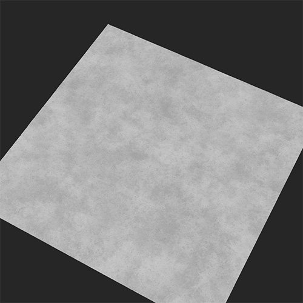

# Carreaux de sol

<table>
<tr style="border: 0;">
<td width="41.60%" style="border: 0;" valign="top">

Générateurs De **Entrée :**

</td>
<td width="58.30%" style="border: 0;" valign="top">

## Description

Le filtre Carreaux de sol décompose le matériau sous-jacent et le convertit en un arrangement de carreaux de sol.

Les images ci-dessous montrent un matériau en béton converti en carrelage avec un motif en damier.

<table>
<tr style="border: 0;">
<td style="border: 0;" valign="top">

{width="200px"}

</td>
<td style="border: 0;" valign="top">

{width="200px"}

</td>
</tr>
</table>

</td>
</tr>
</table>

Paramètres

<b>Paramètres de base</b>

* <b>Générateur aléatoire</b> : \
  La valeur de départ aléatoire détermine les valeurs aléatoires des autres paramètres qui utilisent le caractère aléatoire dans ce filtre.
* <b>Nombre de matériaux</b> : \
  Modifiez le nombre de matériaux à convertir en carreaux de sol. Le premier matériau est déterminé par les calques situés sous le calque de filtre Carreaux de sol. Si cette option est sélectionnée, la seconde peut être ajoutée comme entrée
* <b>Intensité des matériaux d&#39;entrée</b> : 0-1 \
  Degré de visibilité des détails des matériaux d’entrée dans les mosaïques
* <b>Inverser les matières</b> : activer/désactiver \
  Lorsque vous utilisez deux matériaux, exchange là où ils apparaissent dans les carreaux.
* <b>Variation de couleur</b> : 0-1 \
  Degré de variation de la couleur entre chaque carreau du même matériau
* <b>Rayon de biseau</b> : 0-1 \
  Taille de la tuile par rapport à la taille du mortier
* <b>Profondeur en biseau</b> : 0-1 \
  Profondeur du mortier
* <b>Arrondi du biseau</b> : 0-1 \
  Détermine les angles extérieurs des carreaux
* <b>Grain De Surface</b> : 0-1 \
  Détermine le niveau de détail de la matière d’origine sur les cartes de normales et d’height des mosaïques
* <b>Masque de motif</b> : entrée.  \
  Chaque masque de motif Carreaux de sol dispose d’un jeu de paramètres différent. Ici, nous ne couvrons que les paramètres disponibles pour <b>carreau</b>

  * <b>Graine aléatoire </b>\
    La valeur de départ aléatoire détermine les valeurs aléatoires des autres paramètres qui utilisent le caractère aléatoire dans ce filtre.
  * <b>X Quantité </b>\
    Ajuster le nombre de colonnes de mosaïques
  * <b>Quantité Y</b> \
    Ajuster le nombre de lignes de mosaïques
  * <b>Dégradé </b> \
    Ajuste la proportion de la taille du carreau par rapport à la taille du mortier.
  * <b>Luminance aléatoire</b>\
    Comme la luminance a une incidence sur la carte des heights, ce paramètre supprime aléatoirement certains carreaux
  * <b>Rotation du motif</b> : 0-1 \
    Fait pivoter l’angle des carreaux, en les maintenant éloignés les uns des autres pour éviter toute superposition
  * <b>Échelle de forme :</b> 0-1 \
    Ajuste la proportion de la taille du carreau par rapport à la taille du mortier.
  * <b>Échelle de forme aléatoire </b>\
    Ajoute de manière aléatoire une différence de taille des vignettes
  * <b>Taille de forme </b>\
    Réglage de la longueur et de la largeur des carreaux
  * <b>Taille de forme aléatoire </b>\
    Ajout d’un effet aléatoire à la longueur et à la largeur des carreaux
  * <b>Mode de décalage de position</b> : liste déroulante
  * <b>Décalage de position </b>\
    Décale de manière aléatoire les colonnes de mosaïques afin qu’elles ne soient pas alignées horizontalement
  * <b>Position aléatoire</b> \
    Positionne les carreaux de manière aléatoire sur la surface, avec une certaine superposition potentielle entre les carreaux
  * <b>Rotation de la forme </b>\
    Faites pivoter l&#39;angle des carreaux dans la même direction, tout en les gardant aussi proches que possible avec une superposition potentielle
  * <b>Rotation aléatoire de la forme </b>\
    Faites pivoter aléatoirement l&#39;angle des carreaux, tout en les gardant aussi proches que possible avec une superposition potentielle

<b>Écart</b>

* <b>Couleur d&#39;espace</b> : sélection de la couleur \
  Modification de la couleur d’une mosaïque à l’autre
* <b>Rugosité de l&#39;espace</b> : 0-1 \
  Modifiez la valeur de rugosité du matériau entre les carreaux.
* <b>Écart métallique</b> : 0-1 \
  Changez la valeur métallique du matériau entre les carreaux.
* <b>Height de l&#39;espace</b> : 0-1 \
  Modifiez la valeur d’height de la matière entre les carreaux.
* <b>Irrégularité d&#39;espace</b> : 0-1 \
  Ajustez la netteté de l&#39;application du mortier entre les carreaux.

<b>Âge</b>

* <b>Inclinaison du sol</b> : 0-1 \
  Ajouter une inclinaison aux mosaïques aléatoires
* <b>Height aléatoire</b> \
  Ajout aléatoire d’une différence d’height entre les mosaïques
* <b>Dirt</b> : 0-1 \
  Ajouter du dirt aux carreaux et à l’espace
* <b>Dommages</b> : 0-1 \
  Supprimez de manière aléatoire certaines taches sur le bord du biseau de chaque carreau
* <b>Imperfections</b> \
  Ajout de petits trous et d’imperfections dans les carreaux

<b>Paramètres techniques</b>

* <b>Échelle du matériau</b> : 0-1 \
  Échelle du matériau dans les carreaux
* <b>Intensité normale</b> : 0-1 \
  Réglez l’intensité de la normale de l’espace, des carreaux et de la matière à l’intérieur

<b>Guide d&#39;utilisation</b>

Le filtre Carreaux de sol vous permet de convertir rapidement votre matière en carreaux. La plupart des filtres Carreaux de sol sont assez simples à utiliser, sauf lorsque vous utilisez plusieurs matériaux. Pour utiliser deux matières :

1. Définissez <b>Paramètres de base > Nombre de matières</b> sur 2.
1. Faites glisser le deuxième matériau dans l’emplacement d’entrée qui apparaît sous le filtre Carreaux du sol de la pile de calques.
1. Ajustez les paramètres de la matière d&#39;entrée jusqu&#39;à ce que vous soyez satisfait du résultat.

Bien qu&#39;il soit possible d&#39;ajouter plusieurs matériaux et filtres dans un seul emplacement d&#39;entrée, il est généralement préférable d&#39;éviter cette procédure, car elle ajoute de la complexité et peut rendre la lecture de votre matériau plus difficile lorsque vous y reviendrez plus tard. Créez plutôt de nouvelles matières dans votre projet, puis faites glisser une instance de votre nouvelle matière dans l’emplacement d’entrée. Lorsque vous mettez à jour le matériau dans votre projet, le matériau est automatiquement mis à jour dans l’emplacement d’entrée, ce qui vous donne un contrôle total et simplifie la pile de calques.
