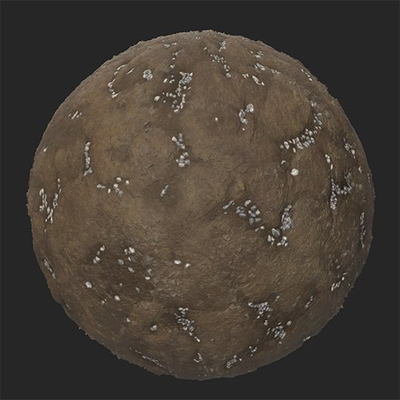

# Gravier

<table>
<tr style="border: 0;">
<td width="41.60%" style="border: 0;" valign="top">

Générateurs De **Entrée :**

</td>
<td width="58.30%" style="border: 0;" valign="top">

## Description

Le filtre de gravier recouvre de gravier votre matériau de manière naturelle, en remplissant les crevasses.

Ces images montrent le **filtre de gravier** utilisé pour remplir les crevasses d&#39;un matériau de boue avec du gravier.

<table>
<tr style="border: 0;">
<td style="border: 0;" valign="top">

</td>
<td style="border: 0;" valign="top">

</td>
</tr>
</table>

</td>
</tr>
</table>

## Paramètres

**Paramètres de base**

* **Générateur aléatoire** :\
  La valeur de départ aléatoire détermine les valeurs aléatoires des autres paramètres qui utilisent le caractère aléatoire dans ce filtre.
* **Quantité** : 0-1\
  Modifiez la quantité de gravier répartie sur le matériau.
* **Couleur primaire** : sélection de la couleur\
  Sélectionner la couleur de base des pierres de gravier
* **Couleur secondaire** : sélection de couleur\
  Sélectionner la couleur secondaire des pierres de gravier
* **Correspondance des couleurs du matériau inférieur** : 0-1\
  Ajustez l’impact de la couleur du gravier sur la couleur du matériau sous-jacent
* **Activer le masque de cavité** : activer/désactiver\
  Lorsque cette option est activée, le gravier remplit les cavités et n&#39;est pas étalé sur les parties supérieures du matériau. Cela peut entraîner une dispersion plus réaliste du gravier.
* **Seuil de volume de diffusion** : 0-50\
  Ajuster le volume de diffusion en fonction des valeurs d&#39;height
* **Masquage Aléatoire** : 0-1\
  Définir le pourcentage de gravier pour masquer de manière aléatoire
* **Taille de la pierre** : 1-10\
  Contrôle de la taille des pierres
* **Variation de la taille de la pierre** : 0-1\
  Contrôle du caractère aléatoire de la taille de la pierre
* **Arrondi De La Pierre** : 0-1\
  Rendez les pierres plus arrondies ou plus angulars
* **Rugosité de la pierre** : 0-1\
  Modifier la valeur de rugosité des pierres
* **Height de pierre** : 0-1\
  Modifiez l’height des pierres. Cela a un impact sur la façon dont les pierres se fondent dans le matériau sous-jacent.
* **Élévation des pierres** : 0-1Modifiez l&#39;élévation de base des pierres. L&#39;élévation définit le sol sur lequel reposent les pierres, tandis que l&#39;height définit l&#39;height des pierres sur le sol.
* **Altitude De La Pierre Aléatoire** : 0-1\
  Ajoutez une valeur aléatoire à l&#39;altitude de chaque pierre.
* **Smoothness de surface** : 0-1\
  Lisser le sommet des pierres
* **Utiliser un masque personnalisé** : activer/désactiver\
  Activez ou désactivez l’utilisation d’un masque personnalisé pour peindre des emplacements de pierre. Les paramètres suivants ne seront visibles que si l&#39;option **Utiliser un masque personnalisé** est activée.
  * **Flou de masque** : 0-1\
    Atténuation des contours du masque peint
  * **Masque personnalisé** : image/pinceau\
    Cliquez sur le pinceau pour peindre un masque personnalisé dans lequel des pierres apparaîtront. Cliquez sur le carré pour importer une image à utiliser comme masque.

**Paramètres avancés**

* **Taille de la surface (cm)** : 0-1 000\
  Modifiez la taille de la surface représentée par votre matériau. L&#39;augmentation de la taille de la surface signifie que la taille physique des pierres de gravier est plus grande, et elles seront modifiées en conséquence.
* **Profondeur Height** **(cm)** : 0-100\
  Modifiez la profondeur physique représentée par la carte d&#39;height de votre matériau. Une augmentation de la profondeur des heights signifie que la taille physique des calculs est plus haute qu’elle ne le serait autrement, l’intensité normale des calculs est donc augmentée.
