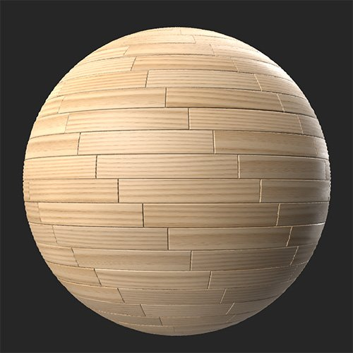

# Parquet

<table>
<tr style="border: 0;">
<td width="41.60%" style="border: 0;" valign="top">

Générateurs De **Entrée :**

</td>
<td width="58.30%" style="border: 0;" valign="top">

## Description

Transformez votre matériau en parquet.

*Un matériau en bois converti en motif de parquet avec le **filtre Parquet**.*

<table>
<tr style="border: 0;">
<td style="border: 0;" valign="top">

{width="200px"}

</td>
<td style="border: 0;" valign="top">

{width="200px"}

</td>
</tr>
</table>

</td>
</tr>
</table>

## Paramètres

**Paramètres prédéfinis**

Utilisez les paramètres prédéfinis pour modifier rapidement les paramètres et voir les différents styles de parquet.

**Paramètres de base**

* **Générateur aléatoire** :\
  La valeur de départ aléatoire détermine les valeurs aléatoires des autres paramètres qui utilisent le caractère aléatoire dans ce filtre.
* **Type de motif** :\
  Sélectionner le motif de parquet
* **X Amount** : 1-30\
  Modification du nombre de planches sur l’axe X
* **Quantité Y** : 1-30\
  Modification du nombre de planches sur l’axe Y
* **Distance de couture** : 0-1\
  Modifier la distance du biseau autour des coutures de planches
* **Variation des planches** : 0-1\
  Variation automatique de la couleur et de la rugosité de chaque planche

**Avancé**

* **Décalage du motif anglais** : 0-1 (ce paramètre est uniquement disponible si **Paramètres de base > Type de motif** est défini sur **Anglais**)\
  Modifier le décalage de chaque ligne de planches par rapport à la ligne précédente
* **Intensité de la couture** : 0-1\
  Ajustez les normales des coutures entre les planches pour les rendre plus ou moins visibles
* **Courbe Biseau Couture** : 0-1\
  Modifier la largeur du biseau entre les planches
* **Plage d&#39;Height de couture** : 0-1\
  Régler l’height des coutures
* **Variation de rotation normale des planches** : 0-1\
  Faire varier l’angle de chaque planche de façon aléatoire
* **Variation de la rugosité des planches** : 0-1\
  Faites varier de façon aléatoire la rugosité de chaque planche.
