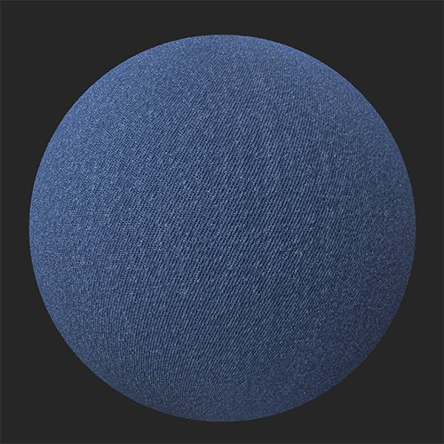

# Motif

<table>
<tr style="border: 0;">
<td width="41.60%" style="border: 0;" valign="top">

Générateurs De **Entrée :**

</td>
<td width="58.30%" style="border: 0;" valign="top">

## Description

Ajoutez un motif à votre matière à partir de l’une des options disponibles ou utilisez une image ou un pinceau pour personnaliser les vôtres.

*Exemple du **filtre de motif**appliqué au denim.*

<table>
<tr style="border: 0;">
<td style="border: 0;" valign="top">

{width="200px"}

</td>
<td style="border: 0;" valign="top">

{width="200px"}

</td>
</tr>
</table>

</td>
</tr>
</table>

## Paramètres

<b>Paramètres de base</b>

* <b>Générateur Aléatoire</b> : 0-1\
  La valeur de départ aléatoire détermine les valeurs aléatoires des autres paramètres qui utilisent le caractère aléatoire dans ce filtre.
* <b>Motif </b> : sélecteur d’images et/ou peinture\
  Sélectionnez un motif dans le générateur de textures ou importez-en un
* <b>Sélection du mode colorimétrique </b> : matière ou couleur uniquement\
  Le mode <b>Matériau</b> influence tous les *canaux PBR* et le mode <b>Couleur uniquement</b> influence uniquement la *couleur de base* du matériau.
* <b>Quantité de couleur </b> : 1-10\
  Sélectionnez la quantité de couleur active dans le motif
* <b>teinte</b> : 0-1\
  Réglage de la teinte de couleur du motif
* <b>Couleur du masque</b> : activer/désactiver\
  Masquer la couleur sélectionnée, selon la <b>quantité de couleur</b>
* <b>Remplacer la couleur : </b>activer/désactiver\
  Remplacer la couleur sélectionnée, selon la <b>quantité de couleur</b>
* <b>Rugosité</b> : 0-1\
  Définir la rugosité de la couleur sélectionnée dépend de la <b>quantité de couleur</b>
* <b>Métallique</b> : 0-1\
  Définir la rugosité de la couleur sélectionnée dépend de la <b>quantité de couleur</b>
* <b>Mode estampage</b> : basculer\
  Sélectionner la direction de l&#39;estampage de la couleur sélectionnée, en fonction de la quantité de couleur <b></b>
* <b>Intensité de l’estampage : </b>0-1<b>\
  </b>L&#39;intensité de l&#39;estampage de la couleur sélectionnée dépend de la <b> quantité de couleur</b>
* <b>Distance d’estampage : </b>0-1\
  Étirer et lisser la zone d&#39;estampage de la couleur sélectionnée, en fonction de la <b> quantité de couleur</b>
* <b>Estampage du grain :</b>0-1\
  Ajouter du grain dans la couleur sélectionnée, selon la <b>quantité de couleur</b>
