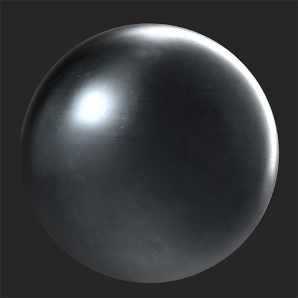

# Perforer

<table>
<tr style="border: 0;">
<td width="41.60%" style="border: 0;" valign="top">

Générateurs De **Entrée :**

</td>
<td width="58.30%" style="border: 0;" valign="top">

## Description

Utilisez le filtre Perforation pour ajouter des trous à votre matière.

*Avant et après l&#39;application du **filtre Perforé**.*

<table>
<tr style="border: 0;">
<td style="border: 0;" valign="top">

{width="200px"}

</td>
<td style="border: 0;" valign="top">

{width="200px"}

</td>
</tr>
</table>

</td>
</tr>
</table>

## Paramètres

**Paramètres de base**

* **Générateur aléatoire** :\
  La valeur de départ aléatoire détermine les valeurs aléatoires des autres paramètres qui utilisent le caractère aléatoire dans ce filtre.
* **Sélection de motif** :\
  Sélectionnez la forme des trous ou choisissez Motif personnalisé pour créer le vôtre.
* **Position de la perforation** :\
  Indiquez si les normales et l’height doivent reculer dans le matériau ou se démarquer de celui-ci
* **Taille Du Chanfrein De Perforation** : 0-1\
  Modification de la taille du chanfrein sur les arêtes des trous
* **Taille du trou** : 0-1\
  Modification de la taille des trous
* **Utiliser le masque** : activer/désactiver\
  Active la **section Masque** que vous pouvez utiliser pour masquer la perforation à l&#39;aide d&#39;un pinceau ou d&#39;une image.
* **Utiliser la carte d&#39;échelle** : activer/désactiver\
  Permet d’utiliser une mise à l’échelle. Lorsque cette option est activée, les paramètres suivants apparaissent :
  * **Multiplicateur De Mappage D&#39;Échelle** : 0-1\
    Ajuster l&#39;impact de la courbe d&#39;échelle sur l&#39;échelle de la perforation
  * **Inverser la carte d&#39;échelle** : activer/désactiver\
    Inverser les valeurs de la carte d’échelle
  * **Mappage d&#39;échelle personnalisé** : image/pinceau\
    Importez une image à utiliser comme échelle ou utilisez le pinceau pour peindre une échelle directement dans la **vue 2D** **vue**

**Masquer**

Cette section est uniquement visible si l&#39;option **Paramètres de base > Utiliser le masque** est activée

* **Inverser le masque** :
* **Flou de masque** : 0-1\
  Réglage du flou appliqué au masque
* **Seuil de masque** : 0-1\
  Modifiez le seuil du masque. Utilisez les valeurs **Flou de masque** et **Seuil du masque** ensemble pour affiner les bords de votre masque.
* **Masque personnalisé** : image/pinceau\
  Importez une image à utiliser comme masque ou peignez votre propre masque directement dans la **vue 2D**

**Perforation**

* **Taille de la perforation** : 0-1\
  Modifiez la taille de chaque perforation, y compris le trou et le chanfrein.
* **Quantité Y De Perforation** : 1-64\
  Ajuster le nombre de perforations sur l&#39;axe Y
* **Quantité X De Perforation** : 1-64\
  Ajuster le nombre de perforations sur l&#39;axe X
* **Densité de perforation** : 0-1\
  Perforations aléatoires du masque
* **Décalage de la perforation** : 0-1\
  Ajuster le décalage d&#39;une rangée de perforations sur deux
* **Opacité De La Couleur De Perforation** : 0-1\
  Régler la transparence de la couleur de la zone chanfreinée des perforations
* **Couleur de perforation** : sélection de la couleur\
  Sélectionner la couleur de la zone chanfreinée de chaque perforation
* **Rugosité de la perforation** : 0-1\
  Modifier la valeur de rugosité des perforations
* **Perforation métallique** : 0-1\
  Modifier la valeur métallique des perforations

**Paramètres avancés**

* **Luminosité** : 0-1
* **Contraste** : -1 à 1
* **Décalage de teinte** : 0-1
* **Saturation** : 0-1
* **Intensité normale** : -1 à 1\
  Régler l&#39;intensité de chaque normale de perforation
* **Intensité de l&#39;Height** : 0-1\
  Régler l&#39;intensité de chaque carte d&#39;height de perforations
