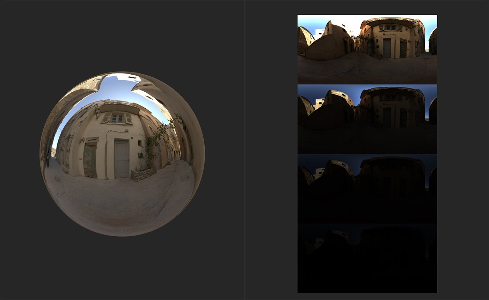

# Aperçu de l’exposition

<table>
<tr style="border: 0;">
<td width="41.60%" style="border: 0;" valign="top">

**Entrées :** Outils HDRI

</td>
<td width="58.30%" style="border: 0;" valign="top">

## Description

Le **filtre** Aperçu de l&#39;exposition **&#x200B;**&#x200B;vous permet de prévisualiser rapidement un spectre de valeurs d&#39;exposition.

Vous pouvez voir ci-dessous ce que fait le **filtre Aperçu de l&#39;exposition**.

Dans l&#39;image ci-dessus, une luminosité de l&#39;environnement a été créée et les données de l&#39;image HDR sont visibles dans la **vue 2D**.

Avec l&#39;**aperçu de l&#39;exposition** **filtre** ajouté à la pile de calques, un nouveau canal - Diagnostics de l&#39;environnement - devient disponible pour afficher l&#39;éclairage de l&#39;environnement à différentes expositions.

</td>
</tr>
</table>

## Paramètres

**Paramètres de base**

* **Exposition min (EV)** : -8 à 8\
  Définissez l’exposition de l’image la moins exposée.
* **Exposition maximale (EV)** : -8 à 8\
  Définissez l’exposition de l’image la plus exposée.

## Guide d’utilisation

Le **filtre Aperçu de l&#39;exposition** fonctionne un peu différemment des autres filtres Sampler. Il s&#39;agit d&#39;un outil conçu pour vous aider à trouver l&#39;exposition correcte à la lumière de votre environnement, mais il n&#39;a aucun impact sur le canal Environnement. En revanche, lorsque vous ajoutez le **filtre Aperçu de l&#39;exposition** à la pile de calques, un canal supplémentaire devient disponible dans la **vue 2D**, à savoir le canal Diagnostic de l&#39;environnement.

Si vous visualisez le canal Diagnostic de l&#39;environnement, vous devriez être en mesure de voir quelques instances de votre image d&#39;environnement 2D à des valeurs d&#39;exposition variables. Ajustez les paramètres du **filtre Aperçu de l&#39;exposition** pour modifier la plage d&#39;expositions visibles dans le canal Diagnostic de l&#39;environnement.
