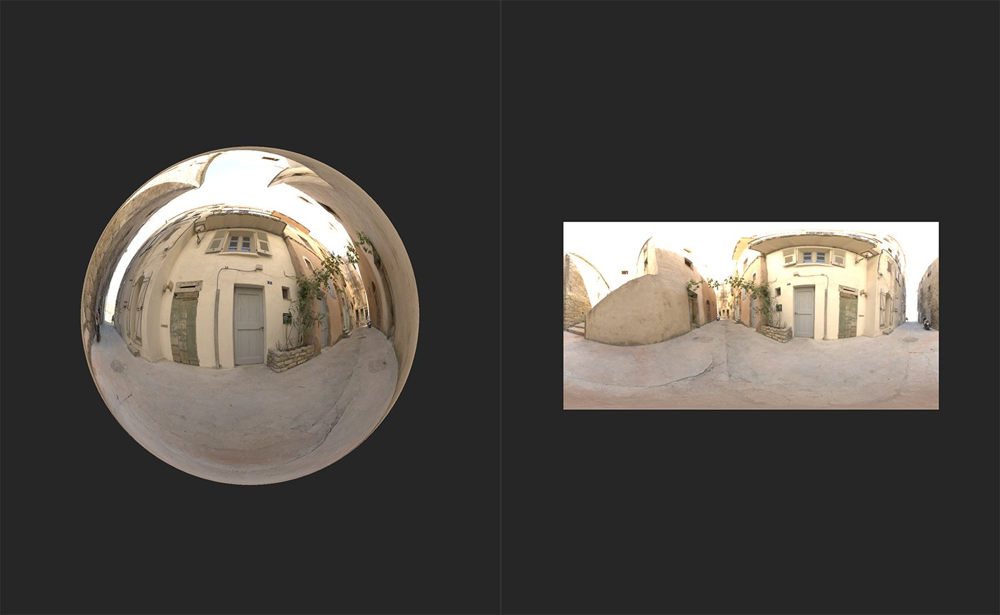

# Exposition

<table>
<tr style="border: 0;">
<td width="41.60%" style="border: 0;" valign="top">

**Entrées :** Outils HDRI

</td>
<td width="58.30%" style="border: 0;" valign="top">

## Description

Modifiez l’exposition de la lumière ambiante.

Les images ci-dessous montrent comment le **filtre Exposition** peut être utilisé pour régler les éclairages de votre environnement.

L&#39;image ci-dessus montre la luminosité de l&#39;environnement avant l&#39;ajout du **filtre d&#39;exposition**.

Avec le **filtre Exposition**, l&#39;exposition de l&#39;environnement a été augmentée, ce qui le fait apparaître beaucoup plus lumineux. Par conséquent, plus de lumière se reflète sur la sphère dans la **vue 3D**.

</td>
</tr>
</table>

## Paramètres

**Paramètres de base**

* **Exposition (EV)** : -8 à 8\
  Réglez l’exposition de la lumière ambiante. EV est l’acronyme de Exposure Value. Il s’agit d’un terme photographique utilisé pour représenter la combinaison de la vitesse d’obturation et de l’ouverture.
