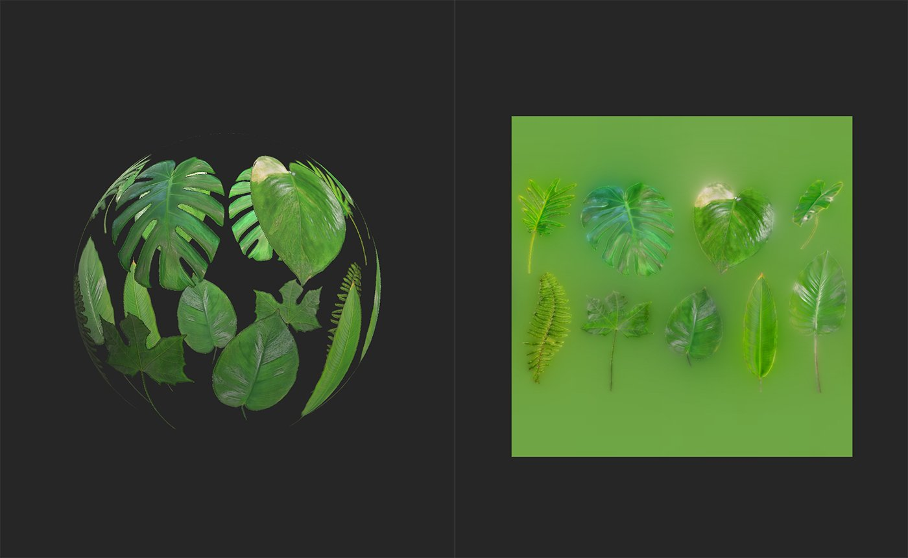

# Créateur d’atlas

<table>
<tr style="border: 0;">
<td width="41.60%" style="border: 0;" valign="top">

Outils **In:**

</td>
<td width="58.30%" style="border: 0;" valign="top">

## Description

Le **créateur d&#39;atlas** **filtre** vous permet de convertir des matériaux et des images en atlas. Vous pouvez ensuite utiliser d&#39;autres filtres tels que **Atlas scatter** et **Atlas splitter** pour utiliser des éléments d&#39;atlas dans les matériaux.

Les images ci-dessous montrent un atlas de feuilles de jungle avant et après traitement par le **créateur d&#39;atlas**.

Dans l’image ci-dessus, une image d’atlas a été importée et convertie en matériau, mais il ne s’agit toujours pas d’un matériau d’atlas, car la texture d’opacité ne tient pas compte des éléments individuels.

Après avoir exécuté **Atlas Creator**, une carte d&#39;opacité est générée et la zone entre les éléments de l&#39;atlas est remplie dans la couche de couleur de base.

</td>
</tr>
</table>

Paramètres

**Paramètres de base**

* **Supprimer les petites formes** : 0-1

  Utilisez cette option pour ajuster la taille minimale des objets dans l’atlas. Ceci est utile pour supprimer des artefacts.
* **Opacité - Influence de la chrominance** : 0-2

  Affinez les contours des éléments de l’atlas en fonction des valeurs chromatiques.
* **Ajouter de l&#39;opacité** : image/pinceau

  Importez un fichier à utiliser comme masque ou utilisez le pinceau pour peindre des zones qui devraient être opaques directement dans la **vue 2D**.

Guide d’utilisation

## Préparation d’une image d’atlas

Avant d&#39;utiliser le **filtre Créateur d&#39;atlas**, il est conseillé de vous assurer que votre image atlas est préparée correctement.

Le **créateur d&#39;atlas** fonctionne en fonction de la couleur de l&#39;image et ne tient pas compte de la transparence. Cela signifie que la meilleure façon de préparer votre image d&#39;atlas est de s&#39;assurer que l&#39;espace entre les éléments est un noir ou un blanc cohérent. Il est ainsi plus facile pour le **créateur d&#39;atlas** de générer le masque d&#39;opacité.

## Génération d’un atlas à partir d’une image

Le **créateur d&#39;atlas** est conçu pour convertir une image d&#39;atlas en atlas de matériaux.

1. Importez votre image source dans la pile de calques.
1. Si vous êtes invité à sélectionner un modèle de création de matériau, sélectionnez Image en matériau. Sinon, avec l&#39;image dans la pile de calques, ajoutez un filtre **Image vers matériau (optimisé par l&#39;IA)** au-dessus de votre image.
1. Attendez le filtre **Image en matériau** pour convertir votre image source en matériau. Ajustez les paramètres jusqu’à ce que vous soyez satisfait du résultat.
1. Ajoutez le **filtre Créateur d&#39;Atlas** en haut de la pile de calques.
1. Ajustez les paramètres de l&#39;**Atlas Creator** jusqu&#39;à ce que vous soyez satisfait des résultats.

1. Ajoutez l’image à la pile de calques. Si vous êtes invité à sélectionner un modèle de création de matière, sélectionnez **Utiliser comme bitmap**.
1. Avec le calque d&#39;image sélectionné, dans le **panneau Propriétés**, modifiez **Utilisation de la sortie** en **Couleur de base**.
1. Ajoutez le **Créateur Atlas** en haut de la pile de calques.
1. Ajustez les paramètres de l&#39;**Atlas Creator** jusqu&#39;à ce que vous soyez satisfait des résultats. Affichez la couche d&#39;opacité dans la **vue 2D** pour voir les résultats du filtre plus clairement.
1. Utilisez le **panneau Exporter** pour exporter les canaux générés.
