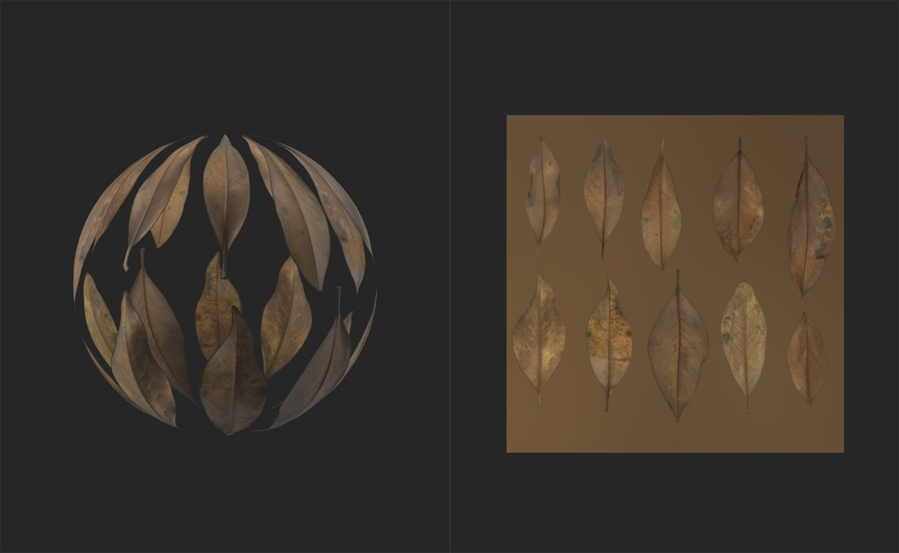

# Outil Recadrage

<table>
<tr style="border: 0;">
<td width="41.60%" style="border: 0;" valign="top">

Outils **In:**

</td>
<td width="58.30%" style="border: 0;" valign="top">

## Description

Utilisez l&#39;**outil Recadrage** pour ajuster le recadrage de votre image ou de votre matériau. L&#39;**outil Recadrage** fonctionne de manière très similaire à l&#39;**outil Transforme**. Avec l&#39;**outil Transforme**, les modifications apportées à la zone de transforme se comportent de manière identique avec l&#39;image sous-jacente. Par conséquent, l&#39;augmentation de l&#39;échelle de la zone de Transforme augmente la taille de l&#39;image sous-jacente. Avec l&#39;**outil Recadrage**, cette relation est inversée, l&#39;augmentation de l&#39;échelle de la zone de recadrage réduit la taille de l&#39;image sous-jacente. Pour cette raison, lorsque vous utilisez l&#39;**outil Recadrage**, il peut être utile de définir la **vue 2D** pour afficher les entrées de calque, au lieu des sorties de Matériau par défaut.

L&#39;**outil Recadrage** est utile pour effectuer des réglages sur des images présentant des formats non standard. Par exemple, vous pouvez utiliser l&#39;outil Recadrage pour régler l&#39;échelle d&#39;une image importée à l&#39;aide des paramètres Taille d&#39;entrée dans le **panneau Propriétés**.

>[!NOTE]
>
> Notez que l&#39;**outil Recadrage** peut fonctionner sur les images ou les matériaux. Si une image ou une couche de numérisation existe dans la pile de calques sous le **calque de recadrage**, le **filtre de recadrage** s&#39;appliquera à la couche de numérisation. S&#39;il n&#39;existe aucune image ou couche de numérisation, le **filtre de recadrage** modifiera le matériau.

Dans les images ci-dessous, vous pouvez voir l&#39;**outil Recadrage** en action.

Notez que la Vue 2D est configurée pour afficher les entrées de calque afin que les poignées de la **Vue 2D** montrent quelle zone de l&#39;entrée deviendra la sortie.

</td>
</tr>
</table>

## Paramètres

**Paramètres de base**

* **Taille d&#39;entrée** : 0-8192\
  Ajustez la taille de l’entrée en pixels sur les axes X et Y.

**Paramètres avancés**

* **Filtrage** :\
  Sélectionnez la méthode de filtrage appliquée aux pixels redimensionnés. Le filtrage bilinéaire floute les pixels les uns dans les autres, tandis que le filtrage le plus proche conserve le contour des pixels.
* **Transforme de recadrage** : 0-1\
  Modifiez les valeurs de la matrice du transforme. La modification de ces valeurs permet un contrôle plus précis de la rotation et de la mise à l’échelle, ainsi qu’une inclinaison des poignées de recadrage.
* **Décalage de recadrage** : 0-1\
  Décalez le recadrage par rapport à la position de départ.

## Guide d’utilisation

>[!NOTE]
>
> Le filtre Recadrage a sa propre résolution. Il recadre et affiche la résolution adéquate en fonction du matériau ou de l’image recadrée. Pour obtenir de meilleurs résultats, placez les calques ci-dessus dans Input Max et utilisez une Agrandissement pour agrandir les résultats finaux.

Cliquez sur l&#39;**outil Recadrage** pour ajouter un nouveau calque de filtre de recadrage en haut de la pile de calques.

La création ou la sélection d&#39;un calque de filtre Recadrage ouvre automatiquement la **Vue 2D**. Avec le calque de recadrage sélectionné, une barre d&#39;outils apparaît en haut de la **Vue 2D**.

## Fonctionnalité

>[!NOTE]
>
> Le filtre Recadrage effectue l’inverse du déplacement, de l’échelle ou de la rotation que vous demandez. Si vous estimez que le filtre Recadrage ne semble pas correct, vous trouverez peut-être le filtre Transforme plus utile.

### Déplacer

Pour déplacer le calque :

1. Survol de la souris dans la zone de transforme
1. Votre curseur se transforme en quatre flèches
1. Cliquez et faites glisser pour déplacer la zone de transforme.

### Échelle

Pour mettre le calque à l’échelle :

1. Placez le curseur de la souris sur l’une des poignées situées au bord ou dans l’angle de la zone de transforme
1. Votre curseur se transforme en quatre flèches.
1. Cliquez et faites glisser pour mettre à l’échelle la zone de transforme.

>[!NOTE]
>
> Les poignées situées dans l’angle de la zone de transforme vous permettent de modifier simultanément l’échelle en deux dimensions, tandis que les poignées situées dans le bord de la zone de transforme vous limitent à une seule dimension.

### Rotation

Pour faire pivoter le calque :

1. Survolez votre souris en dehors de la zone de transformé, mais dans la **Vue 2D**.
1. Une petite flèche horizontale apparaît à côté du curseur.
1. Cliquez et faites glisser pour faire pivoter la zone de transforme.

>[!NOTE]
>
> Vous pouvez modifier le centre de rotation en faisant glisser le petit cercle au centre de la zone de transforme. La boîte de transforme tourne toujours autour de ce cercle.

## Barre d’outils

{width="200px"}

La barre d’outils contient les raccourcis suivants :

* Créer un carré : ajustez l’échelle de la transformation actuelle pour la rendre carrée.
* Rotation +90° (à droite) : rotation de 90° dans le sens des aiguilles d’une montre.
* Rotation -90° (à gauche) : rotation de 90° dans le sens inverse des aiguilles d’une montre.
* Réinitialiser le centre de rotation : réinitialisez le centre de rotation au centre de la zone de Transforme.
* Réinitialiser la transformation : réinitialisez l’outil Transforme à sa position par défaut.
