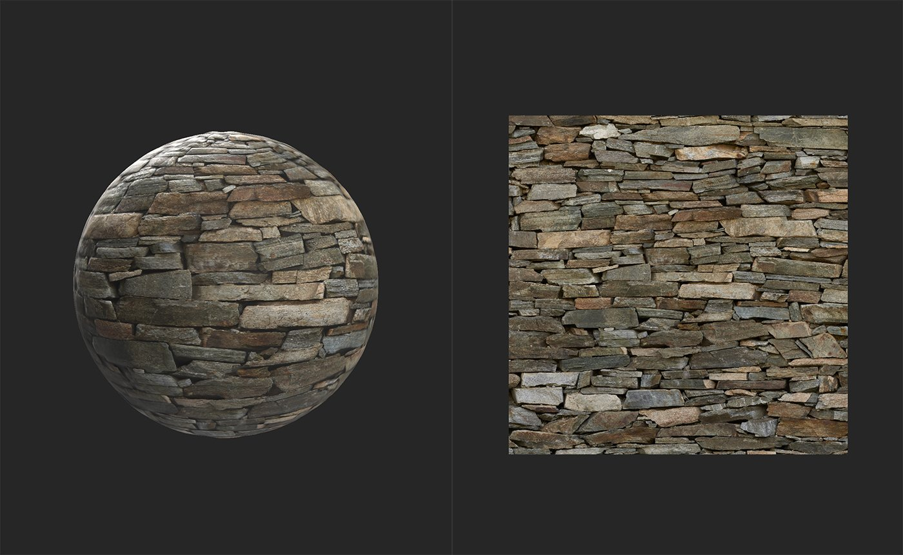

# Delight (optimisé par l’IA)

<table>
<tr style="border: 0;">
<td width="41.60%" style="border: 0;" valign="top">

Outils **In:**

</td>
<td width="58.30%" style="border: 0;" valign="top">

## Description

Le filtre Delighter vous permet de supprimer les informations d’éclairage de la couche de couleur de base. Ceci est important lors de la conversion d’images en matériaux, car généralement les matériaux ne doivent pas inclure d’informations d’éclairage. Un matériau est un ensemble d&#39;informations qui explique comment la lumière doit réagir avec une surface. Ainsi, si des informations de lumière sont déjà transformées en un canal qui ne devrait pas contenir d&#39;informations de lumière, cela peut rompre la capacité du matériau à représenter la surface de manière réaliste.

*Exemple d **image avant et après traitement par le filtre**&#x200B;Delight (optimisé par l’IA)**. Notez que les tons foncés et les tons clairs ont été supprimés, seule la couleur de base est conservée.*

Les images ci-dessous montrent un matériau avant et après traitement par un filtre **Delight (optimisé par l&#39;IA)**.

Dans l&#39;image ci-dessus, le matériau comprend encore une quantité importante d&#39;informations d&#39;éclairage dans la couche de couleur de base. Les ombres sombres entre les briques ne doivent pas être présentes dans la couche de couleur de base.

Après la passe de ravissement, les ombres ont été supprimées pour créer une couche de couleur de base plus précise. Bien que les résultats de cet exemple puissent ne pas sembler perceptibles, le fait de ravir des images est une étape importante de la conversion des images en matériaux.

Dans les images sources, la lumière provient de sources statiques, mais les matériaux doivent pouvoir la gérer sous n’importe quel angle. Par exemple : si une image source avec une lumière dirigée de haut en bas est convertie en un matériau sans passer par une étape de ravissement, elle peut être affichée dans un espace 3D où la lumière brille de bas en haut. Le matériau sera rapidement déplacé, car il semble projeter simultanément des ombres à partir de plusieurs lumières lorsqu’il n’y a qu’une seule source lumineuse.

</td>
</tr>
</table>

## Paramètres

Le delighter n&#39;a pas de paramètres - il fonctionne automatiquement.

## Guide d’utilisation

Comment l’utiliser ?

Ajoutez le **filtre Delighter** en haut de la pile de calques.

### Quand l’utiliser ?

Lors de l&#39;utilisation de **Image vers matériau (B2M)**, une fois que vous avez extrait tous les canaux de vos images et rendu le matériau assemblable, utilisez le filtre Délice pour supprimer les informations d&#39;éclairage de la couleur de base. **Le filtre Image vers matériau (optimisé par l&#39;IA)** inclut un passe de ravissement, vous n&#39;avez donc pas besoin d&#39;utiliser le filtre **Delighter (optimisé par l&#39;IA)** avec lui.
