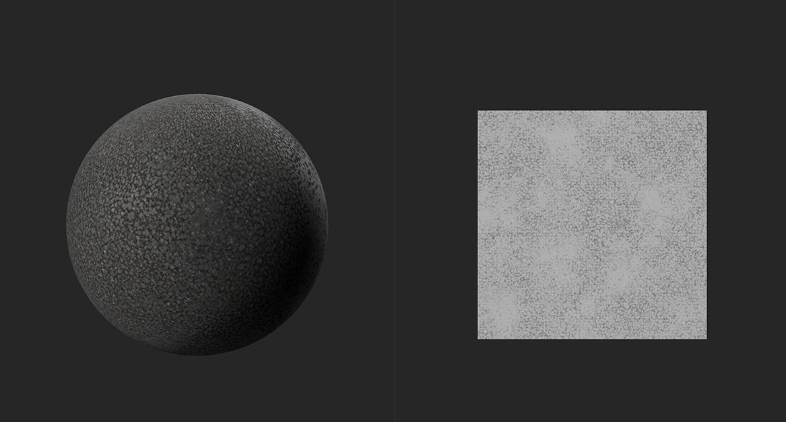

# Height à la normale

<table>
<tr style="border: 0;">
<td width="41.60%" style="border: 0;" valign="top">

Outils **In:**

</td>
<td width="58.30%" style="border: 0;" valign="top">

## Description

Générez des données de couche Normal en fonction de la couche height.

Dans les images ci-dessous, vous pouvez voir le filtre **Height à la normale** en action.

Dans l&#39;image ci-dessus, il n&#39;y a pas de données normales du matériau. Seule la carte d&#39;height est disponible et affichée dans la **vue 2D**.

Avec le filtre **Height à la normale**, les données normales sont générées à partir de la carte d&#39;height affichée dans l&#39;image supérieure. La lumière rebondit de manière plus réaliste sur le matériau dans la deuxième image grâce à la carte de normales générée.

</td>
</tr>
</table>

## Paramètres

**Paramètres de base**

* **Utiliser les unités mondiales** : activer/désactiver\
  Indiquez si les paramètres sont mesurés à l’aide d’unités réelles ou non. Cela modifie les paramètres disponibles.
  * **Si l&#39;option Utiliser les unités universelles est activée :**
    * **Taille de la surface (cm)** : 0-500\
      Définir la taille de l’espace UV en unités universelles
    * **Profondeur Height (cm)** : 0-10\
      Définissez la distance représentée par la carte d’height. Si la courbe d&#39;height représente une petite distance, une grande différence dans les valeurs de courbe d&#39;height peut avoir un faible impact sur l&#39;angle normal. Si la courbe d&#39;height représente une grande distance, une petite différence dans les valeurs de courbe d&#39;height peut représenter un grand angle sur la courbe de normales.
  * **Si Utiliser les unités universelles est désactivé :**
    * **Intensité** : 0-3\
      Réglage de la pente des angles normaux
* **Combiner la normale inférieure** : 0-1\
  Ajoutez le mappage normal existant aux résultats de ce filtre.

**Masquer**

* **Masque personnalisé** : activer/désactiver\
  Activez ou désactivez l’utilisation d’un masque personnalisé. Si cette option est activée, les paramètres suivants apparaissent :
  * **Masque** : image/pinceau\
    Sélectionnez une image à utiliser comme masque ou utilisez le pinceau pour peindre un masque personnalisé directement dans la vue 2D
  * **Masque personnalisé - Flou** : 0-1\
    Flouter le masque
  * **Masque personnalisé - Inverser** : activer/désactiver\
    Inverser le masque
