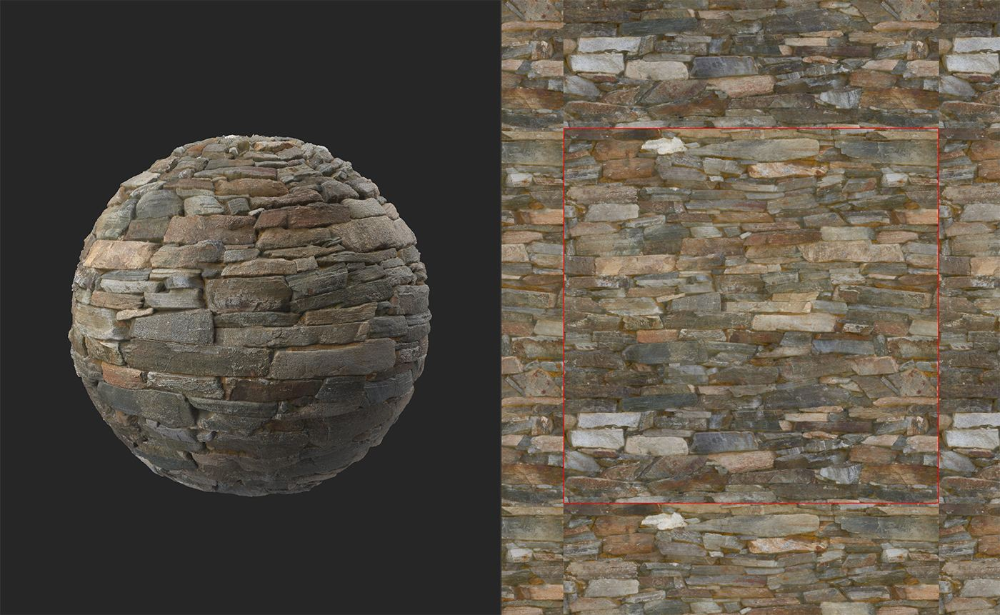

# Création d’une mosaïque

<table>
<tr style="border: 0;">
<td width="41.60%" style="border: 0;" valign="top">

Générateurs De **Entrée :**

</td>
<td width="58.30%" style="border: 0;" valign="top">

## Description

Utilisez le filtre **Création de carreaux** pour rendre votre matériau carrelable. Le **filtre Juxtaposition** rend également votre matériau juxtaposable, mais chaque filtre fonctionne différemment. Si le **filtre Juxtaposer** ne fonctionne pas pour vous, essayez le **filtre Juxtaposer**.

Dans les images ci-dessous, vous pouvez voir comment le filtre **Création de carreaux** peut convertir un matériau sans carreaux en matériau carrelable. Ce matériau fonctionne bien car il suit un motif de type grille et il n’y a pas de points spécifiques qui attirent l’attention.

Dans l’image ci-dessus, la ligne rouge indique la limite du matériau. Il est très clair qu&#39;il y a une couture solide, et que ce matériau ne fait pas de carreaux.

Après **Création de mosaïque**, ce matériau fonctionne bien. Sans la ligne rouge, il serait impossible de voir les coutures aux limites du matériau.

</td>
</tr>
</table>

## Paramètres

**Paramètres de base**

* **Seuil** : 0-1\
  Ajustez la taille et la correspondance du calque supérieur.
* **Smoothness** : 0-1\
  Lissez la couture du calque supérieur.
* **Contraste** : 0-1\
  Réglez le contraste de la couture. La diminution du contraste a le même effet que le flou de la couture.
* **Suppression des défauts** : activer/désactiver\
  Si cette option est activée, le filtre tente de supprimer les artefacts près de la couture entre les calques supérieur et inférieur.
* **Color Equalizer** : 0-50\
  Égalisez les valeurs de couleur pour diminuer la visibilité de la couture.
* **Correspondance d&#39;Height** :\
  Modifiez la façon dont les cartes d’height sont fusionnées pour les calques supérieur et inférieur du filtre. Pour voir les résultats plus clairement, affichez le canal height dans la **vue 2D**. Notez que la correspondance d’height n’a aucune incidence sur les couches autres que la couche d’height. Les normales et l’AOP ne seront donc pas affectées par les modifications apportées à la correspondance d’height.

**Paramètres avancés**

* **Influence de la chrominance** : 0-1\
  Réglez l’impact des valeurs chromatiques sur la couture.
* **Inversion de masque** : activer/désactiver\
  Inversez les masques des calques supérieur et inférieur.
* **Smoothness de correspondance Height** : 0-16\
  Ajustez le flou de la correspondance des heights entre les calques supérieur et inférieur.
* **Source de correctif gauche/droit** : -1 à 1\
  Ajustez l’emplacement de la source pour les correctifs gauche et droit.
* **Source de correctif supérieur/inférieur** : -1 à 1\
  Ajustez l’emplacement de la source pour les patchs supérieur et inférieur.

## Guide d’utilisation

Le **filtre** Placer dans le carreau **&#x200B;**&#x200B;fonctionne en superposant plusieurs copies du matériau les unes sur les autres.

L’image ci-dessous montre la disposition des calques :

* Le périmètre vert montre les bords du matériau résultant du filtre **Mosaïque**
* Les lignes rouges indiquent les bordures du calque inférieur. Le calque inférieur est décalé de 50 % de l’espace UV sur les axes X et Y. Les lignes rouges représentent donc des coutures de mosaïque à recouvrir.
* Le carré bleu et les demi-cercles couvrent les coutures rouges. Les paramètres du filtre vous permettent d’ajuster les bordures des formes bleues pour vous assurer que la couture rouge n’est pas visible tout en conservant la couture bleue aussi lisse que possible.

{width="512px"}

Les demi-cercles gauche et droit se correspondent pour assurer les carreaux de matériau horizontalement, et les demi-cercles supérieur et inférieur assurent les carreaux de matériau verticalement. Le carré bleu au centre supprime toutes les coutures restantes pour créer un matériau entièrement carrelable sans coutures.
