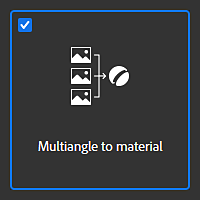

# Multiangle vers matériau

Le modèle **Multiangle vers matériau** crée un matériau à partir de 2 à 8 images d&#39;entrée prises dans des conditions de lumière spécifiques. De telles conditions de lumière peuvent être obtenues avec un scanner de matériau.

>[!NOTE]
>
> Vous trouverez plus d&#39;informations sur la création de votre propre scanner de matériaux [dans cet article](https://www.adobe.com/products/substance3d/magazine/your-smartphone-is-a-material-scanner-vol-ii.html).

## Exemple

Voici un exemple de matériau créé à partir de 8 images d’entrée :

* Les 8 premières images sont les images numérisées sous 8 angles lumineux.
* Les images du bas sont les sorties du modèle (couleur de base, normale, height, métallique et rugosité).

{width="400px"}

## Configuration de Substance 3D Sampler

Il y a 3 choses à définir et à configurer pour être sûr que les canaux PBR seront extraits correctement :

* Ordre des images numérisées
* Premier angle de lumière en entrée
* l’angle de lumière d’entrée suivant

{width="450px"}

### Ordre de numérisation des images

Lors de l’importation de vos images, vérifiez dans le calque d’importation d’image que les 8 images sont consécutives.

Par exemple, la première image à 0° doit être **scan1**, puis l&#39;image à 45° doit être **scan2**... puis l&#39;image à 315° doit être **scan8**

{width="450px"}

### Angle de la première et de la suivante lumière

Dans le calque Multiangle vers matériau :

* Définissez l’angle de la lumière en entrée. Si votre **scan1** est à 180°, l&#39;angle de la première lumière d&#39;entrée =0,5 ou si votre **scan1** est à 0°, l&#39;angle de la première lumière d&#39;entrée = 0
* Définir l&#39;angle de lumière d&#39;entrée suivant : définit le sens de rotation de votre image. Si scan1 est à 0°, scan2 à 45°... la valeur est **antihoraire**

{width="450px"}
