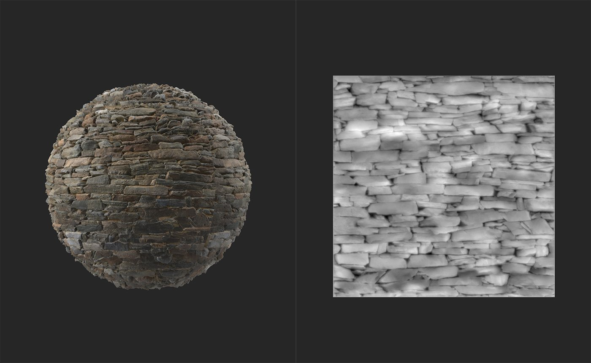

# Normal à l’Height

<table>
<tr style="border: 0;">
<td width="41.60%" style="border: 0;" valign="top">

Outils **In:**

</td>
<td width="58.30%" style="border: 0;" valign="top">

## Description

Générez des informations d’height en fonction de la couche normale.

Les images ci-dessous montrent le filtre **Normal à l&#39;Height** en action. Dans la première image, la carte d’height ne contient aucune information d’height. Dans la deuxième image, après l&#39;application du **filtre Normal à l&#39;Height** **filtre**, une carte d&#39;height réaliste est générée.

</td>
</tr>
</table>

## Paramètres

Ce filtre n&#39;a pas de paramètres. Pour l’utiliser, ajoutez-le simplement en haut de la pile de calques.
