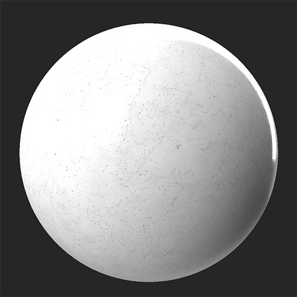

# Fissures

<table>
<tr style="border: 0;">
<td width="41.60%" style="border: 0;" valign="top">

**Entrée :** usure et finition

</td>
<td width="58.30%" style="border: 0;" valign="top">

## Description

Utilisez le **filtre Fissures** pour vieillir et endommager votre matériel en y ajoutant un réseau de fissures et de fissures.

Le **filtre Fissures** a été appliqué à un matériau en marbre propre.

<table>
<tr style="border: 0;">
<td style="border: 0;" valign="top">

{width="200px"}

</td>
<td style="border: 0;" valign="top">

{width="200px"}

</td>
</tr>
</table>

</td>
</tr>
</table>

## Paramètres

**Paramètres de base**

* **Générateur aléatoire** :\
  La valeur de départ aléatoire détermine les valeurs aléatoires des autres paramètres qui utilisent le caractère aléatoire dans ce filtre.
* **Répartition des Fissures** : 0-1\
  Ajustez l’étendue de la propagation des fissures : cela modifie à la fois la largeur et la longueur de la fissure.
* **Quantité de Fissures** : 0-1\
  Modifiez le nombre de fissures à afficher.

**Masquer**

* **Utiliser un masque personnalisé** : activer/désactiver\
  Activez ou désactivez l’utilisation d’un masque personnalisé. Si cette option est activée, les paramètres suivants apparaissent :
  * **Masque** : image/pinceau\
    Sélectionnez une image à utiliser comme masque ou utilisez le pinceau pour peindre un masque personnalisé directement dans la vue 2D.
  * **Masque personnalisé - Inverser** : activer/désactiver\
    Inversez le masque.

**Fissures**

* **Couleur des Fissures** : sélection de la couleur\
  Modifiez la couleur de la surface intérieure révélée par les fissures.
* **Rugosité des Fissures** : 0-1\
  Réglez la valeur de rugosité des fissures.
* **Opacité de la rugosité des Fissures** : 0-1\
  Ajustez l&#39;impact de la valeur de **rugosité des Fissures** sur la carte de rugosité
* **Fissures métalliques** : 0-1\
  Modifiez la valeur métallique des fissures.
* **Opacité métallique des Fissures** : 0-1\
  Ajustez l&#39;impact de la valeur **Fissures métalliques** sur la carte métallique
* **Intensité de l&#39;height des Fissures** : 0-1\
  Ajustez la profondeur des fissures. Cela a un impact à la fois sur le mappage d&#39;height et sur les résultats de mappage normaux du filtre.

**Paramètres avancés**

* **Intensité normale** : 0-1\
  Ajustez la force des normales de la fissure.
* **Plage d&#39;Height** : 0-1\
  Modifiez la plage d’heights de la matière complète. Pour ajuster l&#39;height des fissures, utilisez **Fissures > Intensité de l&#39;Height des Fissures**.
* **Position Height** : 0-1\
  Décalage de la texture height de la matière complète.
