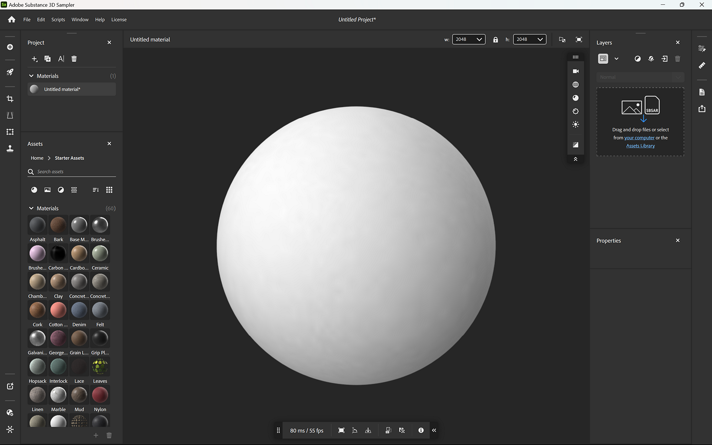

# viewport 2D et 3D

Le **Viewport** affiche votre ressource actuelle. En haut du **V**&#x200B;**iewport**, vous pouvez voir le nom de votre ressource et les options permettant de modifier l&#39;apparence du **Viewport**. Utilisez ces options pour :

* Modifiez la largeur et l’height de votre fichier en pixels.
* Affichez la <b>vue Vue 2D</b>, la <b>vue 3D</b> ou affichez les vues <b>2D </b> et <b>3D </b> ensemble.
* Basculer la <b>vue fractionnée</b> vers l&#39;affichage horizontal.
* Permutez les <b>vues 3D et 2D</b>.
* Basculez entre les viewports standard et plein écran.

## Vue 3D

Le <b>Viewport 3D</b> dispose de deux barres d&#39;outils qui vous permettent de modifier l&#39;apparence de votre ressource dans le <b>Viewport</b>. Par défaut, ces barres d&#39;outils apparaissent dans le coin supérieur droit et au centre inférieur du <b>Viewport 3D</b>.

![] ()

>[!NOTE]
>
> Les barres d&#39;outils du <b>Viewport 3D</b> peuvent être repositionnées :
> 
> * Vous pouvez déplacer les barres d’outils en faisant glisser la poignée en haut ou à gauche de la barre d’outils.
> * Double-cliquez sur la poignée en haut ou à gauche de la barre d’outils pour passer d’une mise en page horizontale à une mise en page verticale.
> * Cliquez sur les doubles chevrons en bas ou à droite de la barre d’outils pour la réduire.

La barre d&#39;outils en haut à droite du Viewport <b>3D </b> comporte des commandes axées sur l&#39;apparence du viewport :

* <b>Afficher</b> : modifiez les paramètres de caméra tels que le mode champ de vision ou projection. Modifiez également la grille et les couleurs d’arrière-plan.
* <b>Maillage</b> : sélectionnez un autre maillage pour afficher vos actifs matériau ou voir les nuances des actifs Éclairages d&#39;environnement.
* <b>Matériau</b> : modifiez la position et la répétition de la texture sur votre maillage.
* <b>Displacement</b> : réglez la qualité et l&#39;intensité du displacement.
* <b>Lumière</b> : sélectionnez et ajustez un éclairage d&#39;environnement, y compris des paramètres tels que l&#39;activation des ombres et du plan du sol.
* <b>Activer/Désactiver le traçage de chemin</b> : le traçage de chemin est une technique de rendu qui fournit des résultats photoréalistes, améliorant l’apparence de vos ressources. Cependant, le traçage de chemin peut être coûteux en termes de calcul. Dans ce cas, vous pouvez activer ou désactiver le traçage de chemin en fonction de vos besoins.

>[!NOTE]
>
> Activez les ombres pour améliorer les visuels viewports. Éteignez les ombres pour améliorer les performances des échantillonneurs.

![] ()

La barre d&#39;outils en bas au centre du <b>Viewport 3D</b> contient les informations et les commandes suivantes :

* <b>Heure Cadre/IPS</b> : ces valeurs indiquent les performances du matériau.
* <b>Objet Cadre</b> : centrez la caméra sur le maillage.
* <b>Modifier l&#39;axe</b> : modifiez l&#39;axe considéré comme actif. Cela peut aider à corriger les problèmes liés aux maillages importés.
* <b>Position</b> : modifiez la position du maillage par rapport au plan du sol.
* <b>Copier l&#39;instantané</b> : copiez rapidement une image du <b>Viewport 3D</b> actuel dans le presse-papiers.
* <b>Enregistrer l&#39;instantané</b> : enregistrez un instantané du <b>Viewport 3D</b> dans un fichier image.
* <b>Contrôles vue 3D</b> : affichez une référence rapide pour les contrôles de caméra dans le Viewport 3D.

![] ()

## Déplacer la caméra

Le viewport utilise une caméra pour effectuer le rendu de la vue 3D. Vous pouvez déplacer la caméra pour modifier votre vue et voir vos créations sous différents angles.

| Raccourci | Mouvement | Description |
| --- | --- | --- |
| Cliquez et faites glisser. | Orbite | Faites pivoter la caméra. Il n’est pas possible de faire rouler la caméra. |
| Clic droit + glisser | Dolly | Avancez et reculez la caméra. |
| Clic du milieu et glissement | Panoramique | Déplacez la caméra vers la gauche, la droite, le haut et le bas. |

La <b>Vue 2D</b> est bidimensionnelle, il n&#39;y a donc pas d&#39;option d&#39;orbite. Effectuez un zoom avant et arrière en maintenant les touches Alt + clic droit enfoncées, et un panoramique en maintenant les touches Alt + glisser enfoncées.

Dans la <b>vue 3D </b> et la <b>Vue 2D</b>, utilisez <b>F</b> pour vous concentrer sur votre ressource. Cette fonction est utile si vous perdez de vue la ressource 3D ou l’espace 2D.

## Vue 2D

![] ()

Par défaut, seule la <b>vue 3D</b> est visible, mais la <b>Vue 2D</b> peut contenir de nombreuses informations et commandes utiles pour certains filtres.

Pour ouvrir la <b>Vue 2D</b>, utilisez le bouton <b>Afficher la sélection </b> en haut à droite du viewport. Vous pouvez également utiliser le raccourci <b>2</b> pour passer rapidement à la <b>Vue 2D</b>.

Avec la <b>Vue 2D </b> ouverte, de nouvelles options apparaissent :

* Dans le coin supérieur droit de la **Vue 2D**, utilisez la liste déroulante pour modifier la source des canaux disponibles à afficher.

  * Les Entrées de calque affichent les couches entrées dans le calque sélectionné
  * Les Sorties de calque affichent les canaux sortants par le calque sélectionné
  * Sorties par matériau affiche les canaux en cours de sortie par le calque supérieur et n’est pas affecté par la sélection de calque.
* En bas de la **Vue 2D**, vous pouvez :

  * Voir la résolution de la couche sélectionnée.
  * Sélectionnez un canal pour l’afficher dans la vue 2D.
  * Voir Couches de couleur et nombre de bits par pixel pour la couche de matériau sélectionnée.

  
