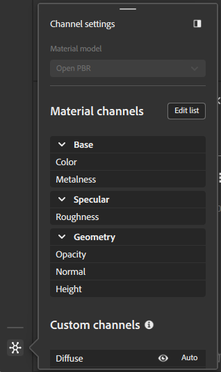
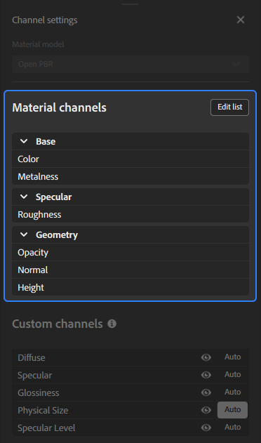

# Panneau Paramètres des canaux

<table>
<tr style="border: 0;">
<td style="border: 0; width: 30%" valign="top">

Le panneau **Paramètres de canal** contrôle la liste des canaux calculée pour votre matériau actuel. Vous pouvez gérer la visibilité des canaux, ajouter ou supprimer des canaux de votre matériau, ou modifier le modèle de matériau utilisé.

</td>
<td style="border: 0;" valign="top">

</td>
</tr>
</table>

## Modèle de matériau

Utilisez cette liste déroulante pour sélectionner le framework shader utilisé pour effectuer le rendu de votre matériau. Les options du panneau **Paramètres de canal** changeront en fonction du modèle de matériau sélectionné.

Lorsque vous modifiez le modèle de matériau, votre pile de calques doit être recalculée pour le nouveau modèle, et différents canaux sont disponibles. Sampler tente de minimiser la perte de données lors de la conversion. Il est toutefois possible que cette modification entraîne de subtiles différences d’apparence avec un nouveau modèle de matériau.

>[!NOTE]
>
> Il est possible de passer d&#39;Adobe Standard Material (ASM) à OpenPBR, mais il n&#39;est pas possible actuellement de passer d&#39;OpenPBR à ASM.

## Canaux de matériau

<table>
<tr style="border: 0;">
<td style="border: 0; width: 30%" valign="top">

Cette section affiche la liste des canaux calculés par défaut en fonction du workflow.

Vous pouvez utiliser le bouton **Modifier la liste** pour ouvrir la **sélection de canaux** et modifier les canaux calculés pour votre matériau.

</td>
<td style="border: 0;" valign="top">

{width="200px"}

</td>
</tr>
</table>

>[!NOTE]
>
> Certains matériaux de la Substance Source ne sortent pas les couches d’opacité ou d’ambient occlusion, par exemple. Même si la couche d’opacité est marquée comme « est calculée », si le fichier de Substance de données ne la sort pas, Sampler ne la génère pas.

### Sélection de canaux

La fenêtre de sélection des canaux vous permet d’ajouter ou de supprimer des canaux du matériau.

Pour ajouter un canal à votre matériau, sélectionnez un canal disponible et utilisez le bouton **>**.
Pour supprimer un canal de votre matériau, sélectionnez-le dans la **liste des canaux sélectionnés** et utilisez le bouton **&lt;**.
Vous pouvez ajouter tous les canaux disponibles à votre matériau avec le **bouton ≫** ou supprimer tous les canaux de votre matériau avec le **bouton ≪**.

Vous pouvez également utiliser des paramètres prédéfinis pour sélectionner rapidement une liste de canaux pour votre matériau. Par défaut, Sampler inclut un certain nombre de paramètres prédéfinis, mais vous pouvez également créer les vôtres :

1. Ajoutez les canaux souhaités à votre matériau.
1. Utilisez le bouton **Enregistrer comme paramètre prédéfini**.
1. Nommez votre paramètre prédéfini.

>[!NOTE]
>
>L’enregistrement d’un paramètre prédéfini n’applique pas ce dernier à votre matériau.

## Canaux personnalisés

Activer/désactiver les canaux supplémentaires qui ne sont pas inclus dans le workflow sélectionné par défaut.

<table>
<tr style="border: 0;">
<td style="border: 0; width: 30%" valign="top">

Chaque canal personnalisé dispose de deux options que vous pouvez utiliser pour le contrôler :

1. Utilisez le bouton Visibilité pour afficher ou masquer la couche dans la vue 2D.
2. Utilisez le bouton **Auto** pour activer ou désactiver le calcul automatique du canal.
   * Lorsque cette option est activée, le canal est calculé si un calque situé au-dessus de lui dans la pile le demande.
   * Lorsque cette option est désactivée, le canal est toujours calculé.

</td>
<td style="border: 0;" valign="top">

{width="200px"}

</td>
</tr>
</table>

