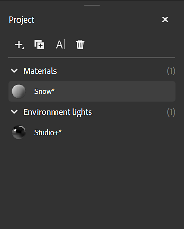

# Panneau Projet

Les projets dans Sampler fonctionnent comme des packs pouvant stocker plusieurs ressources. Le **panneau Projet** affiche les matériaux qui composent votre projet actuel.

Les commandes situées en haut du panneau Projet vous permettent d’ajouter ou de gérer des matériaux dans votre projet actif :

* Utilisez le bouton **Ajouter** pour ouvrir le **menu Paramètre prédéfini de matériau** et ajouter un nouveau matériau à votre projet.
* Utilisez le bouton **Dupliquer** pour dupliquer le matériau actuellement sélectionné.
* Utilisez le bouton **Renommer** pour renommer le matériau actuellement sélectionné.
* Utilisez le bouton **Supprimer** pour supprimer le matériau actuellement sélectionné.

>[!NOTE]
>
> Vous pouvez également cliquer avec le bouton droit de la souris sur un matériau pour le renommer, le supprimer ou le dupliquer.

Cliquez sur l&#39;un de vos actifs pour le charger dans le **Viewport** ou faites glisser un matériau sur le **panneau Calques** pour l&#39;utiliser dans d&#39;autres matériaux.
