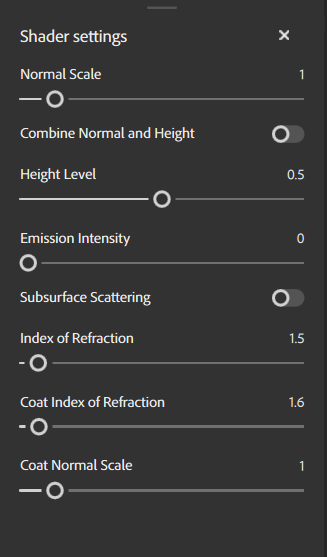

# Panneau Paramètres du nuanceur

Le panneau <b>Paramètres de l&#39;ombrage</b> vous permet de configurer la façon dont l&#39;ombrage restitue vos ressources sur le maillage dans la fenêtre 3D.

## Paramètres du matériau

Les paramètres de matière vous permettent d’ajuster le rendu de la matière active par l’ombrage.

| Nom du paramètre | Description |
| --- | --- |
| Échelle de la normale | Réglez l&#39;intensité de la texture normale. |
| Combiner Normal et Height | Indique si les mappages des Heights et des normales doivent être regroupés en un seul mappage. |
| Niveau de height | Modifiez le niveau de base de l’height pour le displacement. |
| Intensité de l&#39;émission | Réglez l&#39;intensité des cartes émissives. |
| Subsurface scattering | Activez ou désactivez l&#39;option Diffusion sous-surface. |
| Indice de réfraction | Réglez l’angle selon lequel la lumière se réfracte sur les surfaces. |
| Indice de réfraction du revêtement | Réglez l’angle selon lequel la lumière se réfracte sur la couche superficielle. |
| Échelle de la normale du revêtement | Réglez l&#39;échelle normale spécifiquement pour la couche de surface. |
