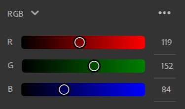

# Sélecteur de couleurs

Le sélecteur de couleurs s’affiche chaque fois que vous devez sélectionner une couleur.

## Présentation de l’interface utilisateur

{width="300px"}

1. **Carré de couleur** : réglez la saturation et la luminosité de votre couleur avec la teinte sélectionnée.
1. **Curseur de teinte** : réglez la teinte de votre couleur.
1. **Actif/Précédent** : la couleur de gauche est la couleur actuelle de votre sélecteur de couleurs. La bonne couleur correspond à la couleur que vous aviez lors de l’ouverture du sélecteur de couleurs. Cliquez sur la couleur de droite pour rétablir la valeur d’origine de la couleur sélectionnée.
1. **Entrée hexadécimale** : vous pouvez saisir directement le code de couleur hexadécimal de la couleur souhaitée.
1. **Pipette** : lancez la pipette pour choisir une couleur à partir de votre écran. Une bulle s’affiche à côté du curseur pour prévisualiser la couleur que vous allez sélectionner.
1. **Curseurs** : ajustez votre couleur à l’aide de différents espaces colorimétriques (RGB ou HSV).
1. **Nuanciers** : enregistrez les couleurs pour y accéder rapidement en vue d’une utilisation ultérieure.

### Curseurs

#### Espace colorimétrique

RGB (rouge, vert, bleu) et TSL (teinte, saturation, valeur) sont les deux espaces colorimétriques disponibles.

{width="200px"}

#### Options de curseur

{width="200px"}

**Afficher les curseurs**

Cette option vous permet de masquer les curseurs pour économiser de l’espace. Même si les curseurs sont masqués, vous pouvez toujours modifier les entrées de valeur.

**Valeurs à virgule flottante**

{width="200px"}

Indiquez si les curseurs doivent utiliser des valeurs de virgule flottante ou des nombres entiers. Les valeurs de virgule flottante sont comprises entre 0 et 1, tandis que les valeurs entières sont comprises entre 0 et 255.

**Curseurs dynamiques**

Indique si l’arrière-plan du curseur se met à jour dynamiquement lorsque les valeurs sont modifiées. L’image ci-dessous montre l’apparence des curseurs lorsque l’option Curseurs dynamiques est désactivée.

{width="200px"}

### Nuancier

Les nuances sont utiles lorsque vous souhaitez enregistrer des couleurs spécifiques à utiliser dans l’application ou dans plusieurs projets.

Les nuances sont globales pour Sampler et non spécifiques par projet.

En cliquant sur le bouton « + », vous ajouterez une nuance dont la couleur actuelle sera la première nuance de votre liste.

{width="200px"}

Remarque : vous ne pouvez pas ajouter deux fois une nuance de la même couleur. La nuance déjà enregistrée est mise en surbrillance lorsque vous tentez de l’ajouter à nouveau.

Une info-bulle avec la valeur de couleur en code hexadécimal s’affiche lorsque vous survolez une nuance.

#### Options de nuancier

Option Tout supprimer.

{width="200px"}

Cliquez avec le bouton droit de la souris sur une nuance pour la supprimer ou la remplacer par la couleur actuelle.

{width="200px"}

Vous pouvez également supprimer une nuance en la faisant glisser hors du sélecteur de couleurs.
