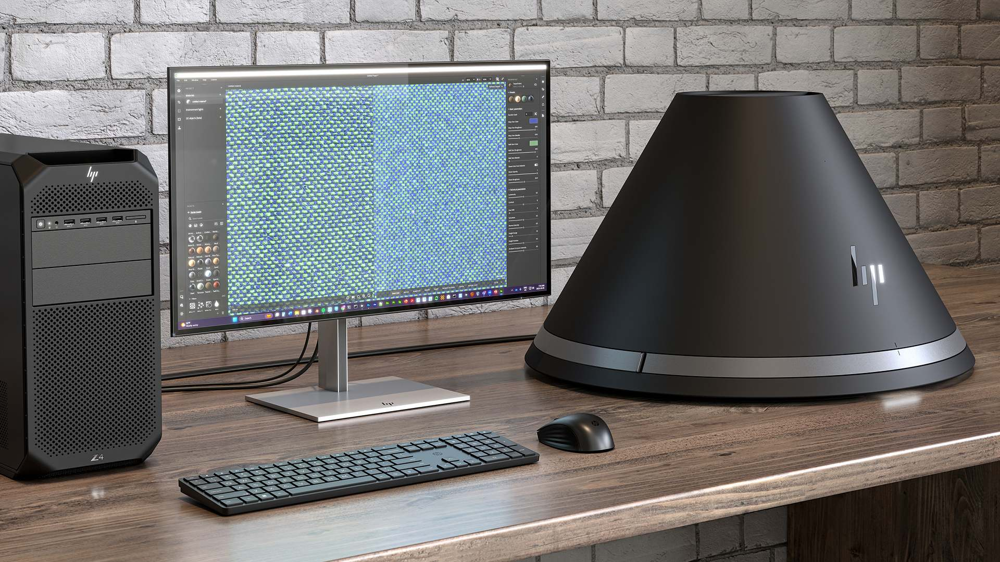

# Prise en charge de HP Z Captis

HP Z Captis est un appareil de capture de matériaux, connecté en mode natif et exploité par Adobe Substance 3D Sampler. Substance 3D Sampler s’intègre à HP Z Captis pour prévisualiser et lancer la capture, traiter automatiquement les canaux PBR et exporter un contenu numérique.

La prise en charge de HP Z Captis est désormais intégrée à la version principale de Sampler et est disponible pour les licences Entreprise, Équipes et Université.

Les appareils Adobe Substance 3D Sampler et HP Z Captis sont vendus séparément. Rendez-vous sur la page officielle [HP Z Captis](https://www.hp.com/us-en/workstations/z-captis.html) pour plus d&#39;informations.

En savoir plus : cette collaboration sur la capture de matériaux entre HP et Adobe a été dévoilée à Siggraph 2024 : <https://www.hp.com/us-en/newsroom/blogs/2024/hp-z-captis.html>. L’objectif du workflow HP Z Captis avec Sampler est de permettre la capture de matériaux partout et la création 3D à échelle durable en intégrant des matériaux du monde réel dans le numérique, en transférant la numérisation vers la chaîne d’approvisionnement et en réduisant le gaspillage de matériaux.
