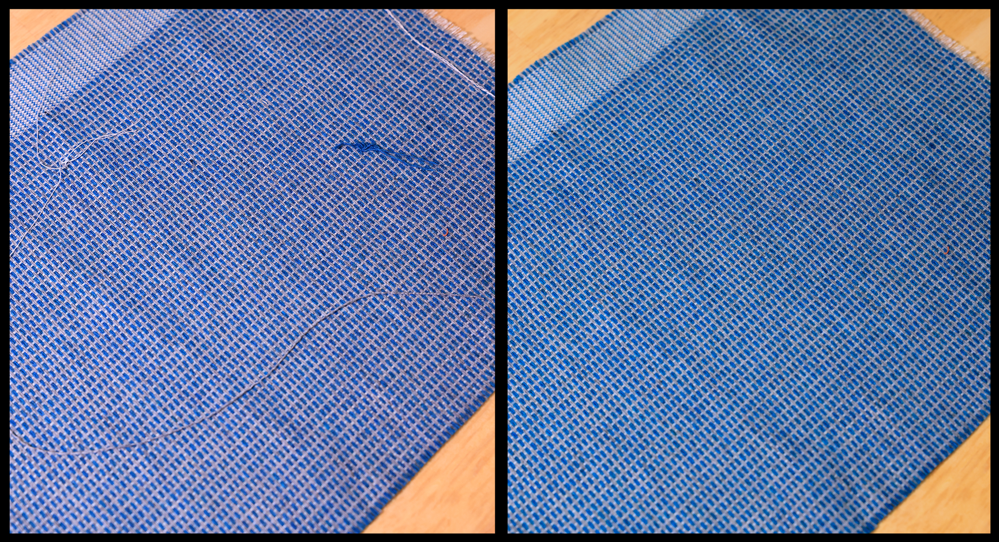
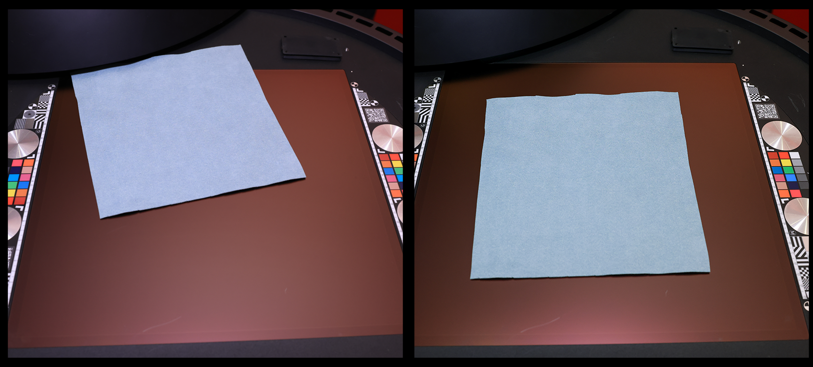

# Bonnes pratiques d&#39;analyse

La qualité d’un document numérisé est déterminée bien avant que vous n’activiez le bouton de numérisation. Un échantillon propre, plat et bien placé produit des cartes nettes prêtes à l&#39;emploi, tandis qu&#39;une capture précipitée transporte chaque pli, tache de dust et fibre perdue directement dans vos canaux PBR.

La règle générale est simple : **une minute supplémentaire passée à préparer votre matériel avant l&#39;analyse vous fait gagner environ dix minutes de nettoyage plus tard**. Le temps passé à repasser un tissu, à brosser un dust ou à aligner votre échantillon est du temps que vous ne passerez pas plus tard à déformer le matériau, à rapiécer les particules ou à éliminer les fibres en vrac.

Cette page couvre deux domaines qui font la plus grande différence : **la préparation de votre échantillon physique** et **son placement correct** dans l&#39;appareil.

## Préparer votre échantillon physique

Tout ce qui est visible sur l’échantillon lors de la capture est intégré dans les cartes. Quelques minutes de préparation suppriment les problèmes à la source, avant qu&#39;ils ne deviennent du travail d&#39;édition.

**Nettoyer l&#39;échantillon**

Nettoyez rapidement l&#39;échantillon avant de le placer. Toute marque sur la surface sera interprétée comme un détail matériel et reproduite sur chaque canal.

**Supprimer le dust et les particules étrangères**

Le dust, les cheveux, les fils et d&#39;autres particules en vrac sont l&#39;une des sources les plus courantes de travail de post-traitement. Brossez ou utilisez de l’air comprimé pour nettoyer la surface, car chaque particule restante doit être peinte à la main ultérieurement.

**Tissus de fer pour supprimer les rides**

Pour les tissus et autres matériaux souples, repasser toujours l&#39;échantillon à plat avant de le scanner. Les plis et les plis créent de fausses informations d&#39;height et d&#39;ombre qui sont difficiles à supprimer par la suite et qui cassent la carrelabilité du matériau.

**Supprimer les taches sur les surfaces lisses**

Sur les matériaux lisses et non poreux, essuyez les taches, les empreintes digitales ou les taches. Ceux-ci apparaissent clairement dans les couches de couleur de base et de rugosité.

**Connaître l&#39;exemple de thickness**

Soyez conscient de l’épaisseur de votre échantillon. Connaître le thickness vous aide à le placer correctement et à configurer la capture de sorte que la surface reste nette sur toute la zone de numérisation.

## Placez votre échantillon correctement

Un bon placement permet de maintenir la matière plate, nette et centrée, ce qui réduit le recadrage, la déformation et l’alignement que vous devrez effectuer ultérieurement.

**Centrer la matière dans la zone de numérisation**

Placez l’échantillon au centre de la zone de numérisation. C&#39;est là que la mise au point et l&#39;éclairage sont les plus réguliers, et donne la surface la plus utilisable une fois le matériau recadré. C&#39;est pourquoi il est toujours idéal de numériser un échantillon à la fois, afin qu&#39;il puisse être placé au centre de la zone de numérisation et vous donner les meilleurs résultats possibles.

**Alignez-le le plus directement possible**

Aligner l&#39;échantillon carrément avec la zone de numérisation plutôt que selon un angle. Un échantillon droit est beaucoup plus facile à mosaïquer et nécessite moins de rotation et de recadrage dans Sampler.

**Garder l&#39;échantillon à plat**

Assurez-vous que l&#39;échantillon est complètement à plat par rapport à la surface de numérisation. Si nécessaire, utilisez les aimants fournis avec l&#39;appareil HP Z Captis pour maintenir en place les matériaux flexibles ou bouclés. Un échantillon plat permet d’éviter la déformation et la mise au point irrégulière, qui prend beaucoup de temps à corriger.

**Ne pas chevaucher les échantillons**

Si vous placez plusieurs échantillons à la fois, évitez qu’ils se touchent ou se chevauchent. Les bords qui se chevauchent créent des limites ambiguës difficiles à séparer et à recadrer par la suite.

## Le gain dans Sampler

Lorsque votre échantillon est propre, plat et centré, les cartes qui arrivent dans Sampler sont déjà presque prêtes pour la production. Vous passez votre temps à affiner le matériau au lieu de le réparer : moins de temps à déformer, moins de temps à nettoyer le dust et les fibres, et moins de temps à corriger les taches et les rides de vos canaux.

Une fois la matière importée, appliquez les filtres Sampler (Égaliser, Mosaïque automatique, Correction de perspective par recadrage, Mosaïque, etc.) pour finaliser l’importation et exportez-la lorsque le résultat vous convient.
