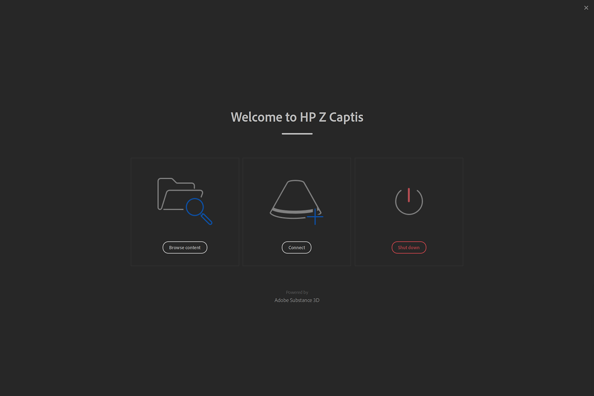
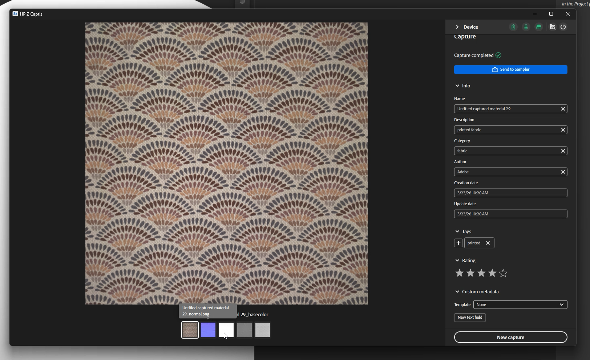

# Lancez Sampler et activez HP Z Captis

Une fois Sampler lancé et que le périphérique HP Z Captis est connecté à votre ordinateur, cliquez sur l’icône Captis/cone dans la barre de gauche.

Si vous ne voyez pas le HP Z Captis apparaître dans l’interface utilisateur, veuillez vous référer à la FAQ.

Après avoir cliqué sur HP Z Captis, une fenêtre dédiée s&#39;ouvre avec 3 options :

1. <b>Parcourir le contenu</b> : l’explorateur de fichiers s’ouvre pour parcourir le stockage local de votre appareil HP Z Captis.
1. <b>Démarrer l&#39;analyse</b> : initialise le périphérique HP Z Captis et lance le flux de capture.
1. <b>Arrêter</b> : cela va arrêter l&#39;appareil et fermer la fenêtre.

## Fermeture de la fenêtre HP Z Captis

À tout moment, si vous fermez la fenêtre HP Z Captis, vous serez invité à <b>poursuivre le processus</b> ou à <b>abandonner</b>.

Si vous sélectionnez Continuer, le périphérique poursuivra sa tâche actuelle hors ligne et sera mis en pause à la fin de l’étape en cours. Vous pourrez reconnecter Sampler ultérieurement pour passer à l’étape suivante de la session d’acquisition.

## Étape d’aperçu

Sampler initialisera l’aperçu de l’appareil HP Z Captis. Il est recommandé de <b>ne pas interagir </b>avec l&#39;affichage pendant l&#39;initialisation.

Dans cette nouvelle mise à jour, il existe deux modes : Automatique et Manuel.

### Paramètres généraux

#### Mode automatique

Vous avez désormais la possibilité de lancer la capture en un clic : Sampler :

* définir un nom par défaut,
* définir automatiquement la zone d&#39;intérêt (ROI)/zone de recadrage à l’aide du rétroéclairage,
* se concentrer sur le retour sur investissement complet ; et
* réglez le paramètre d’intensité sur un paramètre adapté à votre matière.

Si vous avez déjà effectué des captures, la catégorie de matière, les sorties et la résolution d’acquisition sélectionnées seront les mêmes que pour la capture précédente.

#### Mode manuel

Vous pouvez également choisir de définir manuellement certains des paramètres :

*Nom du projet*

Vous pouvez définir un nom de projet pour votre capture et définir le type de sorties à récupérer.

*Sorties*

* Par défaut, seules les couches PBR du matériau (Couleur de base, Normal, height et opacité) sont enregistrées.\
  Vous avez la possibilité de choisir le type de sortie entre LDR (plage dynamique basse) et HDR (plage dynamique élevée).

*Résolution de capture*

* 239 px/po - 94 px/cm (Aperçu : qualité inférieure, balayage plus rapide)
* px/po - 142 px/cm (par défaut : haute qualité, facile à gérer dans la majorité des workflows - équivalent à 4k pour une capture de 30x30cm)
* 718 px/po - 284 px/cm (pleine résolution - équivalent à 8 Ko pour une capture de 30 x 30 cm)

Remarque : seuls les canaux PBR seront chargés dans Sampler.\
Les captures de dossier par défaut enregistrées dans peuvent être modifiées dans les préférences.

<b>Catégorie de matériau</b>

Définissez cette option sur le type de matériau que vous numérisez pour la génération de mappage, ajusté à votre matériau particulier.\
La catégorie par défaut sélectionnée est « Fabric ». Cela vous aidera à optimiser le résultat de votre couche de rugosité.

Si ce que vous numérisez contient plusieurs types de matériaux, veuillez sélectionner la catégorie du plus grand.

<b>Recadrer</b>

Le recadrage peut être effectué automatiquement ou manuellement.

Le recadrage automatique utilisera le contre-jour pour définir le contour du matériau et placer la Zone d&#39;intérêt (ROI) autour de celui-ci. Elle n&#39;est pas adaptée lorsque l&#39;on numérise plusieurs échantillons de matériau à la fois, ou lorsque le matériau est très transparent.
Dans ce cas, le retour sur investissement peut être défini en faisant glisser les angles du widget de recadrage dans l’aperçu, ou en définissant une résolution ou une taille physique définie.

<b>Paramètres de l&#39;appareil photo </b>

* Intensité : permet de régler l’exposition de la caméra.\
  En cliquant sur Auto, vous utiliserez le centre du ROI pour définir la meilleure intensité pour le matériau.

* Mise au point : ajuste la mise au point de l’appareil photo.\
  Cliquer sur Auto définit la mise au point idéale en utilisant le retour sur investissement complet.
  Ce nouvel algorithme de mise au point, où la mise au point n&#39;est plus sur un seul point, permet une mise au point plus uniforme sur le matériau numérisé, conduisant à des numérisations de meilleure qualité qui sont plus faciles à réaliser en mosaïque.

Vous pouvez régler les deux à la main si vous le souhaitez.

<b>Autres paramètres</b>

Les autres types de paramètres<b> ne doivent être modifiés qu&#39;occasionnellement</b> : l&#39;étalonnage des couleurs et de l&#39;alignement.

* Étalonnage des couleurs

Étalonnez la couleur de la carte colorimétrique de base grâce aux zones techniques de HP Z Captis. \
Le matériau final aura alors exactement la même couleur que l’échantillon que vous avez ajouté dans le plateau HP Z Captis.\
Les zones techniques avec les nuanciers sont automatiquement détectées et utilisées pour l’étalonnage. Ils doivent être placés dans leur espace spécifique de chaque côté de l&#39;échantillon.

Cette option est uniquement disponible en mode Studio. Veillez à effectuer la mise au point avant cet étalonnage des couleurs.

Cet étalonnage doit être effectué <b>tous les quelques mois</b>. Il n&#39;est pas nécessaire de le faire à chaque balayage ou chaque fois que le périphérique est utilisé.

* Étalonnage de l’alignement

Cet alignement <b>doit être effectué</b> la <b>première fois que vous configurez votre appareil</b>, chaque fois que vous le déplacez physiquement, puis tous les deux mois. Il n&#39;est <b>pas nécessaire</b> d&#39;effectuer ce processus <b>pour chaque capture</b>.

Veillez à effectuer la mise au point avant cet étalonnage de l’alignement.

Pour effectuer l&#39;alignement, <b>placez un élément comportant des informations nettes et claires, comme un morceau de papier avec du texte imprimé, au centre de l&#39;espace de capture</b>, fermez le tiroir et cliquez sur le bouton d&#39;alignement. Une fois que cela est fait, vous pouvez vous assurer que tout est en place, avec les zones techniques à leur place de chaque côté de l&#39;espace de balayage, un matériau placé au centre et si nécessaire maintenu en place avec les aimants fournis avec l&#39;appareil HP Z Captis, et vous pouvez commencer à scanner vos matériaux.

Une fois que vous êtes prêt : <b>démarrez l&#39;analyse</b>.

## Étapes de capture, de traitement et de copie

Une fois la numérisation démarrée, l’aperçu affiche les photos prises pendant le processus.

La partie traitement est divisée en trois parties :

* <b>Capture</b> : prise de toutes les photos requises

* <b>Traitement</b> : traitement des photos pour générer des canaux PBR (couleur de base, normale, height, opacité)

* <b>Copie</b> : copie des résultats de l&#39;appareil HP Z Captis sur votre ordinateur

Pendant l’acquisition et le traitement, vous pouvez ajouter des métadonnées (les mêmes que celles du panneau Métadonnées de Sampler).

Pendant le traitement, vous verrez que le résultat est construit carreau par carreau.

## Étape récapitulative

À cette étape, vous pouvez passer en revue les résultats de l’analyse. Toutes les couches créées sont affichées (en mode Explorateur, aucune opacité n’est créée, car l’anneau de l’explorateur n’est pas éclairé en contre-jour).

Vous pouvez choisir d’envoyer votre matière à Sampler, de l’ajouter à votre projet et de commencer à la traiter.
Vous pouvez également lancer directement une nouvelle capture sans l’ajouter au projet.
Dans les deux cas, vous trouverez vos cartes numérisées dans le dossier équivalent sur votre ordinateur : C:\Users\username\Documents\Adobe\Adobe Substance 3D Sampler\Captis\Material

## Édition de matériaux

Après la sortie de la fenêtre HP Z Captis, les couches (couleur de base, normale, height, rugosité et opacité, le cas échéant) seront ajoutées en tant que calque dans le panneau Calques.

Utilisez les filtres Sampler (Égaliser, Correction de perspective par recadrage, Mosaïque, ...) pour traiter et nettoyer votre matière.

Une fois que vous avez terminé, vous pouvez :

* Enregistrez votre projet Sampler : Fichier > Enregistrer sous ... (Ctrl + S)

* Exportez votre matière : Fichier > Exporter ... (Ctrl + E)

