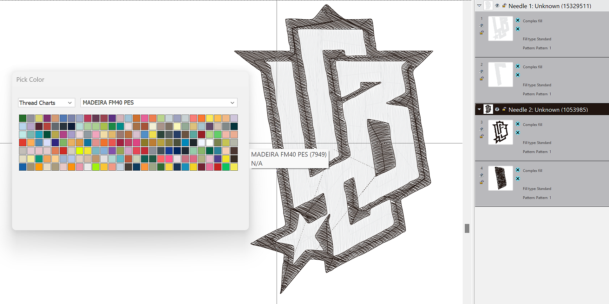
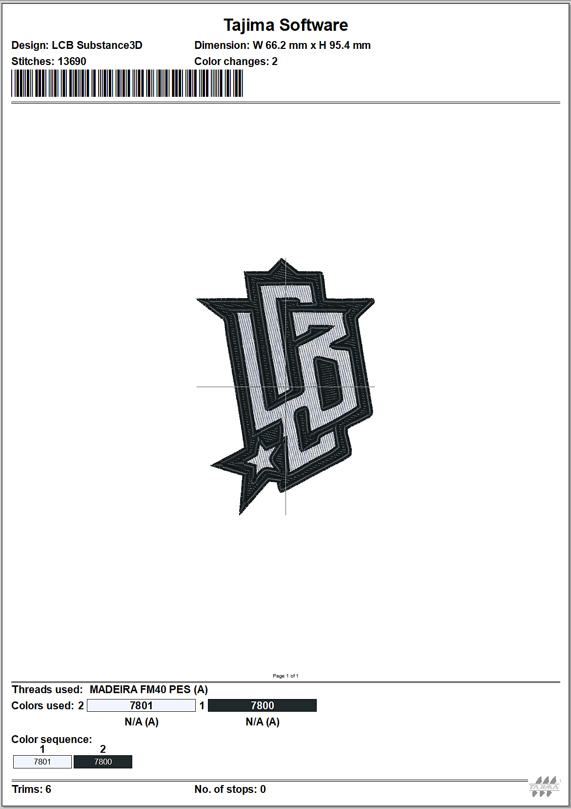

# Tajima Exporter plugin of Embroidery files

Avec cette première validation de principe, vous pouvez désormais transférer leurs designs brodés numériquement depuis Adobe Substance 3D directement dans le logiciel de broderie <b>Tajima DG17</b>, éliminant ainsi la nécessité d&#39;une longue numérisation manuelle.

Voyons comment l’utiliser étape par étape.

## Télécharger

Téléchargez le plug-in Sampler Tajima ici :

[Télécharger le plug-in ici](https://www.adobe.com/go/sampler-tajima-plugin)

## Installation

*À partir de l&#39;interface utilisateur Sampler :*

Accédez à Préférences > Plug-ins et scripts > Ajouter un plug-in

Sélectionnez le dossier de décompression du téléchargement

*À partir de l&#39;explorateur de fichiers :*

Accédez à Documents > Adobe > Adobe Substance 3D Sampler > Plug-ins

Copiez/collez ici le dossier de décompression du téléchargement

## Installation

Ouvrez votre projet Sampler (5.0.3 ou version ultérieure) avec un matériau de broderie.

Ouvrez le plug-in Tajima et exportez vers l’emplacement de votre choix

<b>Logiciel Tajima </b>

<b>1</b> : lancement de l’Assistant Substance 3D

<b>2</b> : sélectionnez le <b>dossier de données</b> approprié (dossier d&#39;exportation Sampler)

<b>3</b> : choisissez le graphique en fil de broderie

<b>4</b> : appliquer un style prédéfini pour des paramètres de fabric optimaux

<b>5</b> : modifiez les formes selon vos besoins pour obtenir les meilleurs résultats

<b>6</b> : prévisualisez la feuille de calcul de conception, avec un code à barres lisible sur ordinateur.

