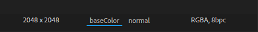

# Version 2019.1

**Substance Alchemist 2019.1 « Sésame »** vous permet de partager vos ressources avec sa nouvelle gestion de projet. La pile de calques a été entièrement reconstruite pour améliorer le workflow. Des commandes et des informations supplémentaires ont été ajoutées à la clôture. Une nouvelle version de notre delighter améliore la qualité et la précision de vos matériaux.

Date de publication : *4 novembre 2019*

>[!NOTE]
>
> **Remarque :** le contenu produit avec la version bêta 0.8.1 ou antérieure n&#39;est pas compatible avec la version 2019.1. Cependant, rien n&#39;est perdu et ces données sont toujours accessibles en lançant la version 0.8.1.

## Principales fonctionnalités

### Nouvel écran d’accueil

Substance Alchemist dispose désormais d&#39;un écran d&#39;accueil qui vous permet de sauter rapidement sur votre dernier projet mais aussi d&#39;en créer de nouveaux. L&#39;écran d&#39;accueil fournit également quelques liens vers nos plateformes existantes, telles que [Substance Academy](https://academy.substance3d.com/).

### Gestion de projet

La version 2019.1 introduit la notion de projets, qui peuvent rassembler des collections de matériaux. Les projets peuvent également être exportés pour être partagés avec d’autres ordinateurs.

Pour en savoir plus sur les projets, voir : [Gestion de projets](../../getting-started/project-management.md).

### New Delighter

Nous avons amélioré notre delighter, qui est utilisé pour supprimer les ombres de vos photos. Il préserve désormais les détails et les couleurs originales des différentes surfaces, ce qui devrait améliorer la précision des matériaux générés.

### Nouvelle pile de calques

La pile de calques a été reconstruite à partir de zéro pour étendre ses possibilités et ses actions. Les modifications notables sont les suivantes :

* **Les matériaux et les masques sont désormais accessibles directement via leur icône dédiée**\
  Lors de l’ajout d’un matériau dans la pile de calques, une nouvelle icône de masque s’affiche désormais. Cliquez sur cette deuxième icône pour afficher les paramètres de fusion du matériau.

  
* **Le mode de fusion peut être modifié directement à partir de la barre d&#39;outils**\
  Désormais, lorsqu’un calque Matériau est sélectionné, son mode de fusion peut être modifié directement à partir de la barre d’outils Pile de calques, sans avoir à cliquer sur le masque.

  
* **Affecter un bitmap à des entrées de numérisation spécifiques**\
  Lorsque vous importez une image bitmap pour créer vos matériaux à partir d’une numérisation, vous pouvez attribuer la bonne utilisation par image bitmap.

  

### Améliorations de la fenêtre d’affichage

Quelques nouvelles fonctionnalités ont été ajoutées à l&#39;aire d&#39;affichage pour en améliorer l&#39;utilisation. Ces nouveaux paramètres sont accessibles dans le [panneau Paramètres du visualiseur](https://helpx.adobe.com/fr/substance-3d/unlisted/documentation/sadoc/viewer-settings-188973164.html).

* **Mode appareil photo**\
  Le mode de projection de la caméra permet de choisir entre Perspective et Orthographique.

  
* **Champ de vision de la caméra**\
  Vous pouvez désormais modifier le champ de vision (FOV) de la caméra de la clôture. Le réglage de cette valeur peut aider à visualiser de manière réaliste vos matériaux. Le champ de vision ne peut être contrôlé que lorsqu’il est en mode de projection Perspective.

  
* **Résolution et nombre de bits par pixel par canal**\
  La vue 2D affiche désormais la résolution et le nombre de bits par pixel de texture de chaque couche.

  

## Notes de mise à jour

### 2019.1.4 Sésame

*(Publié Le 30 Janvier 2020)*

**Ajouté :**

* [Ressources] Invite de confirmation lors de l’effacement d’un dossier de ressources

**Fixe :**

* [Calques] Déplacez les calques vers deux calques ou plus en dessous ou au-dessus
* [Créer] Allocation d&#39;un budget de VRAM suffisant pour avoir de bonnes performances

**Problèmes Connus :**

* Importer beaucoup de ressources peut vraiment ralentir la Substance Alchemist
* Les filtres Fond basé sur le contenu sont lents en haute résolution
* L’utilisation de plusieurs charmants dans un même matériau n’est pas recommandée
* Delighter se bloque avec les anciens pilotes NVIDIA (moins de 400.x)
* Les virgules ou les points peuvent être ignorés lors de la saisie d’une valeur spécifique dans un curseur
* Le filtre Normal à l’Height peut se bloquer sur MacOS

### 2019.1.3 Sésame

*(Publié Le 28 Janvier 2020)*

**Ajouté :**

* [Workflow] Prise en charge de plusieurs workflows
* [Workflow] Prise en charge du workflow de brillance du Specular PBR
* [Workflow] Nouveau panneau Paramètres de canal
* [Workflow] Sélection du workflow lors de la création du projet
* [Paramètres des canaux] Activer/désactiver le calcul d’un canal spécifique
* [Paramètres des couches] Affiche la liste des couches personnalisées disponibles dans la matière active
* [Paramètres des canaux] Calcul automatique des canaux personnalisés si nécessaire
* [Paramètres des canaux] Forcer/Bloquer le calcul des canaux personnalisés
* [Calques] Nouvelle interface utilisateur de l’espace réservé d’entrée Matériau dans les filtres Atlas scatter et Éclaboussure
* [Calques] Le paramètre d’entrée d’image d’un filtre peut être alimenté par les calques sous-jacents
* [Calques] Affiche une notification lorsque certains calques sont obsolètes
* [Calques] Possibilité de mettre à jour vers la dernière version des calques obsolètes via la notification
* [Projet] Nouveaux champs de métadonnées lors de la création du projet
* [Inspire] Les variations générées sont spécifiques à un projet
* [Vue 2D] Basculer entre les entrées de calque, les sorties de calque et les sorties de matériau
* [Écran d’accueil] Option Ajouter un projet d’importation (.alch)
* [Préférences] Nouvelle fenêtre Préférences pour définir l’emplacement du cache et les paramètres de confidentialité des analyses
* [UI] Nouveaux boutons d’interface utilisateur
* [Performance] Amélioration globale du système de parallélisation
* [Performance] Optimisation du nombre de calculus matériels
* [Moteur] Mise à jour de la Substance Engine
* [Framework] Mise à niveau vers Qt 5.13
* [MacOS] Améliorations globales de la prise en charge de macOS Catalina
* [Contenu] Filtre de réglage - Intensité normale et paramètres d’inversion

**Fixe :**

* [Calques] Désactivez le paramètre Entrée d’image lors de la suppression du calque
* [Calques] Correction d’un blocage lors de l’ajout d’un calque de patch de duplication
* [Calques] Correction de certains blocages lors de la fusion de calques empilant des matériaux dans d’autres matériaux d’empilement de calques
* [Exportation] La sélection de canaux pour l’exportation est maintenant respectée.
* [Ressources] Ne se bloque pas lors de la navigation dans le panneau Ressources
* [Ressources] Correction d’un blocage lors de l’importation de fichiers de Substance corrompus
* [Ressources] Réduire le nombre de blocages lors du chargement de dossiers volumineux
* [Vignette] Le calcul des vignettes ne fige pas l’interface.
* [Importation d’image] Uniformisation du type d’image prise en charge dans l’application
* [Paramètre prédéfini] Enregistre la description lors de la création d’un paramètre prédéfini à partir d’un SBSAR
* [Inspire] Correction du glisser-déposer d’image
* [Application] Corriger les blocages à la sortie
* [Application] Correction des blocages à la sortie lors de l’exportation de matériaux
* [UI] Correctifs et améliorations
* [UI] Renommer la ressource temporaire en « matière non enregistrée »
* [Contenu] Mise à jour globale et nettoyage de tous les filtres

**Problèmes Connus :**

* Importer beaucoup de ressources peut vraiment ralentir la Substance Alchemist
* Les filtres Fond basé sur le contenu sont lents en haute résolution
* L’utilisation de plusieurs charmants dans un même matériau n’est pas recommandée
* Delighter se bloque avec les anciens pilotes NVIDIA (moins de 400.x)
* Les virgules ou les points peuvent être ignorés lors de la saisie d’une valeur spécifique dans un curseur
* Le filtre Normal à l’Height peut se bloquer sur MacOS

### 2019.1.2 Sésame

*(Publié Le 11 Décembre 2019)*

**Ajouté :**

* [Workflow] Prise en charge de plusieurs workflows
* [Workflow] Prise en charge du workflow de brillance du Specular PBR
* [Workflow] Nouveau panneau Paramètres de canal
* [Workflow] Sélection du workflow lors de la création du projet
* [Paramètres des canaux] Activer/désactiver le calcul d’un canal spécifique
* [Paramètres des couches] Affiche la liste des couches personnalisées disponibles dans la matière active
* [Paramètres des canaux] Calcul automatique des canaux personnalisés si nécessaire
* [Paramètres des canaux] Forcer/Bloquer le calcul des canaux personnalisés
* [Calques] Nouvelle interface utilisateur de l’espace réservé d’entrée Matériau dans les filtres Atlas scatter et Éclaboussure
* [Calques] Le paramètre d’entrée d’image d’un filtre peut être alimenté par les calques sous-jacents
* [Calques] Affiche une notification lorsque certains calques sont obsolètes
* [Calques] Possibilité de mettre à jour vers la dernière version des calques obsolètes via la notification
* [Projet] Nouveaux champs de métadonnées lors de la création du projet
* [Inspire] Les variations générées sont spécifiques à un projet
* [Vue 2D] Basculer entre les entrées de calque, les sorties de calque et les sorties de matériau
* [Écran d’accueil] Option Ajouter un projet d’importation (.alch)
* [Préférences] Nouvelle fenêtre Préférences pour définir l’emplacement du cache et les paramètres de confidentialité des analyses
* [UI] Nouveaux boutons d’interface utilisateur
* [Performance] Amélioration globale du système de parallélisation
* [Performance] Optimisation du nombre de calculus matériels
* [Moteur] Mise à jour de la Substance Engine
* [Framework] Mise à niveau vers Qt 5.13
* [MacOS] Améliorations globales de la prise en charge de macOS Catalina
* [Contenu] Filtre de réglage - Intensité normale et paramètres d’inversion

**Fixe :**

* [Calques] Désactivez le paramètre Entrée d’image lors de la suppression du calque
* [Calques] Correction d’un blocage lors de l’ajout d’un calque de patch de duplication
* [Calques] Correction de certains blocages lors de la fusion de calques empilant des matériaux dans d’autres matériaux d’empilement de calques
* [Exportation] La sélection de canaux pour l’exportation est maintenant respectée.
* [Ressources] Ne se bloque pas lors de la navigation dans le panneau Ressources
* [Ressources] Correction d’un blocage lors de l’importation de fichiers de Substance corrompus
* [Ressources] Réduire le nombre de blocages lors du chargement de dossiers volumineux
* [Vignette] Le calcul des vignettes ne fige pas l’interface.
* [Importation d’image] Uniformisation du type d’image prise en charge dans l’application
* [Paramètre prédéfini] Enregistre la description lors de la création d’un paramètre prédéfini à partir d’un SBSAR
* [Inspire] Correction du glisser-déposer d’image
* [Application] Corriger les blocages à la sortie
* [Application] Correction des blocages à la sortie lors de l’exportation de matériaux
* [UI] Correctifs et améliorations
* [UI] Renommer la ressource temporaire en « matière non enregistrée »
* [Contenu] Mise à jour globale et nettoyage de tous les filtres

**Problèmes Connus :**

* Importer beaucoup de ressources peut vraiment ralentir la Substance Alchemist
* Les filtres Fond basé sur le contenu sont lents en haute résolution
* L’utilisation de plusieurs charmants dans un même matériau n’est pas recommandée
* Delighter se bloque avec les anciens pilotes NVIDIA (moins de 400.x)
* Les virgules ou les points peuvent être ignorés lors de la saisie d’une valeur spécifique dans un curseur
* Le filtre Normal à l’Height peut se bloquer sur MacOS

### 2019.1.1 Sésame

*(Publié Le 26 Novembre 2019)*

**Ajouté :**

* [Fusion] Nouveau mode de fusion de l’opacité
* [Moteur] Nouvelle version de Substance Engine

**Fixe :**

* [Calques] Correction d’un blocage lors de la suppression d’un calque en cours de calcul
* [Calques] Correction du blocage lors de la suppression du calque inférieur
* [Calques] Correction du blocage lorsque le nom du matériau contient des caractères spéciaux
* [Calques] Arrêtez de calculer tous les filtres qui utilisent un widget
* [Calques] Éviter le blocage lors de l’utilisation des filtres Correctif de duplication et Fond basé sur le contenu
* [Calques] Correction d’un blocage lors du glisser-déposer d’un filtre dans des emplacements d’entrée de projection
* [Ressources] Correction du blocage lors de la liaison de dossiers locaux ou de l’importation de ressources dans la Substance Alchemist
* [Collection] Corriger le blocage lors du basculement rapide entre les matériaux
* [UI] Correction d’un blocage lorsque la valeur est NULL ou n’est pas valide dans la mosaïque, curseurs de displacement dans la fenêtre
* [Inspire] Correction d’un blocage lors de l’accès à l’onglet Inspire
* [Inspire] Correction d’un blocage lors de l’inspiration sur un matériau de pile de calques récemment enregistré
* [Performance] Les matériaux à Substance lourde et les filtres (carrelage) se calculent plus rapidement
* [Aide] Correction du fichier journal d’exportation
* [Contenu] Le filtre Aléatoire fonctionne sur tous les canaux
* [Contenu] Le workflow multiangle prend en compte toutes les numérisations
* [Contenu] Fusion AO - Fusion correcte
* [Contenu] Fusion de courbure - Fusion correcte
* [Contenu] Mélange d’ID de couleur correct
* [Contenu] Fusion de masque personnalisée - Fusion correcte
* [Contenu] Correction du filtre Réglage pour la modification de la rugosité
* [Contenu] Correction du filtre de Matériau de base pour le téléchargement de canaux normaux personnalisés
* [Contenu] Correction du modèle d’importation personnalisé du filtre Estampage

**Problèmes Connus :**

* L’utilisation de plusieurs charmants dans un même matériau n’est pas recommandée
* Delighter se bloque avec les anciens pilotes NVIDIA (moins de 400.x)
* Les virgules ou les points peuvent être ignorés lors de la saisie d’une valeur spécifique dans un curseur
* Le filtre Normal à l’Height peut se bloquer sur MacOS

### 2019.1 Sésame

*(Publié Le 4 Novembre 2019)*

**Ajouté :**

* [Projet] Création d&#39;un projet
* [Projet] Introduction du format de fichier .alch qui contient les données du projet
* [Projet] Exportez un projet .alch contenant les collections et leurs matériaux
* [Projet] Importer un projet .alch
* [Projet] Ouvrir les projets récents
* [Écran d’accueil] Un écran d’accueil s’affiche au lancement
* [Écran d’accueil] Créer un projet à partir de l’écran d’accueil
* [Écran d’accueil] Accédez à la liste de tous vos projets dans l’écran d’accueil
* [Écran d’accueil] Liens rapides pour accéder à la documentation, aux informations sur les fenêtres contextuelles et la gestion des licences
* [Menu Fichier] Intégration d&#39;un menu Fichier
* [Menu Fichier] Accédez aux commandes du projet à partir de l’onglet Fichier et enregistrez la pile de calques
* [Menu Fichier] Accédez aux commandes Annuler et Rétablir depuis l’onglet Edition
* [Menu Fichier] Le menu Aide précédent a été déplacé dans le menu Fichier sous l’onglet Aide
* [Calques] Nouvelle architecture de la pile de calques
* [Calques] Nouvelle interface utilisateur de la pile de calques
* [Calques] Sélectionnez le mode de fusion directement dans la barre d’outils
* [Calques] Accédez séparément aux paramètres de fusion et aux paramètres de matière
* [Calques] Ajoutez des matières directement dans les entrées dédiées du filtre Éclaboussure de la pile de calques
* [Calques] Modifier l’ordre de numérisation directement dans le calque d’importation d’image
* [Fenêtre d’affichage] Contrôle du champ de vision de la caméra
* [Fenêtre d’affichage] Possibilité de basculer entre les caméras orthographiques et de perspective
* [Fenêtre d’affichage] Affichage des informations de résolution et de nombre de bits par pixel pour chaque couche
* [Ressources] Matériaux de base ouverts par défaut
* [Cache] Recherchez le dossier de cache des vignettes.
* [Cache] Recherche du dossier de cache de rendu
* [Panneaux] Le panneau Paramètres de matière est temporairement masqué
* [Workflow] Specular/Lustre temporairement désactivé
* [MacOS] Authentification notariale de la version du système d’exploitation Catalina
* [Contenu] Nouvelle version du filtre Delighter
* [Contenu] Nouveau filtre Image avec fond basé sur le contenu
* [Contenu] Nouveau filtre Remplissage d’après le contenu matériel
* Le filtre Transformation de [Contenu] dispose d’une option de transformation sécurisée

**Fixe :**

* Tous les bugs précédents liés à Créer ne sont pas valides aujourd’hui avec la nouvelle version de l’interface utilisateur et de l’architecture
* Les info-bulles ne masquent pas les icônes de la barre supérieure (3D, 2D, 2D/3D).
* [Contenu] Le filtre Éclaboussure accepte Atlas avec une carte d’height complète
* [Contenu] Le filtre Transformation fonctionne sur les images (scan1, scan2,...)

**Problèmes Connus :**

* L’utilisation de plusieurs charmants dans un même matériau n’est pas recommandée
* Delighter se bloque avec les anciens pilotes NVIDIA (moins de 400.x)
* Les virgules ou les points peuvent être ignorés lors de la saisie d’une valeur spécifique dans un curseur
* Le filtre Normal à l’Height peut se bloquer sur MacOS

**Ajouté :**

* [Fusion] Nouveau mode de fusion de l’opacité
* [Moteur] Nouvelle version de Substance Engine

**Ajouté :**

* [Fusion] Nouveau mode de fusion de l’opacité
* [Moteur] Nouvelle version de Substance Engine

**Ajouté :**

* [Workflow] Prise en charge de plusieurs workflows
