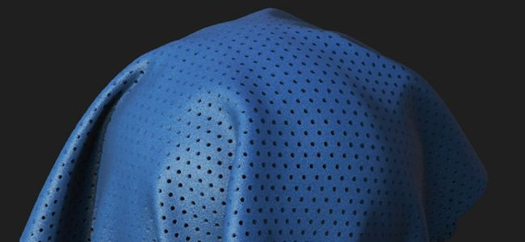

# Version 2020.2 (2.2)

**Substance Alchemist 2020.2 « Udon »** introduit un nouveau processus Image à Matériau optimisé par l’IA pour transformer une seule entrée d’image dans un Matériau entièrement PBR, un modèle de création de Matériau amélioré, de nombreuses améliorations du workflow et de la convivialité, ainsi que de nouveaux contenus tels que de nouveaux filtres.

Date de publication : *15 juin 2020*

## Principales fonctionnalités

### Image en Matériau (optimisé par l’IA)

Le modèle **Image vers Matériau** comporte un nouveau paramètre nommé **Optimisé par l&#39;IA**. Ce nouveau paramètre offre de meilleurs résultats pour générer un matériau PBR de haute qualité à partir d’une seule image d&#39;entrée.

Le paramètre Optimisé par l’IA utilise le machine learning pour reconnaître les formes et les objets et générer avec précision des informations d’height et normales. Ce paramètre inclut également le filtre Délice pour supprimer les tons foncés et les tons clairs. Ce nouveau réglage fonctionne mieux avec les matériaux extérieurs, car l&#39;algorithme a été entraîné avec des sols, des galets, de l&#39;écorce, des pierres et d&#39;autres surfaces extérieures éclairées par un éclairage naturel. D’autres mises à jour apporteront plus de flexibilité et de polyvalence aux matériaux pris en charge. Pour plus de détails, consultez la [page de documentation dédiée](../../filters/tools/image-to-material.md).

Voici une comparaison des informations d’height générées par les deux algorithmes avec leurs valeurs par défaut :

{width="800px"}

>[!NOTE]
>
> Le paramètre Optimisé par l’IA nécessite un matériel spécifique. Elle est uniquement disponible sous Windows et Linux avec un GPU Nvidia. Pour plus d&#39;informations, consultez la [configuration requise](../../getting-started/system-requirements.md).

### Nouveau modèle d’importation de Textures

La fenêtre contextuelle d’importation d’image a été améliorée sous plusieurs aspects. Il existe également un nouveau type de processus disponible nommé **Importation de Textures**.

* **Interface améliorée**\
  L’interface a été mise à jour pour faciliter son utilisation et son apprentissage, avec des explications détaillées pour chaque option disponible.
* **Nouvelle option d&#39;importation de Textures**\
  Une nouvelle option nommée **Importation de Textures** est désormais disponible. Elle permet d&#39;importer et de connecter un ensemble d&#39;images directement dans les canaux de sortie appropriés en fonction de leur nom. Il permet de configurer facilement un matériau à partir d’un groupe d’images existant. Pour plus d&#39;informations, consultez la [page de documentation dédiée](../../features-and-workflows/texture-import.md).

### Nouvelle peinture 2D pour les entrées de masque de filtres

Dans cette version, il est désormais possible de mettre en peinture et de modifier les masques de filtre directement dans la Vue 2D sans avoir à importer une image externe. La peinture recouvre automatiquement les mosaïques pour permettre la création d&#39;un matériau sans couture.

{width="450px"}

* **Passage en mode Peinture 2D**\
  Pour démarrer le mode Peinture 2D, il vous suffit de cliquer sur l’icône de pinceau en regard du nom du masque dans les propriétés du filtre.

  
* **Barre d&#39;outils de Peinture 2D**\
  En mode peinture, la Vue 2D affiche une nouvelle barre d’outils en haut avec les fonctionnalités suivantes :

  * **Couleur du pinceau** : ajustez la valeur de niveaux de gris du pinceau pour peindre le masque.
  * **Taille du stylet de pinceau** : ajustez l’épaisseur du pinceau pour peindre le masque.
  * **Réinitialiser le masque** : effacez le masque actuel en noir, toutes les informations de peinture seront perdues.
  * **Arrêter le dessin** : quittez le mode Peinture 2D.

  
* **Raccourcis clavier**\
  Le mode peinture prend en charge les raccourcis suivants pour accélérer le processus de peinture :

  * **X** : inverser la valeur de niveaux de gris actuelle du pinceau.
  * **Ctrl + Molette de la souris** : modifiez l&#39;épaisseur du pinceau.
  * **[ ou ]** : modifiez l’épaisseur du pinceau.

### Nouveaux raccourcis du mode de création Atlas et Décalcomanies

Deux nouveaux modes de création ont été ajoutés pour tirer parti de nouveaux types de matériaux de Substance et faciliter leur configuration dans la pile de calques :

* **Mode décalcomanie**\
  **Alt + Glisser-déposer** : lorsque vous faites glisser et déposez un matériau à partir d&#39;une collection, maintenez la touche **Alt** enfoncée pour créer automatiquement le matériau en mode projection de décalcomanie.
* **Mode Atlas**\
  **Maj + Glisser-déposer** : lorsque vous faites glisser et déposez un matériau à partir d&#39;une collection, maintenez la touche Maj enfoncée pour créer automatiquement le matériau en mode atlas scatter.

### Nouvel outil de correction de Perspective

Un nouvel outil nommé **Correction de Perspective** a été ajouté à la liste des filtres pour ajuster ou compenser la perspective d&#39;une image.

* **Correction de Perspective**\
  Grâce à ce filtre, il est possible de corriger les valeurs par défaut des numérisations et des images photographiques pour les rendre plus adaptées à la création de matériaux. Le filtre offre quatre points de contrôle qui représentent les coins initiaux de l’image. Déplacez les points pour ajuster/compenser la perspective.

  

### Widget Couleur Amélioré

Le widget de couleur visible dans le panneau Paramètres offre désormais plus de commandes :

* **Infobulle Valeur De Couleur**\
  Lorsque vous passez le curseur de la souris sur un widget de couleur, une info-bulle s’affiche pour décrire la valeur de couleur actuelle (format hexadécimal).
* **Actions Par Clic Droit**\
  Lorsque vous cliquez avec le bouton droit de la souris sur un widget de couleur, un nouveau menu contextuel apparaît avec les actions suivantes :
  * **Effacer** : définissez la couleur sur noir et la valeur alpha sur zéro.
  * **Copier** : copiez en mémoire la valeur de couleur actuelle du widget.
  * **Coller** : collez dans le widget la valeur de couleur actuelle en mémoire.

### Nouveau contenu

Cette version apporte beaucoup de contenu nouveau et varié :

* **Nouveaux Maillages Par Défaut**\
  Trois nouveaux maillages sont disponibles pour présenter les matériaux dans le viewport :
  * Forme de la chaussure
  * T-shirt homme
  * T-shirt femme
* **Nouveaux filtres**\
  Cinq nouveaux filtres sont disponibles dans cette version :
  * Fissures
  * Mousse
  * Piqûres de surface composée
  * Carreaux d’Arrondi aux inférieurs
  * Validation PBR
* **Nouveau mode de Fusion**
* Les filtres et d&#39;autres outils prennent désormais en charge un nouveau mode de fusion nommé **Par mode de Fusion de canal**. Lorsque ce mode est activé, il est possible de modifier l’opération de fusion de chaque couche dans le panneau Propriétés.
* **Exporter les paramètres prédéfinis**\
  Cette version comprend des paramètres prédéfinis d’exportation nouveaux et mis à jour :
  * VStitcher
  * CLO
  * Prise en charge de DetailMap dans les modèles HDRP Unity
