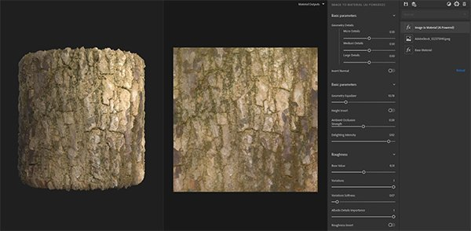
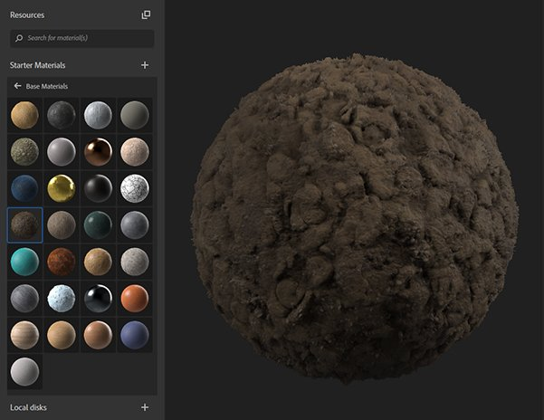

# Version 2020.3 (2.3)

**Substance Alchemist 2020.3 « Vermicelli »** introduit de nouveaux contenus et de nouveaux workflows comme la création d’atlas à partir d’une seule image. Nous avons également amélioré la qualité des vignettes de nos matériaux et avons localisé l’interface en chinois.

Date de publication : *26 octobre 2020*

## Principales fonctionnalités

### Image vers matériau (optimisé par l’IA)

* Nouveaux paramètres
  * Affinez votre géométrie (couches normale et height) en ajustant les différents niveaux de détails (micro, moyen et grand)
  * Réglez l’intensité du ravissement pour conserver certaines informations dans votre couleur de base
  * Des paramètres de variation et de lissage sont disponibles pour générer une couche de rugosité plus précise
* Prise en charge de la série Nvidia RTX 3000

### Workflow de création d’atlas

Avec l’ajout de deux nouveaux filtres, la création de l’atlas à partir d’une seule image est simplifiée dans la Substance Alchemist.

Générateur d’atlas : le filtre génère automatiquement, à partir de la couleur de base, une couche d’opacité. La diffusion des couleurs est également créée sur la couleur de base. Il est recommandé d’utiliser une image avec un arrière-plan uniforme.

Atlas splitter : Le filtre vous permet d’isoler un élément spécifique de votre atlas et de le redimensionner.

### Vignettes

Les vignettes sont maintenant générées à l&#39;aide du nœud Rendu PBR de Substance Designer avec le nouveau mappage d&#39;environnement Studio\_06.

Si la miniature est incorporée dans le fichier d&#39;archive de Substance de données (\*.sbsar), Substance Alchemist lit désormais la miniature et ne la génère pas à nouveau.

Un nouveau paramètre dans les préférences permet de modifier la qualité des vignettes pour gagner du temps. Par défaut, la qualité est définie sur Haute.

### Localisation en chinois

La Substance Alchemist est maintenant localisée en chinois. Vous pouvez modifier la langue de l’interface dans les Préférences.

### Contenu nouveau et mis à jour

* **Filtres techniques**

Déformation : déformez votre matière pour casser des motifs ou rendre votre matière plus vive.

Relief de surface : ajoutez du relief et de la variation sur votre matériau (remplacez le filtre de modulation d&#39;height)

Inverser : inversez les canaux de votre choix

* **Filtres d&#39;altération**

Scratches : ajoutez des rayures sur votre matière. Utile sur les bois et les métaux par exemple.

Empreintes digitales : ajoutez des empreintes digitales sur des métaux ou des matériaux brillants.

Gommes jetées : Dispersion de vieilles gommes sur un sol

* **Filtres colorimétriques**

Coloriser : teinter une partie ou l’ensemble de la matière

Variation de couleur : vous permet désormais de sélectionner la façon de segmenter votre matériau. En plus de la couleur de base, vous pouvez utiliser l’height, l’occlusion ambiante, le métallique et la rugosité.

Remplacer la couleur : sélectionnez une couleur dans la vue 2D et sélectionnez-en une nouvelle.
