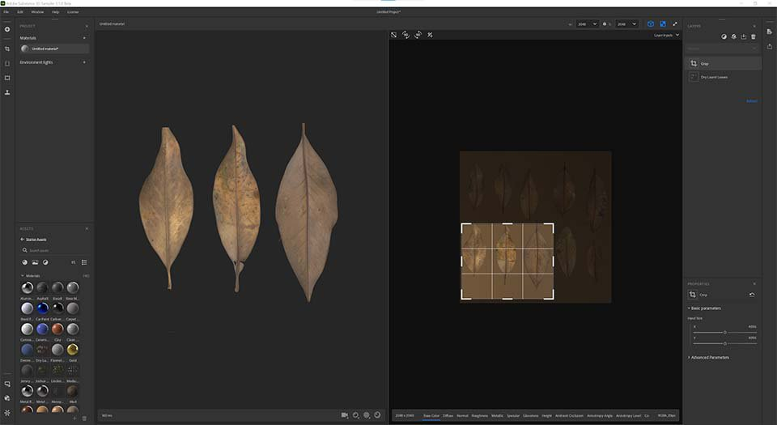

# Version 3.1

Adobe Substance 3D Sampler 3.1 introduit un nouveau sélecteur de couleurs, la prise en charge des fichiers de SVG et une interopérabilité améliorée avec Stager, Photoshop et Illustrator.

Date de publication : *28 septembre 2021*

## Principales fonctionnalités

### Sélecteur de couleurs

Cette version ajoute un nouveau [sélecteur de couleurs](../../interface/tools-and-widgets/color-picker.md) qui inclut une pipette et la prise en charge des nuanciers.

Le sélecteur de couleurs s’affiche chaque fois que vous devez sélectionner une couleur. Il peut être déplacé n’importe où sur votre ou vos écrans.

{width="250px"}

### Prise en charge du SVG

Sampler prend désormais en charge les fichiers de SVG. Vous pouvez les importer dans vos ressources, directement dans la pile de calques ou dans une entrée d’image de calque.

{width="500px"}

### Modifier dans Illustrator

Une nouvelle fonction de modification offre une grande souplesse de mise à jour des images importées. Si vous souhaitez modifier votre fichier de SVG, il vous suffit de le modifier directement dans Illustrator. Sampler mettra instantanément à jour votre visuel avec le nouveau SVG.

### Nouvelle interface utilisateur de recadrage

Sampler dispose désormais d’un widget Recadrage approprié et repensé pour définir facilement la zone recadrée. Vous n’obtiendrez pas non plus de résultats étirés lors du recadrage d’images non carrées en textures carrées.

{width="500px"}

### Format normal

Modifiez vos préférences pour définir le [format normal](../../interface/preferences/normal-format.md) dont vous avez besoin pour votre workflow. Vos normales seront importées, affichées et exportées dans le format que vous sélectionnez dans les préférences.

{width="250px"}

### Exportation des propriétés de matériau dans SBSAR

Tous les paramètres de matière des paramètres du Shader (échelle normale, échelle d&#39;height, niveau d&#39;height,...) sera exporté dans le fichier SBSAR pour être lu dans Substance 3D Stager pour une correspondance parfaite des matériaux.

{width="500px"}

## Notes de mise à jour

### 3.1.0 Xocoalt

*(Publié Le 28 Septembre 2021)*

**Ajouté :**

* [Sélecteur de couleurs] Nouvelle interface utilisateur du sélecteur de couleurs
* [Sélecteur de couleurs] Affichez un aperçu côte à côte des couleurs actuelle et précédente
* [Sélecteur de couleurs] Saisissez votre couleur sous forme hexadécimale
* [Sélecteur de couleurs] Nouvelle pipette avec aperçu des couleurs
* [Sélecteur de couleurs] La pipette permet de choisir une couleur en dehors de Sampler
* [Sélecteur de couleurs] Ajustez les couleurs dans les espaces colorimétriques RGB ou HSV
* [Sélecteur de couleurs] Enregistrement et gestion des nuances
* [Interopérabilité] Modification d’images dans Illustrator à partir du calque d’importation d’image ou des paramètres d’image
* [Interopérabilité] Modification d’images dans Photoshop à partir du calque Importation d’image ou des paramètres d’image
* [Widget] Nouveau widget de recadrage
* [Widget] Appuyez sur Entrée pour valider votre recadrage
* [Widget] Le widget Recadrage lit la taille de l’image pour l’adapter au widget et conserve le rapport lors du redimensionnement
* [UI] Nouvelle interface utilisateur du curseur Niveaux de gris
* [Application] Ajout d’une sélection de format normal dans les préférences
* [Application] Le format normal des calques d’importation d’images suit le format normal par défaut défini dans les préférences
* [Application] Dans la vue 2D, la normale s’affiche selon le format normal défini dans les préférences
* [Application] La normale est exportée dans le format normal défini dans les préférences
* [Export] Ajouter un paramètre de format normal aux exportations de fichiers SBS et SBSAR
* [Exporter] Ajout de paramètres de nuanceur aux exportations de fichiers SBS et SBSAR
* [Export] Définition de la résolution par défaut des graphiques SBS exportés
* [Compound Filters] Assemblage de filtres SSA avec 7z
* [Filtres composés] Ajout de métadonnées de catégorie dans les filtres composés
* [Filtres composés] Les filtres composés peuvent comporter une vignette incorporée
* [Compound Filters] Extension Compound Filters ajoutée (.ssafilter) à la boîte de dialogue Obtenir le contenu du fichier
* [Filtres composés] Importez des filtres composés (.ssafilter) dans le panneau Actifs
* [Moteur] Mettre à jour le moteur Substance vers la version 8.2.0

**Fixe :**

* [Application] Les dossiers locaux connectés peuvent se bloquer
* [Application] Blocage à la sortie
* [Application] Blocage lors du lancement de deux instances de Sampler
* [Contenu] Le filtre de recadrage a un ajustement aléatoire de la valeur initiale
* [Contenu] Certains matériaux de Substance ne sont parfois pas mis à niveau
* [Export] Blocage lors de l’exportation avec un nouveau paramètre prédéfini personnalisé
* [Export] Taille estimée du package manquante dans la fenêtre contextuelle d’exportation
* [Export] Correction de la fuite de mémoire lors de l’exportation de fichiers SBS et SBSAR
* [Filtres composés] Les filtres composés peuvent avoir des entrées en double
* [Filtres composés] Blocage si un filtre a des références non satisfaites
* [Filtres composés] Blocage lors de la réorganisation d’une pile de calques contenant un filtre composé
* [Filtres composés] Le rendu se bloque parfois
* [Image importée] L’importation d’une image déclenche plusieurs rendus
* [Calques] Blocage lors de l’annulation/la restauration
* [Calques] Blocage lors de l’ajout d’un Matériau de base
* [Calques] Blocage lors de l’utilisation d’une image non valide comme éclairage d’environnement
* [Calques] Correction de l’importation en double lors de l’insertion d’un filtre avec plusieurs graphiques
* [Calques] La réorganisation des calques ne fonctionne pas toujours
* [Projet] Blocage lors du chargement d’un fichier de projet incomplet
* [Projet] Blocage lors de l’ouverture d’un projet corrompu
* [Projet] Certaines ressources peuvent disparaître d’un projet
* [Propriétés] Correction des paramètres prédéfinis de filtre manquants
* [UI] Impossible de définir les paramètres d&#39;angle
* [UI] Affichage des métadonnées des filtres dans le panneau Actifs
* [UI] Le regroupement par catégorie masque les filtres
* [UI] Problème de défilement dans le panneau Actifs
* [UI] Le panneau d’exportation comporte désormais une barre de défilement
* [UI] La vignette ne s’affiche pas pour certains formats d’image dans le sélecteur d’images

**Problèmes Connus :**

* [Realtime Engine 2021] Un calcul lourd peut bloquer l’application
* [Realtime Engine 2021] Realtime Engine 2021 se bloquera sur un ordinateur Windows sur lequel le processeur AMD et le GPU Nvidia sont installés
* [Sélecteur de couleurs] Le choix d’une couleur sur un deuxième moniteur avec une résolution différente peut ne pas fonctionner
