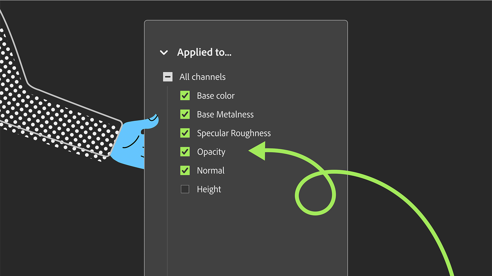

# Version 6.0

Jalapeño

Cette mise à jour introduit la prise en charge OpenPBR standard, des Paramètres prédéfinis de matériau pour une création plus rapide de matériaux avancés et un panneau Propriétés repensé pour une création plus flexible.

Les principales nouveautés sont les suivantes :

## OpenPBR au cœur de l’écosystème Substance

Sampler 6.0 adopte [OpenPBR](../features-and-workflows/openpbr.md), le modèle de matériau unifié du secteur. Créez des matériaux qui sont compris nativement dans l’écosystème 3D plus large : une compatibilité standard et infinie.Concevez une fois, éliminez les conjectures et accélérez votre workflow grâce à un modèle conçu pour une interopérabilité transparente entre les outils.

## Création de matériaux complexes en un clic

Créez instantanément des matériaux plus riches et plus complexes. De nouveaux modèles comme Fuzz, translucency et Blouson transparent vous permettent d&#39;ajouter des effets physiques avancés sans la complexité. Choisissez un modèle et partez !

Plus d&#39;informations *[ici](../interface/tools-and-widgets/material-creation-presets.md)*

## Un logiciel conçu pour la création de matériaux

Sampler 6.0 affine toute l’expérience autour de ce qui compte le plus : la création de matériaux jumeaux numériques de haute qualité. Chaque mise à jour et chaque nouvelle fonctionnalité sont conçues pour éliminer les frictions, vous faire gagner du temps et vous permettre de vous concentrer sur les parties de votre workflow qui ajoutent vraiment de la valeur.

## Nouvelle pile de calques pour un meilleur contrôle

Prenez vos matériaux en main. Le panneau des propriétés remanié vous permet de cibler des filtres par canal, ce qui vous permet d’effectuer des modifications précises sans étapes supplémentaires.

Plus d&#39;informations *[ici](../interface/panels/properties-panel.md)*

## Capture de matériaux plus rapide que jamais

Sampler vous permet désormais de lancer une capture HP Z Captis en un seul clic, avec la zone d&#39;intérêt détectée automatiquement, pivotante à la demande et automatisation intelligente pour la mise au point et l’intensité lumineuse, afin que vous obteniez des cartes nettes et cohérentes avec moins de configuration.

Plus d&#39;informations *[ici](../pipeline-and-integrations/hp-z-captis-support/your-first-capture-step-by-step.md)*

## Notes de mise à jour sur la version 6.0

### **6.0.3**

*(sortie : 24 août 2026)*

**Fixe :**

[Rendu] : solution de contournement temporaire inversée pour les pilotes NVIDIA défectueux

### **6.0.2**

*(sortie : 25 juin 2026)*

**Ajouté :**

* &amp;lbrack ; Assets&amp;rbrack ; Vérifiez la version sbsar et avertissez les utilisateurs que le moteur est trop ancien pour le lire
* &amp;lbrack ; Captis&amp;rbrack ; Add back option pour enregistrer la photométrie Captis dans les préférences

**Fixe :**

* &amp;lbrack ; vue 2D&amp;rbrack ; Ne pas « afficher avec le rapport physique » si la taille physique est désactivée
* &amp;lbrack ; Analytics&amp;rbrack ; Événements d&#39;analyse manquants
* &amp;lbrack ; Analytics&amp;rbrack ; Prevent crashpad to report a crash on vk devicelost
* &amp;lbrack ;Application&amp;rbrack ; Ne détruisez pas vkdevices à la sortie pour éviter un crash dans le pilote nvidia
* &amp;lbrack ; Application&amp;rbrack ; Réparer la sortie de l&#39;observateur de collection lié + gestionnaire de canaux
* &amp;lbrack ;Application&amp;rbrack ; Empêcher un crash à la sortie
* Le filtre &amp;lbrack ; Content&amp;rbrack ; « metal finish » n&#39;a pas d&#39;impact sur le métal
* &amp;lbrack ;Content&amp;rbrack ; Ajouter de la taille physique aux filtres dynamiques où elle est manquante
* &amp;lbrack ; Filters&amp;rbrack ; Supprimer le remplissage d&#39;après le contenu de la liste des actifs masqués
* &amp;lbrack ; Layers&amp;rbrack ; Cliquer sur &#39;réinitialiser tous les paramètres&#39; ne réinitialise pas la liste déroulante &#39;s&#39;applique à&#39;
* &amp;lbrack ; Layers&amp;rbrack ; Fix tweak min &amp; max for position widget
* &amp;lbrack ; Layers&amp;rbrack ; Mise à jour correcte du filtre
* &amp;lbrack ; Taille physique&amp;rbrack ; S’assurer que l’échelle physique fonctionne partout + rendre la taille physique correcte avec des filtres dynamiques
* &amp;lbrack ;Project&amp;rbrack ; Vérifier que la résolution de l&#39;actif est la résolution par défaut (2k x 2k) lors de la création d&#39;un nouvel actif
* &amp;lbrack ;Project&amp;rbrack ; Rouvrir le projet en cours utilisé pour ouvrir la version précédente
* &amp;lbrack ; Project&amp;rbrack ; Sampler ne propose plus de restaurer une sauvegarde de projets corrompus
* &amp;lbrack ; Rendu&amp;rbrack ; Rendu de la vignette du matériau à une résolution maximale de 2k
* &amp;lbrack ;UI&amp;rbrack ; Code défensif pour éviter les crashs si l&#39;utilisateur est plus rapide que l&#39;interface utilisateur

### **6.0.1**

*(sortie : 16 avril 2026)*

**Ajouté :**

* [vue 3D] fournit les maillages par défaut au format USD
* [Application] Détecter les utilisations dans un matériau qui ne sont pas disponibles dans le modèle de matériau actuel
* [Application] Lire l&#39;étiquette de modèle de matériau à partir des fichiers SBSAR
* [Captis] Autoriser la rotation de la zone d&#39;intérêt et la nouvelle résolution 4K
* [Captis] Vérifiez la version du système d’exploitation Captis et avertissez l’utilisateur de la mettre à jour, le cas échéant
* [Captis] Conserver les paramètres d&#39;analyse entre les analyses successives
* [Captis] Nouveau système de mise au point automatique
* Numérisation En Un Clic De [Captis]
* [Captis] Afficher une notification à la fin de la capture
* [Captis] diverses améliorations de l’interface utilisateur/UX
* [Paramètres des canaux] Panneau des paramètres des canaux repensé pour l&#39;OpenPBR
* [Paramètres de canal] pris en charge pour basculer entre les modèles de matériau OpenPBR et ASM
* [Exporter] Activez l&#39;exportation des matériaux en tant que USD, USDA ou USDZ
* [Exporter] prend en charge les canaux d&#39;OpenPBR dans la sélection des canaux d&#39;exportation
* [Exporter] Utiliser le chemin du projet comme chemin d&#39;exportation par défaut
* [Filtres] Autoriser la mise à jour des filtres composés statiques vers dynamiques
* [Filtres] Autoriser la mise à niveau de filtres statiques vers des filtres dynamiques
* [Filtres] Versions dynamiques de Répétition automatique, Remplissage d&#39;après le contenu, Fusion d&#39;Height, Fusion normale
* [Filtres] Masquer la version statique d&#39;un filtre lorsque la version dynamique est présente
* [Filtres] Nouvelle expérience de remplissage
* [Filtres] Nouveau Matériau de base compatible OpenPBR et ASM
* [Importation d’images] L’importation d’images propose désormais d’ajouter des utilisations au workflow
* [Sélecteur d&#39;utilisation amélioré] pour l&#39;importation d&#39;images
* [Calques] La taille de ressource par défaut est désormais de 2 Ko
* [Calques] Activer une sélection d&#39;utilisation de sortie par calque
* [Préférences] Ajouter une préférence de modèle de matériau par défaut
* [Paramètre prédéfini] Le paramètre prédéfini par défaut utilise désormais l&#39;modèle de matériau
* [Rendu] Activer le rendu 8K
* [Rendu] gérer l&#39;shader dans la scène USD
* [Rendu] Effectuez un rendu des images au format du document sans exporter
* modèle de matériau de descripteur de [script] pour la création de ressources dans l’API Python
* [Scripts] nouvelle propriété MaterialModel sur l&#39;actif
* [Interface utilisateur] Ajoutez une catégorie aux actions rapides et masquez les filtres d’environnement/de maillage
* Fenêtre de modèle d&#39;affichage de l&#39;[interface utilisateur] lorsque la pile ne contient qu&#39;un matériau de base
* [Interface utilisateur] Implémentez une recherche floue dans l&#39;accesseur rapide
* [Interface utilisateur] Sélection de modèle intégrée dans la boîte de dialogue de création de matériau
* Création de Matériau d&#39;[interface utilisateur] à partir du démarrage rapide
* Workflow de création de Matériau [UI] avec des modèles
* [Interface utilisateur] Nouveau style pour les barres d&#39;action flottantes
* [Interface utilisateur] Avertir l&#39;utilisateur lorsqu&#39;un matériau a besoin d&#39;utilisations supplémentaires
* [Interface utilisateur] Proposer un nouveau nom de matériau avec un nombre incrémenté
* [Interface utilisateur] : renommez « Créer un projet vide » en « Démarrage rapide »
* Panneau « Obtenir le contenu » remanié de l&#39;[interface utilisateur]
* Implémentation de la recherche [UI] dans l&#39;édition de la liste des canaux
* [Interface utilisateur] Afficher une notification lors de l&#39;enregistrement d&#39;un instantané dans un fichier

**Fixe :**

* [vue 2D] Classez Vue 2D en fonction de l&#39;index d&#39;utilisation des résultats dans la spécification
* [Application] corriger un crash au début
* [Application] Corriger la logique incorrecte pour le filtrage de l&#39;utilisation du workflow avec OpenPBR
* La liste des versions connues de [l&#39;application] est maintenant lue lors de la recherche d&#39;une mise à jour
* [Application] pour empêcher un crash d&#39;accès simultané
* [Application] empêcher un double calcul lors de l&#39;importation d&#39;images avec matériau de base
* [Application] pour empêcher un crash potentiel à la sortie
* [Application] Empêcher le crash lors de deux effacements d&#39;un masque
* [Application] Empêcher la conversion d&#39;utilisation qui perd la casse d&#39;origine
* [Application] Empêcher le calcul inutile de sorties invisibles
* [Application] Remplacez les espaces par des traits de soulignement lors de la création de l&#39;ID d&#39;utilisation à partir du nom
* [Application] Correctifs de mise à jour divers
* Appareil [Captis] non détecté après la mise à jour des stratégies de sécurité
* [Captis] Correction des erreurs de protocole FTP
* [Captis] corriger le recadrage
* [Captis] Concentrez-vous sur un aspect technique avant d&#39;effectuer l&#39;étalonnage des couleurs
* [Captis] Conserver le rapport de recadrage lorsque la résolution est verrouillée
* [Captis] Empêcher le gel lorsque vous appuyez plusieurs fois sur « envoyer les résultats à sampler »
* [Captis] Affichez la fenêtre Captis lorsque vous cliquez sur le menu Captis et elle est réduite
* [Captis] Permutez deux sections dans l&#39;interface utilisateur d&#39;aperçu
* [Captis] Les métadonnées de la ressource finale ne sont pas définies
* [Captis] Correctifs divers
* [Taille de recadrage incorrecte de Captis]
* [Paramètres des canaux] Masquez les canaux dans le panneau s&#39;ils sont invisibles
* [Exporter] L&#39;ouverture d&#39;un dossier avec des caractères spéciaux fonctionne correctement
* [Exporter] Empêcher le crash lors de l&#39;exportation lorsque l&#39;arborescence a été déchargée
* [Exporter] Les sorties sélectionnées ne sont pas persistantes dans la boîte de dialogue d&#39;exportation
* [Filtres] L&#39;exportation d&#39;un arbre avec des images rompt la résolution d&#39;image dynamique
* [Filtres] Corriger la disponibilité des filtres C++
* [Filtres] Corriger la détection de filtre dynamique de tampon de Clone
* [Filtres] Corriger l&#39;initialisation du compteur UID lors du remplissage d&#39;utilisations dynamiques
* [Filtres] Corriger l&#39;espace colorimétrique dans l&#39;Assistant Limites automatiques
* [Filtres] corriger les tailles de sortie de recadrage
* [Filtres] : le filtre de mise à jour avec le paramètre épinglé fonctionne
* [Filtres] pour empêcher un crash sur macOS dans l’assistant Limites automatiques
* [Les filtres] empêchent le crash lors de la mise à niveau lorsqu&#39;une entrée est manquante
* [Filtres] empêcher le crash lors du chargement d&#39;un filtre composé sans nom de fichier
* [Filtres] Le réglage du masque cible a été dupliqué dans PatchMatch
* [Importation d&#39;image] corriger la mesure manuelle automatique pour la taille physique
* [Taille de pixellisation de l&#39;image] correcte en SVG lorsqu&#39;elle est utilisée comme ajustement
* [Calques] L’affectation d’une utilisation à une image en la saisissant ne fonctionne pas
* [Calques] évitez les crashs lors de l&#39;ajout de calques à la pile
* Les Paramètres exposés de [calques] qui n&#39;avaient pas besoin d&#39;être mis à jour ont été supprimés
* [Calques] Correction de l’ajout du générateur de textures en tant que mappage
* Aplatissement des [calques]
* [Calques] aplatissent la sous-pile en taille d&#39;entrée, et non en taille de document
* [Calques] pour empêcher les crashs lors de l&#39;aplatissement d&#39;une pile contenant des calques aplatis
* [Calques] empêcher l&#39;affichage par Matériau de base du message d&#39;optimisation du rendu
* [Calques] La mise à jour d&#39;un filtre vers un filtre de sortie unique ne mettait pas correctement à jour l&#39;interface utilisateur
* [Préférences] Correction de la modification des préférences
* [Projet] Correction de l’importation de projets .alch
* L&#39;enregistrement du [projet] n&#39;échoue plus en mode silencieux
* [Rendu] Évitez les crashs sur macOS en conservant le mode de planification automatique
* [Rendu] la modification du composant V de la répétition de texture n&#39;a eu aucun effet
* [Rendu] Corriger les rendus et les vignettes manquants
* [Rendu] empêchant l&#39;accès simultané aux valeurs de sortie
* [Rendu] gère correctement les valeurs de sortie d&#39;une arborescence dans le moteur de rendu
* [Rendu] Arrêtez de recréer la structure de l&#39;arborescence à chaque rendu
* [Création de scripts] pour corriger un crash dans get_project_assets
* [Les scripts] empêchent le crash d&#39;aplatissement à partir de l&#39;API Python
* [Interface utilisateur] Tous les diviseurs du panneau Propriétés ont désormais la largeur du panneau
* [Interface utilisateur] Évitez d&#39;afficher les utilisations internes de la répétition automatique comme personnalisées
* [Interface utilisateur] corriger le menu contextuel rompu
* [Interface utilisateur] corriger le menu contextuel pour les réglages du générateur
* [Interface utilisateur] : correction du chargement des polices
* [Interface utilisateur] : correction du bouton de paramètre prédéfini de matériau avec des noms longs
* [Interface utilisateur] : correction des liaisons de réglage à plusieurs curseurs
* [Interface utilisateur] : correction des boutons de petite taille rares dans la boîte de dialogue
* [Interface utilisateur] corriger la modification de la valeur de réglage lors de la création du composant
* [Interface utilisateur] Corriger l&#39;affichage de l&#39;entrée variable et supprimer la commande fantôme incorrecte
* [Interface utilisateur] : correction de la mise à jour du panneau des paramètres d’affichage lorsque le contexte des ressources change
* [Interface utilisateur] : correction du mode d’enchaînement de mots du sélecteur unifié
* [Interface utilisateur] Interdire l&#39;ajout de caractères spéciaux dans le champ de nom des métadonnées
* L&#39;affichage de l&#39;outil de mesure de Taille physique de l&#39;[interface utilisateur] ne fonctionne pas
* [Interface utilisateur] Empêcher le crash lors de l’ouverture du panneau des paramètres de canal
* [Interface utilisateur] Empêcher le crash lors de l&#39;utilisation de « Rétablir la disposition par défaut »
* [Interface utilisateur] Empêcher la disparition de la notification de mise à jour dans l&#39;arborescence
* [Interface utilisateur] hiérarchiser le filtre dynamique lors de la recherche par nom
* [Interface utilisateur] Faites défiler le panneau des propriétés pour utiliser les modifications
* [Interface utilisateur] : mise à jour des paramètres de canal lors de l’ajustement de l’utilisation d’une image
* [Interface utilisateur] Mise à jour du libellé dans la fenêtre contextuelle de conversion de Modèle de matériau

## Supprimé

* [Interface utilisateur] Supprimer l&#39;élément de menu Capture 3D
* [Interface utilisateur] Supprimer le panneau IA générative
* [Interface utilisateur] : supprimer les paramètres de shader
