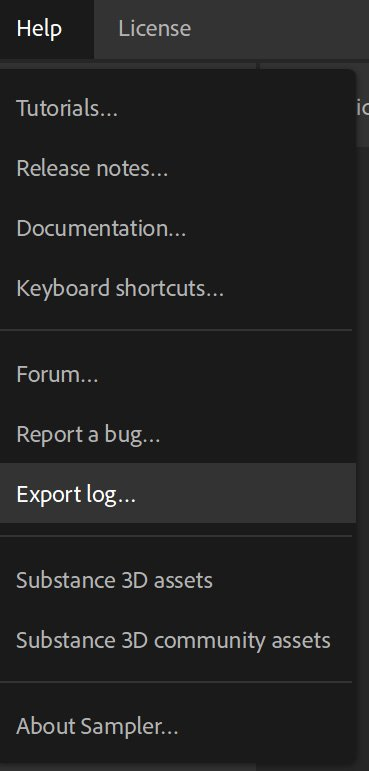

# Exportation du fichier journal

Lorsque vous avez besoin d’assistance concernant Substance 3D Sampler, il est toujours préférable de partager votre fichier journal afin de fournir le contexte de la configuration de votre ordinateur.

## Exportation du fichier journal à partir de l’application

Le fichier journal peut être directement exporté à partir de Substance 3D Sampler en accédant au menu **Aide** et en sélectionnant l&#39;élément **Exporter le fichier journal**.

## Récupération manuelle du fichier journal sur le disque

Si vous ne parvenez pas à lancer Substance 3D Sampler, vous pouvez récupérer le fichier journal manuellement en accédant au dossier suivant :

Version Adobe :

* **Windows** : C:\Users\**&#x200B; nom d’utilisateur**\AppData\Local\Adobe\Adobe Substance 3D Sampler\log.txt
* **Système d’exploitation Mac** : Macintosh > Utilisateurs > **nom d’utilisateur** > Bibliothèque > Application Support > Adobe > Adobe Substance 3D Sampler > log.txt

Version de Substance 3D :

* **Windows** : C:\Users\**&#x200B; nom d’utilisateur**\AppData\Local\Allegorithmic\Adobe Substance 3D Sampler\log.txt
* **Système d’exploitation Mac** : Macintosh > Utilisateurs > **nom d’utilisateur** > Bibliothèque > Application Support > Allegorithmic > Adobe Substance 3D Sampler > log.txt
* **Linux** : /home/**nom d’utilisateur**/.local/share/Allegorithmic/Adobe Substance 3D Sampler/log.txt

>[!NOTE]
>
> Sous **Windows**, « Appdata » est un dossier masqué.\
> Sous **Mac OS**, « library » est un dossier masqué.\
> Sous **Linux**, « .local » est un dossier masqué.

## Joindre votre fichier journal à une publication de forum

Lorsque vous demandez de l’aide sur le forum, un fichier journal est requis. Voici comment joindre un fichier journal à votre message :

1. Vérifier le paramètre « **Joindre un fichier** »
1. Cliquez sur le bouton « **Choisir un fichier** » et localisez votre fichier journal
1. Cliquez sur « **Publier** » lorsque votre message est prêt à être publié et à charger votre fichier journal

